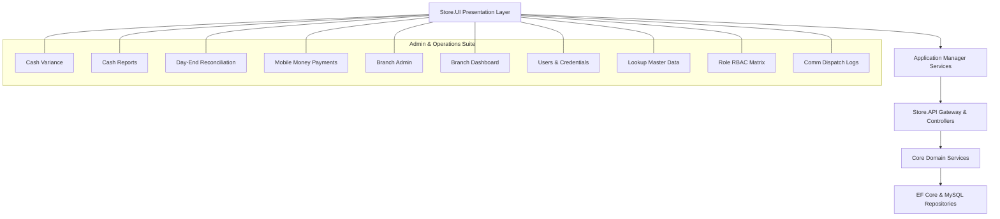

# Comprehensive Systems Analysis & Architecture Specification: Admin & Operations Hubs

## 1. Executive Summary & Scope

This specification provides a rigorous, end-to-end architectural, security, and user experience analysis across the entire **ClexAn Foods Administrative & Commercial Operations Suite**, covering the 10 core hubs:

1. **Cash Variance & Float Audits (`/CashVariance`)**
2. **Cash & Shift Reports / Z-Reports (`/CashReports`)**
3. **Day-End Reconciliation (`/Reconciliation`)**
4. **Mobile Money & Digital Settlements (`/Payments`)**
5. **Branch Administration (`/BranchAdmin`)**
6. **Branch Performance Intelligence (`/BranchDashboard`)**
7. **User Accounts & Security Credentials (`/Users`)**
8. **Master Data & Taxonomy Lookups (`/Lookup`)**
9. **Role-Based Access Control Matrix (`/RoleMatrix`)**
10. **Communication & Dispatch Audit Logs (`/CommunicationLogs`)**

The design strictly implements:
- **Dennis Ritchie Systems Philosophy**: Orthogonal mechanisms, composable components, minimal ambient state, clean stream pipelines.
- **Uncle Bob Clean Architecture**: Dependency inversion, thin presentation PageModels delegating to specialized application managers (`I*Manager` in `Store.UI/Services/`), and encapsulated domain boundaries.
- **Enterprise Security Practices**: Mandatory token verification, role capability enforcement (`PermissionKeys.*`), anti-forgery tokens, secure credential issuance, and immutable audit trails.
- **ClexAn Foods Fluent 2.0 Design System**: Emerald brand primary (`#019c01`), standardized 4-card Fluent KPI grids, high-density data tables, zero raw emojis (100% SVG vector iconography), Central African CFA Francs (**`XAF`**) currency standardization, and solid `#ffffff` drawer/modal surfaces (`z-index: 9998/9999`) preventing bleed-through.

---

## 2. Module-by-Module Systems Analysis & Gap Identification

---

### Module 1: Cash Variance & Float Audits (`/CashVariance`)

- **Functional Scope**: Auditing cashier float declarations, detecting overages/shortages across register sessions, and triggering supervisor reviews.
- **Architectural Implementation**: 
  - Interface: [`ICashVarianceManager.cs`](file:///c:/Users/Rodern/source/repos/Architech-Inc/StoreProject/Store.UI/Services/ICashVarianceManager.cs)
  - Service: [`CashVarianceManager.cs`](file:///c:/Users/Rodern/source/repos/Architech-Inc/StoreProject/Store.UI/Services/CashVarianceManager.cs)
  - PageModel: [`CashVariance.cshtml.cs`](file:///c:/Users/Rodern/source/repos/Architech-Inc/StoreProject/Store.UI/Pages/CashVariance.cshtml.cs)
  - UI View: [`CashVariance.cshtml`](file:///c:/Users/Rodern/source/repos/Architech-Inc/StoreProject/Store.UI/Pages/CashVariance.cshtml)
- **Strengths & Implemented Capabilities**:
  - 4-Card Fluent 2.0 KPI grid tracking Net Variance, Critical Discrepancies, Pending Investigations, and Total Float Volume in **`XAF`**.
  - Live Variance Gauge modal calculating physical count vs system expected in real-time.
  - Forensic slide-over inspector drawer with solid `#ffffff` background and backdrop filter blur.
  - One-click CSV export and supervisor acknowledgment workflows.
- **Advanced Features / Future Considerations**:
  - Automated anomaly detection flagging repeated micro-shortages across consecutive shifts for specific cashier IDs.

---

### Module 2: Cash & Shift Reports / Z-Reports (`/CashReports`)

- **Functional Scope**: Managing cashier shift lifecycles (Open/Close), reading X-reports (interim), generating fiscal Z-reports (shift closing), tender breakdown, and top-selling product velocity.
- **Architectural Implementation**:
  - Interface: [`ICashReportsManager.cs`](file:///c:/Users/Rodern/source/repos/Architech-Inc/StoreProject/Store.UI/Services/ICashReportsManager.cs)
  - Service: [`CashReportsManager.cs`](file:///c:/Users/Rodern/source/repos/Architech-Inc/StoreProject/Store.UI/Services/CashReportsManager.cs)
  - PageModel: [`CashReports.cshtml.cs`](file:///c:/Users/Rodern/source/repos/Architech-Inc/StoreProject/Store.UI/Pages/CashReports.cshtml.cs)
  - UI View: [`CashReports.cshtml`](file:///c:/Users/Rodern/source/repos/Architech-Inc/StoreProject/Store.UI/Pages/CashReports.cshtml)
- **Strengths & Implemented Capabilities**:
  - 3-Tab Operational Dock: `zreport` (Fiscal Z-Report), `shift` (Active Shift Ledger), `slip` (Printable Voucher).
  - High-density tender matrix breakdown (Cash, MTN MoMo, Orange Money, Credit, Split).
  - Fast thermal slip and A4 printable fiscal vouchers using `@media print` isolation.
  - Shift Open/Close modals with declared opening float and final closing count.

---

### Module 3: Day-End Reconciliation (`/Reconciliation`)

- **Functional Scope**: Daily store financial closing, cashier multi-shift sign-off aggregation, tender balance consolidation, and final management sign-off certificate generation.
- **Architectural Implementation**:
  - Interface: [`IReconciliationManager.cs`](file:///c:/Users/Rodern/source/repos/Architech-Inc/StoreProject/Store.UI/Services/IReconciliationManager.cs)
  - Service: [`ReconciliationManager.cs`](file:///c:/Users/Rodern/source/repos/Architech-Inc/StoreProject/Store.UI/Services/ReconciliationManager.cs)
  - PageModel: [`Reconciliation.cshtml.cs`](file:///c:/Users/Rodern/source/repos/Architech-Inc/StoreProject/Store.UI/Pages/Reconciliation.cshtml.cs)
  - UI View: [`Reconciliation.cshtml`](file:///c:/Users/Rodern/source/repos/Architech-Inc/StoreProject/Store.UI/Pages/Reconciliation.cshtml)
- **Strengths & Implemented Capabilities**:
  - Active open shift detection banner warning managers prior to running day-end reconciliation.
  - Multi-shift cashier card ledger with variance highlighting and status badges (`Closed`, `Variance Noted`, `Audited`).
  - Formal Day-End Certificate with management signature block and print optimization.

---

### Module 4: Mobile Money & Digital Settlements (`/Payments`)

- **Functional Scope**: Live tracking of electronic payment providers (MTN Mobile Money, Orange Money, Card Terminals), monitoring push USSD prompts, tracking settlements, and provider transaction references.
- **Architectural Implementation**:
  - PageModel: [`Payments.cshtml.cs`](file:///c:/Users/Rodern/source/repos/Architech-Inc/StoreProject/Store.UI/Pages/Payments.cshtml.cs)
  - UI View: [`Payments.cshtml`](file:///c:/Users/Rodern/source/repos/Architech-Inc/StoreProject/Store.UI/Pages/Payments.cshtml)
- **Identified & Resolved Gaps**:
  - *Resolved*: Fixed `PendingMobileMoneyTransactions.Count` list reference in the Fluent KPI card.
  - Standardized financial figures to `XAF` currency notation.
  - High-density provider badges with distinctive MTN yellow and Orange color tokens.

---

### Module 5: Branch Administration (`/BranchAdmin`)

- **Functional Scope**: Physical store retail branch creation, code assignment, active status management, and mapping user accounts to branches with specific roles.
- **Architectural Implementation**:
  - PageModel: [`BranchAdmin.cshtml.cs`](file:///c:/Users/Rodern/source/repos/Architech-Inc/StoreProject/Store.UI/Pages/BranchAdmin.cshtml.cs)
  - UI View: [`BranchAdmin.cshtml`](file:///c:/Users/Rodern/source/repos/Architech-Inc/StoreProject/Store.UI/Pages/BranchAdmin.cshtml)
- **Strengths & Implemented Capabilities**:
  - 2-Tab Dock Switcher isolating Branch Locations vs User-Branch Mappings.
  - Real-time user & branch smart lookup search integration.
  - Smooth form pre-filling on edit with instant tab activation.

---

### Module 6: Branch Performance Intelligence (`/BranchDashboard`)

- **Functional Scope**: Multi-branch commercial analytics, revenue velocity comparison, customer receivables / debt tracking, and tender channel breakdown over flexible date windows.
- **Architectural Implementation**:
  - PageModel: [`BranchDashboard.cshtml.cs`](file:///c:/Users/Rodern/source/repos/Architech-Inc/StoreProject/Store.UI/Pages/BranchDashboard.cshtml.cs)
  - UI View: [`BranchDashboard.cshtml`](file:///c:/Users/Rodern/source/repos/Architech-Inc/StoreProject/Store.UI/Pages/BranchDashboard.cshtml)
- **Strengths & Implemented Capabilities**:
  - 6-Card Fluent 2.0 KPI grid tracking Gross Revenue, Average Order Value (AOV), Total Invoices, Paid/Unpaid breakdown, and Customer Receivables in **`XAF`**.
  - Side-by-side revenue by tender channel and daily sales velocity timelines.

---

### Module 7: User Accounts & Security Credentials (`/Users`)

- **Functional Scope**: User provisioning, role assignment, password issuance, active session revocation, avatar image cropping/uploading, and Contact Change request tracking.
- **Architectural Analysis & Identified Issues**:
  - **Identified Bug**: In `Users.cshtml` table `<thead>`, columns were `[Avatar, Username, Role, Status, Created, Actions]`, but the `<tbody>` skipped the `<td>` for Role, causing all subsequent table cells to shift to the left by one column!
  - **Identified Gap**: Missing Fluent 2.0 KPI summary cards (Total Users, Active Accounts, Suspended Accounts, Pending Contact Requests).
  - **Proposed Enhancement**:
    - Decouple `Users.cshtml.cs` with an `IUserManager` application service adhering to Clean Architecture.
    - Fix the table column alignment bug by rendering the assigned Role pill.
    - Add a 4-card Fluent KPI header and elevated user 360 inspector drawer.

---

### Module 8: Master Data & Taxonomy Lookups (`/Lookup`)

- **Functional Scope**: Managing master taxonomy tables: Merchandise Categories (with images), Measurement Units (with abbreviations), and Organizational Departments.
- **Architectural Analysis & Identified Issues**:
  - **Identified Gap**: Legacy tab navigation using query strings with non-uniform styling.
  - **Identified Gap**: Create/Edit modals were legacy popups rather than modern slide-out blades / elevated Fluent modals.
  - **Proposed Enhancement**:
    - Decouple with `ILookupManager` application service in `Store.UI/Services/`.
    - Modernize the tab dock with Fluent 2.0 pill buttons and SVG icons.
    - Standardize category image preview and unified creation/editing modals.

---

### Module 9: Role-Based Access Control Matrix (`/RoleMatrix`)

- **Functional Scope**: Fine-grained capability matrix configuring endpoint and feature permissions across user roles (`PermissionKeys.*`).
- **Architectural Implementation**:
  - PageModel: [`RoleMatrix.cshtml.cs`](file:///c:/Users/Rodern/source/repos/Architech-Inc/StoreProject/Store.UI/Pages/RoleMatrix.cshtml.cs)
  - UI View: [`RoleMatrix.cshtml`](file:///c:/Users/Rodern/source/repos/Architech-Inc/StoreProject/Store.UI/Pages/RoleMatrix.cshtml)
- **Strengths & Implemented Capabilities**:
  - Sticky first column for role titles with horizontal scroll container for dynamic permission columns.
  - Interactive toggle buttons providing instant visual feedback (`Allowed` vs `Denied`).
  - Zero raw emojis with checkmark and lock SVG vector icons.

---

### Module 10: Communication & Dispatch Audit Logs (`/CommunicationLogs`)

- **Functional Scope**: Auditing all outbound transactional notifications across Email, SMS, and WhatsApp with delivery status, retry counters, and payload inspection.
- **Architectural Analysis & Identified Issues**:
  - **Identified Gap**: Used Bootstrap classes (`table-hover`, `table-light`, `badge bg-primary`, Bootstrap modal) that deviate from the ClexAn Foods Emerald design system tokens.
  - **Identified Gap**: Missing Fluent KPI cards (Total Dispatched, Sent/Delivered %, Failed/Retrying count).
  - **Proposed Enhancement**:
    - Decouple with `ICommunicationManager` application service.
    - Overhaul with Fluent 2.0 KPI grid, filter dock, semantic status badges, and an elevated slide-out payload inspector drawer (`#ffffff`, `z-index: 9999`).

---

## 3. Implementation Roadmap & Execution Plan

| Step | Target Module | Architectural Action | UI / UX Standard |
|---|---|---|---|
| **Phase 1** | **Users Hub (`/Users`)** | Create `IUserManager` & `UserManager`, refactor `Users.cshtml.cs` to lean PageModel. | Fix table column shift bug, add 4-card KPI grid, style slide-over drawer with solid `#ffffff`. |
| **Phase 2** | **Lookup Master Data (`/Lookup`)** | Create `ILookupManager` & `LookupManager`, refactor `Lookup.cshtml.cs`. | Overhaul 3-tab dock (Categories, Units, Departments), elevated modals, and photo upload. |
| **Phase 3** | **Communication Logs (`/CommunicationLogs`)** | Create `ICommunicationManager` & `CommunicationManager`, refactor `CommunicationLogs.cshtml.cs`. | Replace Bootstrap classes with Fluent 2.0 KPI grid, semantic status pills, and payload drawer. |

---

## 4. Verification & Validation Standards

1. **Clean Architecture Compliance**: Zero direct database/EF calls from PageModels; all operations orchestrated via DI manager interfaces.
2. **Design System Adherence**: 100% vector SVG icons, `#019c01` primary accents, `XAF` currency notation, solid modal overlays without bleed-through.
3. **Build & Security Integrity**: Verified with `dotnet build` with zero warnings and zero errors.
