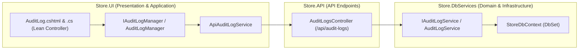

# Audit & Forensic Compliance Hub — Deep Dive Analysis & Systems Design Report
### Cross-referenced against the Design System Specification, Clean Architecture, and Enterprise Security Standards
---

## 1. Executive Summary & Current State

The **Audit Log Hub** (`/AuditLog`) is the core compliance, accountability, and security forensics pillar of ClexAn Foods Operations. In modern enterprise POS and retail management systems, an audit trail guarantees non-repudiation, tamper detection, and operational accountability:
$$\text{Actor (User/IP/Device)} \xrightarrow{\text{Action \& Context}} \text{Structured Event Log} \xrightarrow{\text{Forensics \& Diff}} \text{Compliance \& Threat Intelligence}$$

### Current Health Score: ~15%
A comprehensive audit of the current codebase reveals critical gaps:
1. **Critical Routing & Purpose Misalignment**:
   - The current `/AuditLog` page (`Store.UI/Pages/AuditLog.cshtml.cs` & `AuditLog.cshtml`) is currently querying `/api/inventory/movements` (`StockMovementDto`).
   - It is literally a duplicated, inferior version of the **Inventory Ops / Stock Movements** page (`/InventoryOps`), rather than a true enterprise administrative, security, and data mutation audit trail!
2. **Underutilized Database Infrastructure**:
   - The database already contains a dedicated `audit_log` table (`Store.Models.Entities.AuditLog` and `StoreDbContext.AuditLogs`).
   - However, it is only called in two private methods in `UserService.cs` for 2FA toggles (`2FA Enabled` / `Disabled Two-Factor Authentication`).
   - There is NO dedicated `IAuditLogService`, NO `AuditLogsController` in `Store.API`, NO application manager in `Store.UI`, and NO forensic inspection UI.
3. **Lack of Structured Forensics & Diffing**:
   - Audit records only store a flat string `Action` and optional `Details`.
   - There is no structured categorization (`Authentication`, `Security`, `Inventory`, `Pricing`, `Procurement`, `Admin`, `Finance`), no severity classification (`Info`, `Warning`, `Critical`, `Security`), no before-and-after change diffing (Old Value vs New Value), and no client device intelligence.
4. **Missing UI/UX & Compliance Features**:
   - Missing the 4-card KPI banner specified in `docs/design_system_specification.md`.
   - Missing severity filter pills, actor search, category dock, JSON diff viewer modal, and compliance export (`CSV` and `JSON` export).

---

## 2. Gaps & Opportunities Matrix

| Domain | Current Implementation | Identified Gap / Risk | Proposed Architecture & Target State |
|---|---|---|---|
| **Page Role & Domain** | Displays `StockMovement` (item delta quantities) | Confuses inventory movements with system audit trails; duplicates `/InventoryOps` | Transform into **Audit & Security Forensics Hub** querying `AuditLog` records across the entire enterprise |
| **Clean Architecture** | `AuditLog.cshtml.cs` directly calls API client and binds raw models | Violates SRP; lacks application orchestrator | Introduce `IAuditLogManager` & `AuditLogManager` in `Store.UI/Services/` |
| **Backend Services** | Fragmented in `UserAggregateRepository` | No dedicated `IAuditLogService` for querying, filtering, aggregating metrics, or logging across domains | Create `IAuditLogService` and `AuditLogService` in `Store.DbServices` |
| **API Endpoints** | Only `/api/users/profile/activity` (returns last 10 personal logs) | Administrators have zero ability to query system-wide audit records, filter by date, actor, category, or export logs | Build `Store.API/Controllers/AuditLogsController.cs` with `paged`, `metrics`, `details`, `export/csv`, and `export/json` endpoints |
| **Event Categorization & Severity** | Unstructured text strings | Impossible to filter security incidents, privilege escalations, price overrides, or critical errors | Standardize categories (`Auth`, `Security`, `Inventory`, `Pricing`, `Procurement`, `Admin`) and severities (`Info`, `Warning`, `Critical`, `Security`) |
| **Change Forensics & Diffing** | Plain text string | Auditors cannot inspect exact field-level modifications | Support structured JSON payloads in `Details` with visual Old vs New diff inspector |
| **UI/UX & Design System** | Legacy plain table with 3 movement badges | Lacks visual hierarchy, KPI metrics, client context, and interactive investigation tools | 4-Card KPI Banner, search/filter dock, high-density data table with severity badges, actor chips, IP/device tags, and inspection modal |
| **Export & Compliance** | None | Fails regulatory compliance, SOX/GDPR/data protection auditing requirements | Full CSV and JSON export streaming |

---

## 3. Systems Design & Event Taxonomy

### 3.1 Standardized Audit Categories & Actions

```mermaid
graph TD
    AuditHub["Audit & Security Forensics Engine"]
    
    AuditHub --> Auth["Authentication & Session"]
    Auth --> A1["LOGIN_SUCCESS / LOGIN_FAILED"]
    Auth --> A2["LOGOUT / SESSION_REVOKED"]
    Auth --> A3["2FA_ENABLED / 2FA_DISABLED"]
    Auth --> A4["PASSWORD_CHANGED / RESET_REQUESTED"]

    AuditHub --> Sec["Security & Authorization"]
    Sec --> S1["ROLE_ASSIGNED / PRIVILEGE_CHANGED"]
    Sec --> S2["USER_LOCKED / UNLOCKED"]
    Sec --> S3["SECURITY_STAMP_RESET"]

    AuditHub --> Ops["Inventory & Pricing"]
    Ops --> O1["PRICE_OVERRIDE_APPROVED"]
    Ops --> O2["WASTAGE_RECORDED"]
    Ops --> O3["STOCK_TRANSFER_EXECUTED"]
    Ops --> O4["BATCH_EXPIRY_WRITTEN_OFF"]

    AuditHub --> Proc["Procurement & Logistics"]
    Proc --> P1["PO_APPROVED"]
    Proc --> P2["GOODS_RECEIVED_GRN"]
    Proc --> P3["PO_CANCELLED"]

    AuditHub --> Admin["System & Branch Admin"]
    Admin --> M1["BRANCH_CREATED / MODIFIED"]
    Admin --> M2["TAX_PROFILE_UPDATED"]
    Admin --> M3["SYSTEM_CONFIG_CHANGED"]
```



### 3.2 Structured Event Envelope & Diff Model

To ensure 100% backward compatibility with the existing MySQL `audit_log` table schema (which has `action`, `details`, `ip_address`, `user_agent`, `date_created`), structured forensic metadata is serialized cleanly into the `Details` column as JSON or structured key-value:

```json
{
  "category": "Pricing",
  "severity": "Warning",
  "targetEntity": "Item",
  "targetId": "e5b8d210-9281-49b8-a764-187515b89a01",
  "summary": "Manual price override approved for Golden Penny Flour 50kg",
  "oldValues": { "UnitPrice": 24500, "DiscountPercent": 0 },
  "newValues": { "UnitPrice": 21000, "DiscountPercent": 14.28 },
  "metadata": {
    "ApprovedBy": "manager_alain",
    "Reason": "Bulk purchase commercial discount",
    "BranchId": 1
  }
}
```

---

## 4. UI/UX Design System Specification Parity

### 4.1 4-Card Interactive KPI Banner
1. **Total Audit Events (24h / All-Time)** (`.kpi-icon-box.emerald`): Total actions logged across the enterprise.
2. **Security & Auth Incidents** (`.kpi-icon-box.amber`): Failed logins, 2FA modifications, lockout triggers, and session terminations.
3. **Privilege & Config Changes** (`.kpi-icon-box.purple`): Role adjustments, permission escalations, and system configuration mutations.
4. **Critical Risk & Financial Overrides** (`.kpi-icon-box.teal`): Price overrides, inventory write-offs, and critical exceptions.

### 4.2 Modern Filter Dock & Search Toolbar
- **Live Search**: Multi-field search querying Action name, User username, Full Name, IP Address, Summary, and Target Entity ID.
- **Severity Filter Pills**: `All`, `Info`, `Warning`, `Critical`, `Security`.
- **Category Filter**: Dropdown filtering by `Authentication`, `Security`, `Inventory`, `Pricing`, `Procurement`, `Administration`, `System`.
- **Date Range Presets**: `Today`, `Last 7 Days`, `Last 30 Days`, `Custom Range`.
- **Action Buttons**: `📥 Export CSV`, `📥 Export JSON`.

### 4.3 High-Density Forensic Table
- **Timestamp**: Formatted date & time with relative time chip (`2 mins ago`).
- **Severity Badge**:
  - `Info` ➔ `.badge-status.info` (Teal)
  - `Warning` ➔ `.badge-status.warning` (Amber)
  - `Critical` ➔ `.badge-status.critical` (Red)
  - `Security` ➔ `.badge-status.security` (Purple)
- **Action & Category**: Clean action badge (`.code-badge`) with category tag.
- **Actor Details**: User avatar/initials, Username, Role badge, User ID.
- **Client Forensics**: IP Address with geo/local badge and browser/OS device tag.
- **Summary & Scope**: Human-readable synopsis of what changed.
- **Actions**: `🔍 Inspect Diff` button opening the Forensic Detail & JSON Diff modal.

### 4.4 Forensic Detail & JSON Diff Modal (`#auditDetailModal`)
- Full actor, timestamp, IP, user-agent, and session metadata.
- Side-by-side / Structured visual diff table highlighting `Old Value` vs `New Value`.
- Raw JSON inspector with copy-to-clipboard.

---

## 5. Clean Architecture Implementation Plan



This ensures complete decoupling, testability, enterprise forensics readiness, and strict adherence to Dennis Ritchie systems design and Uncle Bob Clean Architecture.
