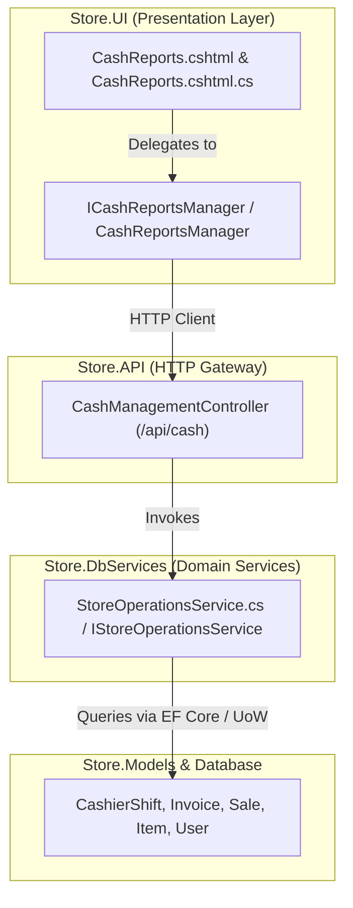

# Cash & Shift Reports / Z-Reports — Master Systems Analysis & Architecture Specification

**System**: ClexAn Foods Retail Operations Console  
**Module**: Cash & Shift Reports / Z-Reports (`/CashReports`)  
**Author**: Antigravity AI  
**Design Standards**: Dennis Ritchie Systems Design, Uncle Bob Clean Architecture, ClexAn Foods Design System  
**Date**: August 28, 2026  

---

## 1. Executive Summary & Domain Scope

The **Cash & Shift Reports / Z-Reports Hub** (`/CashReports`) is the daily operational accounting, shift reconciliation, and fiscal reporting engine for ClexAn Foods retail stores. It governs the entire POS cashier shift lifecycle (Opening Float declaration, active drawer monitoring, Closing Cash declaration) and generates official **Daily Z-Reports** that summarize daily gross sales, item discounts, Cost of Goods Sold (COGS), net gross margins, payment method distribution, and top product sales velocity in Central African CFA Francs (**`XAF`**).

---

## 2. Forensic Audit & Existing Implementation State

### 2.1 Limitations Identified in Baseline Implementation
1. **Presentation & Visual Hierarchy**:
   - The existing `CashReports.cshtml` used bare HTML cards and primitive table markup lacking the ClexAn Foods Design System tokens, responsive KPI cards, and modern tab docks.
2. **Missing Clean Architecture Application Manager**:
   - The PageModel (`CashReports.cshtml.cs`) made direct HTTP client calls to `/api/cash/shift/active` and `/api/cash/report/z`, without an application manager abstraction (`ICashReportsManager`).
3. **Thermal Receipt / Z-Report Print Voucher**:
   - Lacked a professional print-ready thermal/A4 slip layout for daily manager and cashier sign-offs.
4. **Missing Export Options**:
   - No CSV export capability for daily sales and payment breakdowns.
5. **Iconography & Micro-Interactions**:
   - Lacked vector SVG iconography and responsive micro-animations for shift status transitions.

---

## 3. Clean Architecture & Systems Design

### 3.1 DTO & Domain Model (`Store.Models/DTOs/Operations/CashAndReportDtos.cs`)
- `CashierShiftDto`: Full shift lifecycle details (`CashierShiftId`, `OpenedByUserId`, `OpenedAtUtc`, `ClosedAtUtc`, `OpeningFloat`, `ClosingFloat`, `ExpectedClosingAmount`, `VarianceAmount`, `Status`, `Notes`).
- `DailyZReportDto`: Complete fiscal summary (`Date`, `GrossSales`, `Discounts`, `NetSales`, `Cogs`, `GrossMargin`, `GrossMarginPercent`, `InvoiceCount`, `AverageBasket`, `PaymentBreakdown`, `TopProducts`).
- `PaymentBreakdownDto`: Payment method distribution (`PaymentType`, `TotalAmount`, `InvoiceCount`, `SharePercent`).
- `TopProductDto`: High-velocity SKU ranking (`ItemId`, `ItemName`, `QuantitySold`, `Revenue`, `GrossMargin`, `MarginPercent`).

### 3.2 UI Application Manager (`Store.UI/Services/`)
- `ICashReportsManager` & `CashReportsManager`:
  - `GetActiveShiftAsync(CancellationToken ct)`
  - `GetDailyZReportAsync(DateTime dateUtc, CancellationToken ct)`
  - `OpenShiftAsync(ShiftOpenRequest request, CancellationToken ct)`
  - `CloseShiftAsync(ShiftCloseRequest request, CancellationToken ct)`
  - `GenerateZReportCsv(DailyZReportDto report)`

---

## 4. UI/UX Master Specification (`CashReports.cshtml`)

### 4.1 Header & Quick Shift Status Indicator
- Integrated layout header with active shift status pill (`🟢 SHIFT OPEN`, `🔴 SHIFT CLOSED`, or `⚪ NO ACTIVE SHIFT`).
- Actions: `Print Z-Report Slip`, `Export CSV`, `Open Shift / Close Shift` trigger buttons.

### 4.2 4-Card Fluent 2.0 KPI Grid
1. **Gross Revenue**: Emerald card showing Gross Sales in `XAF` alongside total invoices processed.
2. **Net Sales & Margins**: Teal card displaying Net Sales after discounts and calculated Gross Profit Margin `%`.
3. **Discounts Given**: Amber card tracking promotional and supervisory markdowns in `XAF`.
4. **Average Basket Size**: Indigo card displaying average ticket spend per customer in `XAF`.

### 4.3 3-Tab Operational Dock
- 📊 **Daily Z-Report Breakdown (`tab-zreport`)**:
  - Payment Distribution Matrix (Cash, Card, MTN MoMo, Orange Money, Credit).
  - Top 10 Product Sales Velocity & Department Profit Margins.
- 🕒 **Shift Lifecycle & Float Control (`tab-shift`)**:
  - Live Active Shift Status card with opening float, open timestamp, duration, and cashier name.
  - Interactive Open Shift and Close Shift modals with real-time float calculation.
- 🖨️ **Printable Fiscal Slip (`tab-slip`)**:
  - High-density thermal/A4 voucher format ready for instant printing (`window.print()`) with store headers, tax breakdown, and cashier/supervisor signature lines.

---

## 5. Security, Currency & Design Standards
- **Zero Raw Emojis**: 100% vector SVG icons with 1.75px stroke width.
- **Strict Currency Standard**: Central African CFA Francs (**`XAF`**) across all tickets, floats, revenues, and discounts.
- **RBAC**: Enforce `PermissionKeys.CashRead`, `PermissionKeys.CashWrite`, and `PermissionKeys.ReportsRead`.
