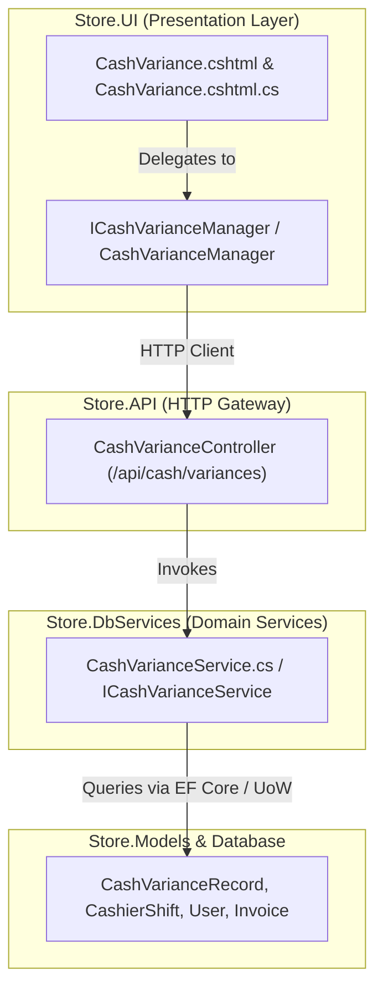

# Cash Variance & Float Audits — Master Systems Analysis & Architecture Specification

**System**: ClexAn Foods Retail Operations Console  
**Module**: Cash Variance & Shift Float Audits (`/CashVariance`)  
**Author**: Antigravity AI  
**Design Standards**: Dennis Ritchie Unix Systems Philosophy, Uncle Bob Clean Architecture, ClexAn Foods Design System  
**Date**: August 28, 2026  

---

## 1. Executive Summary & Domain Scope

The **Cash Variance & Float Audits Hub** (`/CashVariance`) is the retail store's fiscal control and loss-prevention engine. It provides end-to-end reconciliation, mathematical variance detection, supervisory review workflows, and forensic audit trails between expected cash balances and actual physical till counts recorded during POS cashier shifts.

### Core Business Objectives:
1. **Shift Float & Drawer Integrity**: Verify that POS cashier drawers balance against opening floats, cash sales transactions, cash drop withdrawals, and refunds.
2. **Discrepancy Attribution**: Categorize cash deviations through standardized reason codes (`COUNTING_ERROR`, `TILL_FLOAT_SHORT`, `UNLOGGED_CHANGE_DRAWER`, `COUNTERFEIT_DETECTED`, `THEFT_SUSPECTED`, `SYSTEM_GLITCH`).
3. **Dual-Custody Supervisory Governance**: Enforce separation of duties where cashiers record count declarations, and authorized shift supervisors review, approve, or escalate discrepancies.
4. **CFA Franc (`XAF`) Financial Accountability**: Quantify net algebraic cash variance, gross shortages (deficits), and gross overages (surpluses) in Central African CFA Francs.

---

## 2. Forensic Audit & Existing Implementation State

### 2.1 Current Implementation State
The existing `/CashVariance` implementation provided baseline recording and review capabilities, but exhibited key limitations:
- **Presentation Layer**: Used legacy table markup and basic styles without the ClexAn Foods Design System (`tokens.css`, Fluent 2.0 KPI cards, tab docks, semantic badges, and SVG vector iconography).
- **Missing Executive KPI Metrics**: Lacked an aggregated summary of total unresolved pending reviews, net algebraic cash discrepancy in `XAF`, total accumulated shortages, and total overages.
- **Architectural Coupling**: The PageModel (`CashVariance.cshtml.cs`) directly called backend service methods without an application manager layer (`ICashVarianceManager`), violating Clean Architecture SRP guidelines.
- **Crude Modal Interactions**:
  - The record modal did not dynamically compute real-time variance delta as amounts were typed.
  - The review modal lacked full forensic context of the shift (cashier name, shift duration, float value, opened/closed timestamps).
- **No Multi-Dimensional Tab Filtering**: Lacked instant tab navigation for Pending Reviews, Shortages (Deficits), Overages (Surpluses), and Full Historical Ledger.
- **No CSV Export**: Missing financial export capabilities for store accountants and internal audit.

---

## 3. Clean Architecture & Systems Design

### 3.1 DTO & Domain Enhancements (`Store.Models/DTOs/Cash/CashVarianceDtos.cs`)
Enrich DTOs with financial metrics and forensic context:
- `CashVarianceMetricsDto`:
  - `TotalPendingCount` (`int`)
  - `NetDiscrepancyXaf` (`decimal`): Algebraic sum `Sum(Actual - Expected)` in `XAF`.
  - `TotalShortagesXaf` (`decimal`): Absolute sum of negative variances in `XAF`.
  - `TotalOveragesXaf` (`decimal`): Absolute sum of positive variances in `XAF`.
  - `TotalReviewedCount` (`int`)
  - `TotalEscalatedCount` (`int`)
- `CashVarianceDto`:
  - `CashVarianceRecordId`
  - `CashierShiftId`
  - `ExpectedAmount` (`XAF`)
  - `ActualAmount` (`XAF`)
  - `Variance` (`XAF`)
  - `ReasonCode`
  - `Notes`
  - `Status` (`Pending`, `Reviewed`, `Escalated`)
  - `RecordedByUser`, `RecordedByUserId`
  - `ReviewedByUser`, `ReviewedByUserId`
  - `ReviewNotes`, `ReviewedAt`
  - `DateCreated`
  - `ShiftOpenedAtUtc`, `ShiftClosedAtUtc`, `ShiftOpeningFloat`

### 3.2 UI Application Manager (`Store.UI/Services/`)
- `ICashVarianceManager` / `CashVarianceManager`:
  - `GetMetricsAsync()`
  - `GetAllAsync(CashVarianceStatus? status)`
  - `RecordVarianceAsync(RecordCashVarianceRequest request)`
  - `ReviewVarianceAsync(int id, ReviewCashVarianceRequest request)`
  - `GenerateCsvExport(List<CashVarianceDto> records, CashVarianceMetricsDto metrics)`

---

## 4. UI/UX Master Specification (`CashVariance.cshtml`)

### 4.1 4-Card Fluent 2.0 KPI Banner
1. **Net Discrepancy**: Dynamic color (Emerald for positive surplus, Rose for negative deficit) displaying `Net: +/- XAF`.
2. **Pending Investigations**: Amber card (`#d97706`) tracking count of unreviewed variances requiring supervisor action.
3. **Total Shortages (Deficits)**: Rose card (`#e11d48`) tracking total cash missing from drawers in `XAF`.
4. **Total Overages (Surpluses)**: Teal card (`#0d9488`) tracking total excess cash found in drawers in `XAF`.

### 4.2 4-Tab Analytical Navigation Dock
- ⚠️ **Pending Review (`tab-pending`)**: Actionable list of open variance records requiring review, with instant one-click review buttons.
- 📉 **Shortages / Deficits (`tab-shortages`)**: Filtered ledger of shifts with negative variance.
- 📈 **Overages / Surpluses (`tab-overages`)**: Filtered ledger of shifts with positive variance.
- 📜 **All Audits Ledger (`tab-all`)**: Complete historical ledger with instant live search and reason code filtering.

### 4.3 Interactive Modals & Slide-out Drawer
- **Record Variance Modal (`#recordVarianceModal`)**:
  - Live reactive calculation: updates `Variance Delta (XAF)` with color indicators as Expected and Actual amounts are typed.
  - Reason Code select dropdown with predefined standard codes.
  - Detailed justification notes.
- **Review Decision Modal (`#reviewVarianceModal`)**:
  - Displays original shift summary and calculated discrepancy.
  - Decision selector: `Reviewed` (Approve & Settle) vs `Escalated` (Escalate to Audit/Management).
  - Review notes textarea.
- **Slide-out Forensic Inspector Drawer (`#varianceDrawer`)**:
  - Click any row to view complete timeline: cashier name, timestamps, float amount, expected vs counted cash, and supervisor sign-off.

---

## 5. Security & Verification Strategy
1. **RBAC & Authorization**:
   - Viewing variances requires `PermissionKeys.CashRead` or `PermissionKeys.ReportsRead`.
   - Recording or reviewing variances requires `PermissionKeys.CashWrite`.
2. **Zero Raw Emojis**: 100% vector SVG icons with consistent stroke widths.
3. **Currency Consistency**: All values strictly formatted in Central African CFA Francs (**`XAF`**).
