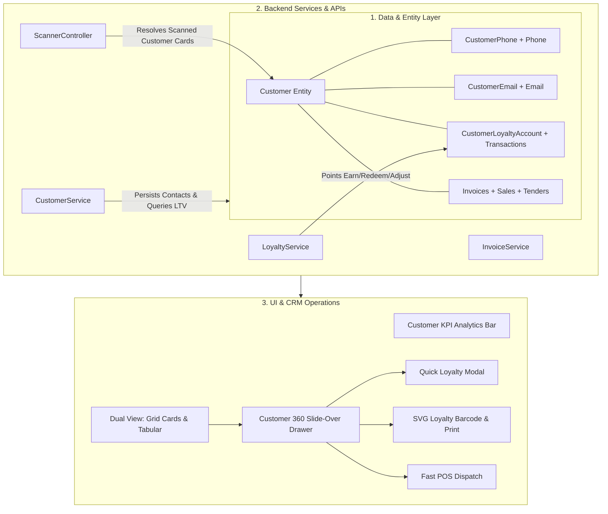
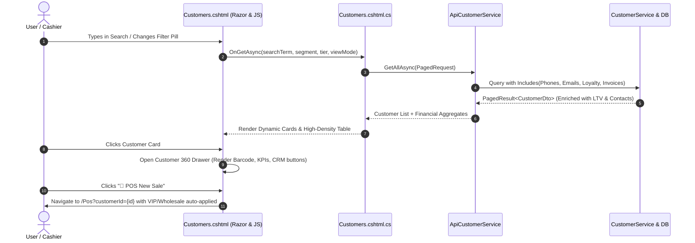

# Customer Management & CRM 360 Hub — Comprehensive Analysis & Design Specification

**Document Version:** 1.0.0  
**Author:** Antigravity AI Engineering  
**Target Module:** Customer Directory, CRM 360 Slide-Over Hub, POS Integration & Smart Scanner  
**Status:** Approved for Implementation  

---

## 1. Executive Summary

This specification provides a complete audit, architectural analysis, and technical blueprint for upgrading the Customer Management subsystem into an enterprise-grade **Customer CRM & 360° Engagement Hub**.

The upgraded module provides:
1. **End-to-End Data Integrity**: Complete persistence of multiple contact mechanisms (Phone, Email, Addresses) and automatic synchronization with EF Core relationships.
2. **Customer 360° Slide-Over Drawer**: Interactive side panel providing real-time financial KPIs (Lifetime Value, Average Order Value, Outstanding Debt/Balance), purchase history, and direct communication shortcuts (WhatsApp, Tel, Email).
3. **Loyalty Program & Rewards Integration**: Dynamic tier progression tracking (Bronze $\rightarrow$ Silver $\rightarrow$ Gold), real-time points balance, and direct adjustment/redemption modals.
4. **Digital Loyalty Barcode / QR Identity Generation**: Pure vector SVG Code128 / QR barcodes generated for every customer, supporting 1-click printing of membership cards and optical camera scanning.
5. **Smart Scanner Hub & POS Dispatch**: Deep-linking from physical card/phone scans to instant POS customer selection with automatic wholesale/VIP segment discount application.
6. **Dual View Layout**: Toggling between a modern visual Card Grid and a high-density tabular operational view with debounced multi-field search and active filter pills.

---

## 2. Cross-Project Component Audit & Findings

We audited the entire codebase to identify existing implementations, reused services, and cross-cutting dependencies:

### 2.1 Backend Services & Entity Relationships

| Area | Existing Implementation | Current Limitation / Gap | Target Enhancement |
| :--- | :--- | :--- | :--- |
| **Contact Persistence** | `Phone`, `Email`, `CustomerPhone`, `CustomerEmail` entities exist in `StoreDbContext`. | `CustomerService.CreateAsync` and `UpdateAsync` completely ignore `Phone` and `Email` parameters. | Persist and update contact records atomically in `CustomerService` using UoW. |
| **DTO Mapping** | `CustomerDto` defines `PrimaryPhone` and `PrimaryEmail`. | `CustomerService.MapToDto` never populates `PrimaryPhone` or `PrimaryEmail` (always `null`). | Eagerly load primary phone and email in queries and project into DTOs. |
| **Financial Aggregates** | Invoices link to `CustomerId` via `Invoice.CustomerId`. | No endpoint or query calculates Customer Lifetime Value (LTV), total orders, or outstanding unpaid balance. | Enrich `CustomerDto` or Customer detail queries with `TotalSpend`, `OrderCount`, and `OutstandingBalance`. |
| **Loyalty Service** | `LoyaltyService` manages points, tiers, and transactions (`Bronze: 0-499`, `Silver: 500-1999`, `Gold: 2000+`). | `Loyalty.cshtml` is an isolated page; no quick adjustment or live points display inside customer management. | Embed live loyalty tier meters and quick-earn/adjust actions inside the Customer 360 Drawer. |
| **Smart Scanner** | `ScannerController.cs` resolves Items, Invoices, Employees, Suppliers, and Batches. | Scanning a customer loyalty barcode or phone number returns `"Unrecognized Barcode"`. | Add Customer entity resolution to `ScannerController.cs` with direct POS/Profile action shortcuts. |
| **Segment Pricing** | `CustomerSegment` enum (`Standard`, `Wholesale`, `VIP`) and `CustomerSegmentPrices` exist. | Customers page does not show active pricing segment tier or allow instant wholesale dispatch. | Add visual segment badges and deep links to POS with segment context pre-applied. |

---

## 3. Detailed Gap Analysis & Bug Catalog

### 3.1 Critical Bugs Identified

1. **Bug #1: Contact Data Loss on Creation (`CustomerService.cs`)**
   - `CreateCustomerRequest` has `Email` and `Phone` properties.
   - In `CustomerService.CreateAsync`, only the `Customer` entity is saved; `Phone` and `Email` are dropped without creating `CustomerPhone` or `CustomerEmail` records.
2. **Bug #2: Missing Contact Fields in Update DTO (`CustomerDtos.cs`)**
   - `UpdateCustomerRequest` does not contain `Phone` or `Email` properties, preventing contact modifications during edits.
3. **Bug #3: Unpopulated Contact DTOs (`CustomerService.cs`)**
   - `CustomerService.MapToDto` maps only top-level scalar properties. As a result, `PrimaryPhone` and `PrimaryEmail` are always returned as `null` across all API responses.
4. **Bug #4: Query Parameter Ignored in PageModel (`Customers.cshtml.cs`)**
   - `OnGetAsync` accepts `int page = 1` but does not bind `searchTerm`, `segment`, `tier`, `sortBy`, or `viewMode`.
5. **Bug #5: Fragile Inline JavaScript Concat (`Customers.cshtml`)**
   - Customer rows use `onclick="openEdit('@c.CustomerId', '@Html.Raw(c.FirstName.Replace("'", "\\'"))', ...)"`. Customer names with special characters or newlines break the DOM script execution.

---

## 4. Architectural & UI/UX Design Specification

### 4.1 Top-Level KPI Dashboard Bar
Four responsive metric cards placed above the filter bar:
1. **Total Customers**: Count of registered customers with active percentage.
2. **VIP & Wholesale Accounts**: Breakdown of specialized pricing tiers.
3. **Loyalty Enrollment & Points**: Total enrolled accounts and accumulated loyalty points.
4. **Customer Receivables / Debt**: Total outstanding balance across unpaid invoices.

### 4.2 Search & Filter Toolbar
- **Debounced Instant Search**: Real-time filtering by Name, Phone, Email, or Customer ID.
- **Segment Pills**: `All`, `Standard`, `Wholesale`, `VIP`.
- **Loyalty Tier Pills**: `All`, `Bronze`, `Silver`, `Gold`.
- **Debt Filter Pill**: `All`, `Has Unpaid Balance`.
- **Sorting Selector**: `Name (A-Z)`, `Newest First`, `Highest Spend (LTV)`, `Most Points`.
- **Dual View Switcher**: Grid cards with avatar heroes vs. High-density operational table.

### 4.3 Customer 360° Slide-Over Drawer
Triggered by clicking any customer card or table row:
- **Hero Header**: High-res avatar / initials fallback, Full Name, Segment badge, Loyalty Tier badge.
- **Direct CRM Actions**:
  - 🟢 **WhatsApp**: `https://wa.me/{phone}`
  - 📞 **Call**: `tel:{phone}`
  - ✉️ **Email**: `mailto:{email}`
- **Financial Summary Grid**:
  - **Lifetime Value (LTV)**: Formatted currency (`XAF`).
  - **Orders Completed**: Count of finalized invoices.
  - **Average Ticket Size**: LTV / Order Count.
  - **Account Receivables**: Unpaid invoices indicator with settle link.
- **Loyalty & Rewards Section**:
  - Current Points Balance & Progress Bar toward next tier.
  - "⚡ Quick Adjust Points" trigger button.
- **Digital Membership Barcode**:
  - Vector Code128 / QR barcode generated from Customer ID.
  - "🖨️ Print Loyalty Card" button (isolated print stylesheet).
- **Recent Transaction History**:
  - Last 5 purchases with invoice date, total, payment method, and status badge.
- **Footer Command Bar**:
  - `🛒 POS New Sale`: Dispatches to `/Pos?customerId={id}`.
  - `✏️ Edit Profile`: Opens the edit modal with pre-filled fields.
  - `🗑️ Deactivate / Delete`: Confirmed administrative deletion.

### 4.4 Image Upload with CropperJS Modal
- Customer avatar upload supports drag-and-drop and square (1:1) cropping preview before submission.

---

## 5. Technical Implementation Blueprint

---

## 6. Verification & Validation Checklist

- [ ] **Contact Persistence**: Creating a customer with phone and email populates `CustomerPhones` and `CustomerEmails` in MySQL.
- [ ] **Contact Update**: Modifying a phone/email in the edit modal updates existing records or inserts new primary contacts.
- [ ] **Contact Mapping**: All DTO responses contain correct `PrimaryPhone` and `PrimaryEmail`.
- [ ] **Customer 360 Drawer**: Clicking a customer opens the slide-over drawer smoothly with LTV, orders, and loyalty details.
- [ ] **Barcode & Print**: Pure SVG barcode renders and prints cleanly on thermal and standard membership card paper.
- [ ] **POS Dispatch**: Clicking "POS New Sale" navigates to `/Pos?customerId=...` properly.
- [ ] **Smart Scanner**: Scanning customer barcode in the floating widget resolves customer profile and provides quick-action shortcuts.
