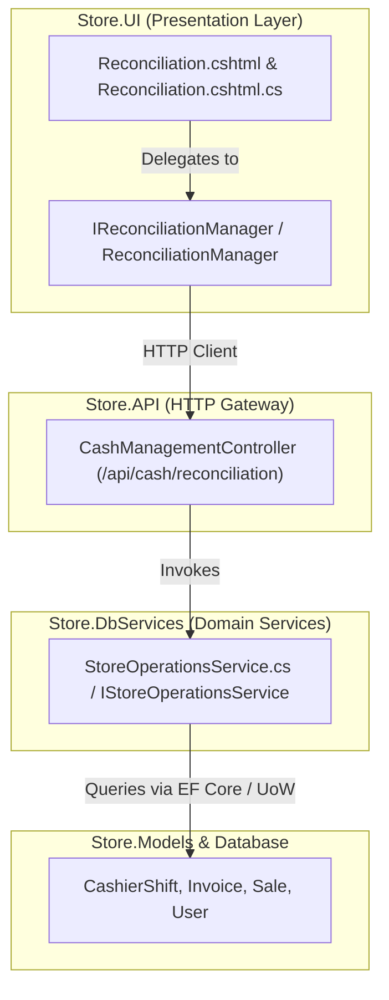

# Day-End Reconciliation — Master Systems Analysis & Architecture Specification

**System**: ClexAn Foods Retail Operations Console  
**Module**: Day-End Reconciliation (`/Reconciliation`)  
**Author**: Antigravity AI  
**Design Standards**: Dennis Ritchie Systems Design, Uncle Bob Clean Architecture, ClexAn Foods Design System  
**Date**: August 28, 2026  

---

## 1. Executive Summary & Domain Scope

The **Day-End Reconciliation Hub** (`/Reconciliation`) is the store's consolidated daily balancing, fiscal closing, and multi-shift auditing engine. It aggregates all POS cashier shifts, till floats, tender distributions, and cash variance declarations across all registers for a given business trading day.

### Core Business Objectives:
1. **Multi-Shift Consolidation**: Aggregate all register shifts opened and closed during the business day into a single cohesive audit view.
2. **Open Shift Guarding**: Detect unclosed/active shifts that prevent formal end-of-day financial sign-off.
3. **Cash & Digital Tender Reconciliation**: Compare physical cash receipts against electronic payment channels (MTN Mobile Money, Orange Money, POS Card Terminals, Account Credit).
4. **Net Discrepancy Accounting in `XAF`**: Quantify algebraic daily variance in Central African CFA Francs (**`XAF`**).
5. **Auditor & Store Manager Sign-off**: Provide printable thermal/A4 fiscal reconciliation slips for physical record archiving.

---

## 2. Forensic Audit & Existing Implementation State

### 2.1 Limitations Identified in Baseline Implementation
1. **Presentation & Styling**:
   - The existing `Reconciliation.cshtml` used legacy `.kpi-card` markup and un-styled `.shift-card` blocks lacking the ClexAn Foods Design System tokens, rounded elevation, and responsive grids.
2. **Architectural Coupling**:
   - The PageModel (`Reconciliation.cshtml.cs`) made direct HTTP client calls to `/api/cash/reconciliation` without an application manager abstraction (`IReconciliationManager`), violating SRP and Clean Architecture guidelines.
3. **Missing Multi-Dimensional Tabs**:
   - Lacked tabbed separation between Multi-Shift Ledger, Store-wide Payment Channel Distribution, and the Formal Day-End Sign-off Slip.
4. **Missing Financial Export**:
   - No CSV export option for store accountants and internal audit teams.
5. **Iconography & Micro-Interactions**:
   - Missing SVG vector icons for cashier statuses, payment types, and shift metrics.

---

## 3. Clean Architecture & Systems Design

### 3.1 DTO & Domain Model (`Store.Models/DTOs/Operations/CashAndReportDtos.cs`)
- `DayEndReconciliationDto`:
  - `Date` (`DateOnly`)
  - `TotalShifts` (`int`)
  - `OpenShifts` (`int`)
  - `TotalCashSales` (`decimal`)
  - `TotalNonCashSales` (`decimal`)
  - `TotalVariance` (`decimal`)
  - `Shifts` (`IReadOnlyList<ShiftReconciliationDto>`)
- `ShiftReconciliationDto`:
  - `CashierShiftId` (`Guid`)
  - `CashierName` (`string`)
  - `OpenedAtUtc` (`DateTime`), `ClosedAtUtc` (`DateTime?`)
  - `OpeningFloat` (`decimal`), `ClosingFloat` (`decimal?`)
  - `ExpectedClosingAmount` (`decimal?`), `VarianceAmount` (`decimal?`)
  - `Status` (`ShiftStatus`)
  - `CashSalesTotal` (`decimal`)
  - `InvoiceCount` (`int`)
  - `PaymentBreakdown` (`IReadOnlyList<PaymentBreakdownDto>`)

### 3.2 UI Application Manager (`Store.UI/Services/`)
- `IReconciliationManager` & `ReconciliationManager`:
  - `GetDayEndReconciliationAsync(DateOnly date, CancellationToken ct)`
  - `GenerateReconciliationCsv(DayEndReconciliationDto report)`

---

## 4. UI/UX Master Specification (`Reconciliation.cshtml`)

### 4.1 Header & Open Shift Guard
- Dynamic status banner: `🟢 ALL SHIFTS CLOSED & BALANCED` or `⚠️ 2 OPEN SHIFTS DETECTED - CLOSE BEFORE SIGN-OFF`.
- Actions: `Export CSV Report`, `Print Day-End Sign-off Slip`, `Navigate to Cash Reports`.

### 4.2 4-Card Fluent 2.0 KPI Grid
1. **Total Daily Sales**: Emerald card showing Gross Daily Sales (`XAF`) with Cash vs Non-Cash split.
2. **Shift Audit Progress**: Amber/Teal card displaying Total Shifts with count of Open vs Closed shifts.
3. **Net Day-End Discrepancy**: Dynamic card (Emerald if >= 0, Rose if < 0) displaying algebraic Net Variance (`+/- XAF`).
4. **Cash vs Digital Mix**: Purple card showing Cash Tender Share % vs Electronic Payment Share %.

### 4.3 3-Tab Operational Dock
- 📊 **Cashier Shift Ledger (`tab-shifts`)**:
  - High-density card grid for every cashier shift with cashier name, shift duration, float balances, variance delta, invoice volume, and payment method table.
- 💳 **Store Payment Distribution (`tab-payments`)**:
  - Aggregated payment breakdown for the entire day across all cash registers.
- 📑 **Printable Fiscal Sign-off Slip (`tab-signoff`)**:
  - Thermal / A4 formatted printable voucher (`window.print()`) with official fiscal summary, cashier signatures, and store manager certification.

---

## 5. Security & Verification Standards
- **Zero Raw Emojis**: 100% vector SVG icons with 1.75px stroke width.
- **Strict Currency Standard**: Central African CFA Francs (**`XAF`**).
- **RBAC**: Enforce `PermissionKeys.ReportsRead` and `PermissionKeys.CashRead`.
