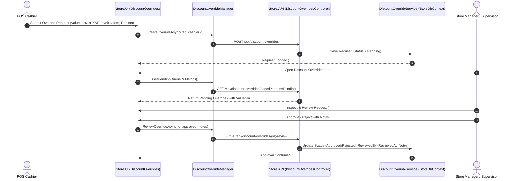
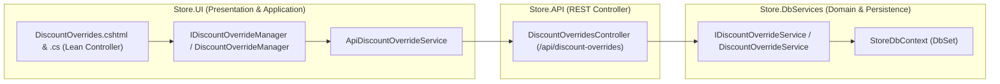

# Discount Overrides Hub — Deep Dive Analysis & Systems Design Report
### Cross-referenced against the Design System Specification, Clean Architecture, and Retail Supervisory Controls
---

## 1. Executive Summary & Current State

The **Discount Overrides Hub** (`/DiscountOverrides`) is the supervisory authorization and fraud-prevention gateway for ClexAn Foods POS operations (EX-FR-3.3 / FRA-1 / MCT-4). When a cashier requires an ad-hoc price reduction or custom markdown beyond standard threshold limits, an override request is created for managerial review:
$$\text{Cashier at POS} \xrightarrow{\text{Override Request (Value, Item/Invoice, Reason)}} \text{Manager Authorization Queue} \xrightarrow{\text{Approve / Reject with Notes}} \text{Authorized Cart Adjustment in XAF}$$

### Current Health Score: ~30%
An audit of the current implementation reveals critical governance, UX, and architectural deficiencies:
1. **Security & Permission Enforcement Gaps**:
   - `DiscountOverridesModel` currently lacks granular permission gates (`PermissionKeys.PricingWrite` vs `PermissionKeys.CashWrite`). Any logged-in user can access the page and trigger the `OnPostReviewAsync` approval endpoint.
2. **Clean Architecture Violations**:
   - `DiscountOverridesModel` directly injects 4 separate domain/infrastructure services (`IDiscountOverrideService`, `IApiClientService`, `IInvoiceService`, `IItemService`) and handles multi-service orchestration inside the UI PageModel.
   - Missing `IDiscountOverrideManager` / `DiscountOverrideManager` in `Store.UI/Services/`.
3. **No KPI Metrics & Unpaged In-Memory Queries**:
   - No KPI summary cards to track pending approvals count, today's approved overrides, rejection rates, or total financial markdown impact.
   - The query `GetAllAsync` returns an unbounded list without pagination or keyword search.
4. **Currency & Financial Valuation Visibility**:
   - Fixed amounts lack standardized **`XAF`** currency labels.
   - No financial impact calculation showing the estimated revenue loss in `XAF` for each override request.
5. **Supervisory Review & Inspection Workflow**:
   - The UI lacks a comprehensive detail inspector modal to review full invoice context, line items, and audit timestamps before making an approval decision.

---

## 2. Gaps & Opportunities Matrix

| Domain | Current Implementation | Identified Gap / Risk | Proposed Architecture & Target State |
|---|---|---|---|
| **Clean Architecture** | UI PageModel injects 4 services directly | Violates Single Responsibility Principle; tight coupling | Introduce `IDiscountOverrideManager` / `DiscountOverrideManager` in `Store.UI/Services/` |
| **Security & Access Control** | No explicit permission checks on PageModel | Unauthorized cashiers can approve their own or peers' overrides | Restrict approvals to `PermissionKeys.PricingWrite` / Managers, while allowing submissions via `PermissionKeys.CashWrite` |
| **KPI Metrics** | None | Managers lack visibility into pending queues and total financial markdown exposure | 4-Card KPI Banner: Pending Queue, Approved Today, Rejected / Blocked, Total Override Impact (XAF) |
| **Search & Pagination** | Unbounded list with basic dropdown | Performance degrades with large volume; no search by cashier or invoice | Server-side paged query with search (cashier, reviewer, item, justification) and status pills |
| **Detail & Review Inspector** | Basic action buttons with small modal | Lack of context on full cart / customer / justification | Modern Review & Inspection Modal showing full invoice context, financial markdown in XAF, and manager notes |
| **Compliance Export** | None | Inability to perform periodic loss-prevention audits | Streaming `📥 Export CSV` for audit compliance |

---

## 3. Systems Design & Workflow Taxonomy

---

## 4. UI/UX Design System Parity

### 4.1 4-Card Interactive KPI Banner
1. **Pending Approval Queue** (`.kpi-icon-box.amber`): Count of urgent pending discount overrides waiting for supervisory review.
2. **Approved Overrides** (`.kpi-icon-box.emerald`): Total overrides approved in the current operating period.
3. **Rejected / Blocked** (`.kpi-icon-box.purple`): Overrides denied or flagged for excessive markdown.
4. **Estimated Valuation Impact** (`.kpi-icon-box.teal`): Total financial discount value granted in **`XAF`**.

### 4.2 Modern Filter Dock & Search Toolbar
- **Search Input**: Live search box filtering by Cashier username, Supervisor reviewer, Item name, Invoice ID, or Justification reason.
- **Status Filter Pills**: Quick filter pills (`All Requests`, `Pending Approvals`, `Approved`, `Rejected`, `Cancelled`).
- **Primary Actions**:
  - `📥 Export CSV`: Download complete discount override audit ledger.
  - `+ New Override Request`: Cashier override submission modal.

### 4.3 High-Density Supervisory Table
- **Request ID & Created Timestamp**: Formatted date & time.
- **Scope & Target Entity**: Whole Invoice badge (`.badge-neutral`) or Product Chip (`.badge-purple`).
- **Requested Markdown**: Formatted as `15% OFF` or `3,500 XAF OFF`.
- **Justification Synopsis**: Cashier's stated business reason.
- **Cashier Chip**: Profile chip with avatar and username.
- **Supervisory Status Badge**: `Pending` (Amber), `Approved` (Emerald), `Rejected` (Red), `Cancelled` (Slate).
- **Reviewer & Notes**: Supervisor name with review timestamp and notes.
- **Action Buttons**:
  - `🔍 Inspect`: Open full review & audit modal.
  - `✅ Approve`: Quick manager approval with optional note.
  - `❌ Reject`: Open rejection modal with mandatory explanation note.
  - `🚫 Cancel`: Requester cancellation.

### 4.4 Interactive Review & Detail Modals
- **New Override Request Modal (`#createOverrideModal`)**:
  - Invoice lookup auto-complete.
  - Product lookup auto-complete.
  - Type (Percentage vs Fixed in **`XAF`**) and Value.
  - Justification textarea.
- **Supervisory Review Modal (`#reviewOverrideModal`)**:
  - Detailed request header with Cashier, Target Item/Invoice, and Stated Justification.
  - Manager Decision: Approve / Reject radio options.
  - Supervisory Notes & Compliance comments.

---

## 5. Clean Architecture Implementation Plan

