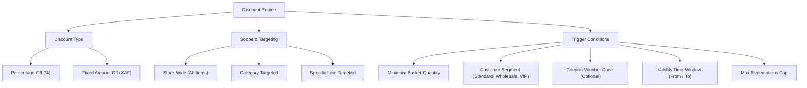
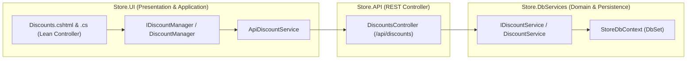

# Discount & Promotional Rules Hub — Deep Dive Analysis & Systems Design Report
### Cross-referenced against the Design System Specification, Clean Architecture, and Retail Pricing Strategy
---

## 1. Executive Summary & Current State

The **Discount Rules Hub** (`/Discounts`) is the strategic pricing and promotional engine of ClexAn Foods. It controls automated price reductions, quantity-based volume breaks, customer segment loyalty pricing, and coupon vouchers:
$$\text{Product / Cart} \xrightarrow{\text{Trigger Conditions (Min Qty, Segment, Coupon)}} \text{Discount Rule Execution} \xrightarrow{\text{Percentage or Fixed XAF Reduction}} \text{Adjusted Line Price in XAF}$$

### Current Health Score: ~35%
A comprehensive audit of the current codebase reveals significant functional, UX, and architectural deficiencies:
1. **Currency Inconsistency**:
   - The current `Discounts.cshtml` explicitly displays legacy Ghanaian Cedi (`GHS @d.FixedAmount`) on line 67 and line 131/192, directly violating the standardized **`XAF`** (Central African CFA franc) currency mandate across ClexAn Foods.
2. **Missing Targeting Selectors in UI**:
   - Although the `Discount` entity and backend support targeting specific items (`ItemId`) and categories (`CategoryId`), the UI modal has NO controls or dropdowns to pick items or categories! All discounts created in the UI are forced to store-wide rules.
3. **Architecture & Clean Separation**:
   - `DiscountsModel` directly interacts with `IDiscountService` and binds flat form properties (`CreateName`, `CreatePercentage`, etc.) rather than using structured request models and an application orchestrator.
   - Missing `IDiscountManager` / `DiscountManager` application service in `Store.UI/Services/`.
4. **Missing KPI Metrics & Server-Side Filtering**:
   - No KPI summary cards to track active rule count, coupon utilization, segment rules, and total redemptions.
   - Missing server-side paged queries, multi-field search (rule name, coupon code, item name, category name), and export capabilities.
5. **No Rule Simulation & Margin Safety Calculator**:
   - Managers cannot simulate discount deductions or preview margin impacts before activating promotional campaigns.

---

## 2. Gaps & Opportunities Matrix

| Domain | Current Implementation | Identified Gap / Risk | Proposed Architecture & Target State |
|---|---|---|---|
| **Currency Standardization** | Hardcoded `GHS` strings in table and modals | Inconsistent currency; breaks financial reporting | Standardize all values and inputs strictly to **`XAF`** |
| **Targeting & Scope UI** | No product or category selectors in modal | Cannot create item-specific or category-specific discounts via UI | Add dynamic item catalog search picker and category dropdown in Create/Edit modals |
| **Clean Architecture** | `DiscountsModel` binds 20+ flat properties and calls domain service directly | Violates SRP; lacks application orchestration | Introduce `IDiscountManager` & `DiscountManager` in `Store.UI/Services/` |
| **KPI Metrics** | None | Store operators have zero visibility into active discount volume and redemption rates | 4-Card Interactive KPI Banner: Active Rules, Coupon Vouchers, Segment Rules, Total Redemptions |
| **Search & Pagination** | In-memory list with only `activeOnly` filter | Poor performance with large rule catalogs; no keyword search | Server-side paged query with search (name, coupon, product), type filter, and segment filter |
| **Simulation & Calculator** | None | Risk of accidental over-discounting or negative margins | Embedded Discount Rule Simulator calculating exact discounts on test quantities/prices |
| **Export & Auditing** | None | No compliance or finance rulebook export | Streaming `📥 Export CSV` for discount rulebook auditing |

---

## 3. Systems Design & Rule Taxonomy

---

## 4. UI/UX Design System Specification Parity

### 4.1 4-Card Interactive KPI Banner
1. **Active Promotional Rules** (`.kpi-icon-box.emerald`): Count of currently active discount rules.
2. **Coupon Vouchers** (`.kpi-icon-box.amber`): Count of active coupon-code campaigns with usage limits.
3. **Segment Loyalty Rules** (`.kpi-icon-box.purple`): Quantity-break and VIP/Wholesale customer tier discounts.
4. **Total Redemptions** (`.kpi-icon-box.teal`): Cumulative times discounts and coupons have been applied at POS.

### 4.2 Modern Filter Dock & Search Toolbar
- **Search Input**: Instant search filtering by Rule Name, Coupon Code, Targeted Item, or Category.
- **Type Filter Pills**: `All Rules`, `Percentage (%)`, `Fixed Amount (XAF)`, `Coupons`, `Auto-Applied`.
- **Segment Dropdown**: Filter by `All Segments`, `Standard`, `Wholesale`, `VIP`.
- **Primary Actions**:
  - `📥 Export CSV`: Download promotional rulebook.
  - `+ New Discount Rule`: Open modern multi-step rule builder.

### 4.3 High-Density Discount Rules Table
- **Rule Name & Scope Badge**:
  - Store-Wide ➔ `.badge-neutral` (Store-Wide)
  - Category ➔ `.badge-teal` (Category: Beverages)
  - Specific Item ➔ `.badge-purple` (Item: Golden Penny Flour)
- **Discount Value**: Bold percentage (`20% OFF`) or formatted currency (`5,000 XAF OFF`).
- **Trigger Conditions**: Min Qty tag (`≥ 3 units`) & Segment chip (`Wholesale`).
- **Coupon Voucher**: Copyable `.code-badge` (e.g. `SAVE20`) or `⚡ Auto-Applied`.
- **Redemption Progress**: Visual utilization tracker (`42 / 100 uses` with progress mini-bar).
- **Validity Window**: Active date range with `Active`, `Expired`, `Exhausted`, or `Inactive` semantic badge.
- **Action Buttons**:
  - `🧮 Simulate`: Test rule against custom prices in real time.
  - `✏️ Edit`: Open modern edit modal.
  - `🗑️ Delete`: Confirm deletion dialog.

### 4.4 Interactive Modals & Rule Simulator
- **Create/Edit Rule Modal (`#createDiscountModal`)**:
  - Rule Name, Type (`Percentage` vs `Fixed Amount`), Value in `%` or **`XAF`**.
  - Target Scope selector: Store-wide vs Category vs Specific Item (with catalog search auto-complete).
  - Minimum Basket Quantity & Customer Segment.
  - Coupon Code (optional), Max Uses cap, and DateTime range picker.
  - Live **Discount Simulation Banner**: Test price input showing exact discount amount in `XAF`.
- **Discount Simulator Modal (`#simulatorModal`)**:
  - Allows cashiers and managers to input an Item Price, Quantity, and Customer Segment to view the discount calculation breakdown and effective unit price.

---

## 5. Clean Architecture Implementation Plan

