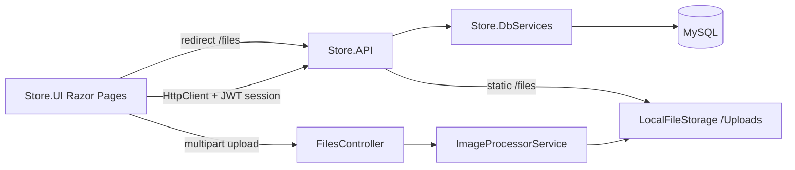

Optimized tool selectionI'll analyze the current codebase structure and key areas covered in those past sessions to build a complete picture.

Explore StoreProject structure

Read 

Read 

Searched for files matching `**/*.{csproj,cshtml,cs}`, 200 matches

Searched for regex `TODO|FIXME|HACK|XXX|NotImplemented|throw new NotImplementedException` (`**/*.{cs,cshtml,js}`), 2 results

Searched for files matching `**/Migrations/**/*.cs`, 25 matches

Searched for regex `ThumbnailUrl|FullImageUrl|ImagePath|ImageProcessor|IFileStorage` (`**/*.{cs,cshtml,js}`), 318 results

Read 

Searched for files matching `**/Store.UI/**/*.{js,css}`, 9 matches

Searched for regex `blade|modal|toast|showToast|openBlade|data-blade|app-blade|app-modal` (`**/Store.UI/**/*.{cshtml,js,css}`), 510 results

Read 

Read , lines 1 to 80

Read 

Read 

Read 

Read 

Read 

Read 

Read 

Read 

Read 

Read 

Read , lines 1 to 80

Read , lines 1 to 200

Read 

Searched for regex `Layout\s*=|ActivePage|operations\.css|showToast|openBlade|modal-overlay|blade|data-bs-toggle` (`**/Store.UI/Pages/**/*.cshtml`), 252 results

Searched for regex `class \w+Controller|\[Http(Get|Post|Put|Delete|Patch)` (`**/Store.API/Controllers/**/*.cs`), 174 results

Read , lines 1 to 80

Read 

Searched for regex `bootstrap|data-bs-|btn btn-|modal fade|ImagePath|WeatherForecast|placeholder|coming soon|not yet|stub|WIP|incomplete` (`**/Store.UI/**/*.{cshtml,cs,js,css}`), 122 results

Read 

Read 

Read 

Read 

Read 

Read 

Read 

Read , lines 48 to 58

No matches found. Your search pattern might be excluded completely by either the search.exclude settings or .*ignore files.
If you believe that it should have results, you can check into the .*ignore files and the exclude setting (here are some excluded patterns for reference:[**/node_modules,**/bower_components,**/*.code-search]).
Then if you want to include those files you can call the tool again by setting "includeIgnoredFiles" to true.

Searched for regex `PostMultipartAsync|class ApiResponse|Ok\(` (`**/Store.UI/Services/**/*.cs`), 3 results

Read 

Read , lines 1 to 100

Read , lines 1 to 50

Searched for regex `StatusMessage|showToast|TempData` (`**/Store.UI/Pages/Shared/**/*.{cshtml,cs}`), 4 results

Read , lines 1 to 50

Searched for files matching `**/Store.UI/Pages/**/*.cshtml`, 42 matches

Read , lines 90 to 150

Searched for regex `data-crop|ImageUpload|AvatarUpload` (`**/Store.UI/Pages/**/*.{cshtml,cs}`), 39 results

Read , lines 1 to 80

Read 

Ran terminal command: git log --oneline -25 ; git status -sb

Optimized tool selection

Read 

Ran terminal command: git log --oneline -20; Write-Host "---"; git status -sb; Write-Host "---"; git branch -v

# StoreProject — Full Context Analysis

Synthesized from the current codebase plus your past sessions (SRS features, UI/UX refactor, image pipeline, employee edit, POS/checkout, Docker/CI).

---

## 1. Architecture

| Project | Role |
|---------|------|
| Store.API | REST API, JWT, file/image infra, middleware |
| Store.UI | Razor ops console (BFF); no direct DB |
| Store.Models | Entities, DTOs, interfaces |
| Store.DbServices | EF Core/MySQL, services, migrations, seed |
| Store.API.Tests | Middleware/security tests mainly |

**Pattern:** UI → `Api*Service` → API → domain services → MySQL.

---

## 2. What is solid and done

### Core retail ops
- Auth (username/email/phone), JWT, permissions, role matrix  
- Users, employees, customers, catalog, invoices, POS  
- Inventory ops, batches, stock transfers, wastage  
- Pricing, discounts, overrides, loyalty/campaigns  
- Cash shifts/Z-report, reconciliation  
- Branches, payments (MoMo/Orange scaffolding)  
- Landing page + Fluent-style CSS tokens/components  

### Features from this Copilot thread
- **EX-FR-1.1 Suppliers** — CRUD + multi contact create/edit + modal reset  
- **EX-FR-1.2 Purchase Orders** — full lifecycle API + UI  
- **EX-FR-5.2 Cash Variance** — record/review API + UI  
- Migration `AddPurchaseOrdersAndCashVariance` present  

### Image pipeline (from past sessions)
- Dual URLs: `ThumbnailUrl` + `FullImageUrl` (migration `ImageProcessingUpdate`)  
- Client compress (WebP) + CropperJS crop  
- Server ImageSharp: thumb 200×200, full max 800×800, EXIF strip  
- Upload folders: `users`, `employees`, `customers`, `items`, `categories`  
- UI `/files` → API redirect proxy  
- Profile avatar + crop fixes committed (`0705ec6`, `2283621`, `f706129`)  

### UI/UX refactor (partial)
- Blades, toasts, empty states, `components.css`  
- POS blade checkout path; antiforgery header support  
- EF retry strategy wrap for invoice/order transactions  

**Latest commit:** `f706129` — global responsive image viewer  
**Working tree:** clean except StoreProject.code-workspace modified  

---

## 3. Highest-impact problems (prioritized)

### P0 — Likely broken today

| Issue | Why it matters |
|-------|----------------|
| **File upload response shape** | API returns nested `ApiResponse.data.{thumbnailUrl,fullImageUrl}`; `ApiFileService` may bind flat top-level → silent null URLs (matches “profile image didn’t update”) |
| **Bootstrap modals without Bootstrap** | `CashVariance`, `DiscountOverrides` use `data-bs-*` / `modal fade`; `_AppLayout` does **not** load Bootstrap → Review/Record modals likely dead |
| **Duplicate “Purchase Orders” nav** | `/Orders` (legacy `IOrderService`) vs `/PurchaseOrders` (new workflow) — same label, different systems |

### P1 — UX / consistency

| Issue | Detail |
|-------|--------|
| **Toast only auto-wired on `_Layout`** | Most pages use `_AppLayout` → still banner/`TempData`, not `showToast` |
| **Mixed modal systems** | Blade / custom overlay / Bootstrap / Suppliers custom blades |
| **GUID paste UX** | PO, CashVariance, Batch, Transfers, Loyalty still want raw GUIDs |
| **Suppliers images** | Entity has thumb/full; **UI has no upload** |
| **`data-open-blade` not global** | Each page reimplements open; only close is global in `site.js` |
| **Deactivated items / empty lists** | Past bug reports: lookup/employees data display, inactive catalog visibility — partially addressed; worth re-verify |

### P2 — Cleanup
- Scaffold leftovers (`WeatherForecast`, `_Host` remnants)  
- `UserService` path still throwing `NotImplementedException` in one branch  
- Seeder typos / legacy `img/*` paths vs `/files/...`  
- Duplicate CSS (`.modal-overlay` in components + operations)  
- Button class drift (`button-primary` vs `btn btn-primary`)  

---

## 4. Page / UI pattern map (current)

| Pattern | Pages |
|---------|--------|
| **Blade** | POS, Orders, Suppliers, PurchaseOrders, StockTransfers (part), Wastage, Users |
| **Custom modal overlay** | Catalog, Customers, Employees, Campaigns, Discounts, Batch, Lookup, Invoices… |
| **Bootstrap modal (fragile)** | CashVariance, DiscountOverrides |
| **Image crop upload** | Profile, Users, Employees, Customers, Catalog, Lookup(categories) |
| **No image UI** | Suppliers (despite model support) |

---

## 5. Nav reality (`_AppLayout`)

- **Store:** Dashboard, POS, Catalog, Customers, Invoices, **Purchase Orders → `/Orders`**, Suppliers, Loyalty, Campaigns, Profile  
- **Ops (permissioned):** Employees, Inventory, Batch, Transfers, Wastage, **Purchase Orders → `/PurchaseOrders`**, Audit, Discounts, Pricing, Cash, Reconciliation, **Cash Variance**, Payments  
- **Admin:** Branches, Users, Lookup, Role Matrix  

So PO appears twice under different routes — intentional historically, confusing now.

---

## 6. SRS expansion status (section 10)

| ID | Feature | Status |
|----|---------|--------|
| EX-FR-1.1 | Supplier master + contacts | **Done** (no image UI) |
| EX-FR-1.2 | PO + GRN-style receive | **Done** backend/UI; GUID UX weak |
| EX-FR-1.3 | Landed cost | Not started |
| EX-FR-1.4 | Supplier KPIs | Not started |
| EX-FR-2.x | Warehouse bins / handheld count | Partial (transfers only) |
| EX-FR-3.x | Advanced promos | Partial (discounts/campaigns) |
| EX-FR-4.x | Loyalty deep | Partial |
| EX-FR-5.1 | Day-end recon | Page exists |
| EX-FR-5.2 | Cash variance | **Done** API; **UI modals likely broken** |
| EX-FR-5.3–5.4 | OHADA/tax packs | Not started |
| EX-FR-6.x | Multi-entity | Branches only |

Core FR-1…FR-10 largely implemented; expansion modules mixed.

---

## 7. Past session → current code mapping

| Session theme | Outcome in repo |
|---------------|-----------------|
| Employee edit broken (`@Html.Raw` JSON in onclick) | Fix pattern applied on several pages; still watch JSON-in-attribute pages |
| UI/UX overhaul | tokens/components/blades/toasts/empty states; not fully normalized |
| POS 400 checkout | Antiforgery header + EF execution strategy |
| Image dual-URL + crop | Implemented + committed; upload deserialize risk remains |
| Landing page | `Index` + `_LandingLayout`; `_Host` route conflict fixed |
| Docker/CI | Present under .github / compose |
| PO + CashVariance + Suppliers (this thread) | Backend + UI present; polish/nav/modals incomplete |

---

## 8. Recommended next work (when you say go)

**Stabilization first (recommended):**
1. Fix `ApiFileService` ↔ `FilesController` response contract  
2. Convert CashVariance (and DiscountOverrides) off Bootstrap → project modal/blade  
3. Collapse nav: one Purchase Orders entry → `/PurchaseOrders`; deprecate or relabel `/Orders`  
4. Wire TempData → `showToast` on `_AppLayout`  
5. Smoke-test Employees/Lookup/Catalog/Profile image + edit after hard refresh  

**Then product:**
6. Supplier image upload  
7. Dropdown/search pickers instead of GUIDs on PO / variance / transfers  
8. Next SRS item (e.g. EX-FR-1.3 landed cost or warehouse depth)

---

## 9. Mental model for continuing

You have a **working modular monolith** with:
- Strong API surface and MySQL schema  
- A UI mid-migration (Fluent blades + leftover Bootstrap + dual PO pages)  
- An image stack that is architecturally right but may still fail at the last mile (response binding + layout toast parity)

I have full context now. Tell me which track to execute:

1. **Stabilize** (upload + CashVariance modals + PO nav)  
2. **Next SRS feature**  
3. **Finish UI/UX normalization** on remaining pages