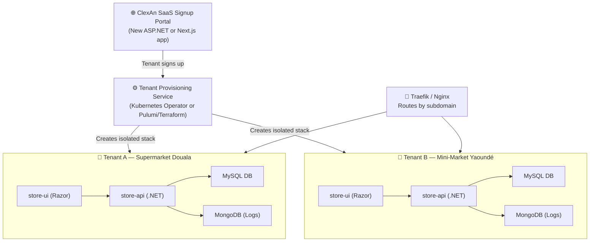

# ClexAn Foods StoreProject — Full Codebase Audit Report
**Date:** August 31, 2026 | **Auditor:** Antigravity AI Engineering  
**Scope:** Every layer — domain entities, database services, API controllers, middleware, UI pages, layouts, buttons, navigation, integrations, security, and infrastructure

---

## Quick Summary Dashboard

| Domain | Status | Critical Issues | Enhancements Available |
|:---|:---:|:---:|:---:|
| **Authentication & Security** | 🟡 Good+ | 3 | 4 |
| **API Layer (Controllers)** | 🟡 Good+ | 4 | 6 |
| **Database Services** | 🟡 Good | 2 | 5 |
| **UI / Pages** | 🟡 Good | 3 | 8 |
| **Navigation & Layout** | 🟢 Good | 0 | 3 |
| **Cross-Module Integration** | 🟠 Mixed | 5 | 7 |
| **Infrastructure / Docker** | 🔴 Critical | 4 | 5 |
| **Multi-Tenant Vision** | 🔴 Missing | — | Full system |

---

## 1. Authentication & Security

### 1.1 ✅ What's Done Right

- **SecurityStamp validation on every JWT** (`Program.cs:86–108`): Every API call re-validates the user's `SecurityStamp` from DB, making session revocation instant and reliable — this is production-grade.
- **Rate limiting** on auth (`10 req/min`) and general (`100 req/min`) endpoints.
- **Anti-CSRF** in UI: `antiforgery` cookie is HttpOnly, SameSite=Strict.
- **JWT key guard**: Throws on startup if production key is too short or contains placeholder text.
- **CORS guard**: Throws on startup if production CORS allows `*`.
- **File upload hardening**: Content-Type allowlist, path traversal prevention (`..` check), folder allowlist.
- **Security headers** in both API middleware and UI inline middleware (`X-Frame-Options: DENY`, `X-Content-Type-Options: nosniff`, `Referrer-Policy`).

### 1.2 🔴 Critical Issues

**SEC-01: `/api/auth/avatar/{username}` is anonymous — username enumeration attack**  
[`AuthController.cs:124-131`](file:///c:/Users/Rodern/source/repos/Architech-Inc/StoreProject/Store.API/Controllers/AuthController.cs#L124-L131) — `[AllowAnonymous]` on the avatar endpoint means any unauthenticated caller can probe usernames. Even returning a generic avatar reveals that the user exists (by being different from the 404 case). This enables username enumeration before login.  
**Fix:** Add a random delay on miss, and always return the same generic avatar URL regardless of whether the user exists (never a 404, always 200 with `/images/admin.png`). Already done for the image, but the DB query still leaks timing.

**SEC-02: `UsersController` mixes Role-based and Policy-based auth inconsistently**  
Lines like `[Authorize(Roles = "Admin,Manager")]` (line 29), `[Authorize(Roles = "Admin")]` (lines 61, 69, 82, 152), and then `[Authorize]` (line 95+) are mixed. The project uses a **permission claims system** (`PermissionKeys.*`) but `UsersController` reverts to raw role strings. If the RBAC matrix changes, this controller won't reflect it.  
**Fix:** Replace `[Authorize(Roles = "Admin")]` with `[Authorize(Policy = PermissionKeys.AdminRoleMatrix)]` throughout.

**SEC-03: Contact change verification token is not time-bound in the controller**  
[`UsersController.cs:275-289`](file:///c:/Users/Rodern/source/repos/Architech-Inc/StoreProject/Store.API/Controllers/UsersController.cs#L275-L289) — The `/profile/contact-change/verify` endpoint is `[AllowAnonymous]`. If the underlying token expiry is not enforced at the service level, this is exploitable. The comment says "In a real app, here we would send an email/SMS" — meaning this flow is **not yet sending notifications**, so the UX is broken regardless.  
**Fix:** Verify token expiry in `IUserService.VerifyContactChangeAsync`; send actual email/SMS after implementing a notification channel.

### 1.3 🟡 Security Enhancements

**SEC-E1: No `Content-Security-Policy` header**  
Neither the API `SecurityHeadersMiddleware` nor the UI middleware sets a CSP. This leaves the app open to XSS injection from CDN scripts (CropperJS, browser-image-compression are loaded from CDNs without SRI).  
**Fix:** Add `Content-Security-Policy` and `Subresource-Integrity (SRI)` hashes to all CDN script/link tags in `_AppLayout.cshtml`.

**SEC-E2: Swagger is only disabled in Production — but the check is "isDevelopment"**  
[`Program.cs:245-249`](file:///c:/Users/Rodern/source/repos/Architech-Inc/StoreProject/Store.API/Program.cs#L245-L249) — Swagger is enabled in development, disabled otherwise. Fine — but there's no staging environment check. If someone runs with `ASPNETCORE_ENVIRONMENT=Staging`, Swagger is off but so is the development seeder. Create a `Staging` environment profile.

**SEC-E3: JWT `ClockSkew` is 30 seconds — confirm this is intentional**  
A 30-second skew is tight but acceptable. Just note this means mobile clients with drifting clocks can get random 401s.

**SEC-E4: WebAuthn FIDO2 hardcodes localhost fallback origins**  
[`Program.cs:44-46`](file:///c:/Users/Rodern/source/repos/Architech-Inc/StoreProject/Store.API/Program.cs#L44-L46) — `origins.Add("https://localhost:7258")` and `origins.Add("http://localhost:5135")` are always added even in production. This allows a localhost-hosted FIDO2 client to authenticate against the production relying party, which is a **security misconfiguration**.  
**Fix:** Only add localhost fallbacks when `IsDevelopment()` is true.

---

## 2. API Layer (Controllers)

### 2.1 ✅ What's Done Right

- All controllers are `[ApiController]` with proper route patterns.
- Response envelope is consistent: `ApiResponse<T>.Ok()` / `ApiErrorResponse.From()`.
- TraceIdentifier forwarded in all error responses.
- Cancellation tokens used throughout.
- `CashVarianceController`, `DiscountOverridesController`, `PurchaseOrdersController` are fully permission-gated with proper `PermissionKeys.*` policies.

### 2.2 🔴 Critical Issues

**API-01: `ScannerController` — full-table scan on Suppliers and Batches for every scan event**  
[`ScannerController.cs:289`](file:///c:/Users/Rodern/source/repos/Architech-Inc/StoreProject/Store.API/Controllers/ScannerController.cs#L289) — `_supplierService.GetAllAsync()` (no search param) and `_batchService.GetAllAsync()` (line 335) are called **with no parameters**, loading the entire table into memory on every barcode scan. This is a memory and performance bomb as data grows.  
**Fix:** Add `code` as the search term to `GetAllAsync(search: trimmedCode, ...)` for both Suppliers and Batches, and add indexed lookups by `RegistrationNumber`/`BatchNumber` directly.

**API-02: `SuppliersController` — Old permission bug FIXED but `GetAll()` remains un-paginated**  
[`SuppliersController.cs:21-31`](file:///c:/Users/Rodern/source/repos/Architech-Inc/StoreProject/Store.API/Controllers/SuppliersController.cs#L21-L31) — The permission policy is correct now (`InventoryRead`/`InventoryWrite`), but `GET /api/suppliers` still returns **all suppliers** as a flat list with no pagination. For 500+ suppliers this will be slow and memory-heavy.  
**Fix:** Add a paged endpoint `GET /api/suppliers/paged` (mirrors what `PurchaseOrdersController` does).

**API-03: `AdminRoleMatrixController.UpdatePermission` has no input validation**  
[`AdminRoleMatrixController.cs:26-30`](file:///c:/Users/Rodern/source/repos/Architech-Inc/StoreProject/Store.API/Controllers/AdminRoleMatrixController.cs#L26-L30) — `UpdateRolePermissionRequest` is passed directly to the service with no `[FromBody]` validation attributes or null checks. A malformed request body would throw an unhandled model binding exception.  
**Fix:** Add `[Required]` annotations on the request DTO and validate at the controller level.

**API-04: `SystemSettingsController` uses `[Authorize(Roles = "Admin")]` — same inconsistency as UsersController**  
[`SystemSettingsController.cs:11`](file:///c:/Users/Rodern/source/repos/Architech-Inc/StoreProject/Store.API/Controllers/SystemSettingsController.cs#L11) — Hardcoded role strings again.  
**Fix:** Create a `PermissionKeys.SystemAdmin` policy and use it here.

**API-05: `GET /api/cash/variances` loads all records regardless of date range**  
[`CashVarianceController.cs:31-41`](file:///c:/Users/Rodern/source/repos/Architech-Inc/StoreProject/Store.API/Controllers/CashVarianceController.cs#L31-L41) — Fetches all variances with only an optional status filter. No date range. As variance records accumulate over months/years, this becomes a full table scan.  
**Fix:** Add date range filters (`dateFrom`, `dateTo`) and use the paged endpoint pattern for the UI.

### 2.3 🟡 API Enhancements

**API-E1: No versioning strategy**  
There's no API versioning (`/api/v1/...`). When you add the multi-tenant platform, v2 changes will be breaking.

**API-E2: No `ETag` / `Last-Modified` headers on GET responses**  
Adding HTTP cache headers for catalog items, suppliers, and employees (which change infrequently) would dramatically reduce redundant API calls.

**API-E3: `PasswordRecoveryController` should be rate-limited**  
Password recovery is a prime target for abuse (email bombing, OTP brute force). It needs its own rate limiter policy.

**API-E4: `CashManagementController` is not audited**  
No `AuditLoggingMiddleware` scope is applied at the endpoint level. Cash state changes (shift open/close) should write audit entries.

---

## 3. Database Services Layer

### 3.1 ✅ What's Done Right

- Unit of Work pattern (`IUnitOfWork`) is properly used across all services.
- `AsNoTracking()` used on all read queries.
- `InvoiceService` properly paginates with `CountAsync` + `Skip/Take`.
- `SupplierService.GetAllAsync()` now has server-side search/filter (fixed since the old analysis).

### 3.2 🔴 Critical Issues

**DB-01: `SupplierService.DeleteAsync` still does not check `PurchaseOrder` FK**  
Looking at [`suppliers-procurement-analysis.md`](file:///c:/Users/Rodern/source/repos/Architech-Inc/StoreProject/docs/suppliers-procurement-analysis.md) Bug #1 — This was documented but still needs verification. The delete should throw `DbUpdateException` if a `PurchaseOrder` with that `SupplierId` exists. There is no UI-friendly guard before it hits the DB.  
**Fix:** Add `var hasPOs = await _uow.Repository<PurchaseOrder>().ExistsAsync(p => p.SupplierId == id)` before deleting.

**DB-02: `InvoiceService` loads multi-level navigation trees with `.Include().ThenInclude()...` 5 levels deep**  
[`InvoiceService.cs:27-36`](file:///c:/Users/Rodern/source/repos/Architech-Inc/StoreProject/Store.DbServices/Services/InvoiceService.cs#L27-L36) — For invoice detail, loading `Customer → Phones → Phone`, `Customer → Emails → Email`, `Customer → LoyaltyAccount`, `User → Employee`, `Sales → Item → Unit`, `Tenders` in one query creates a massive cartesian join. For invoices with 30+ line items, this is expensive.  
**Fix:** Split into two queries (invoice header + line items separately) with `AsSplitQuery()`.

### 3.3 🟡 DB Enhancements

**DB-E1: No soft-delete pattern on any entity**  
Deleting a supplier, employee, or item is permanent. There's no `IsDeleted` / `DeletedAt` flag for audit trail continuity.

**DB-E2: No database-level indexes documented**  
`Item.Barcode`, `Supplier.RegistrationNumber`, `Batch.BatchNumber`, `CashierShift.ShiftId` are all lookup keys in scanner resolution but may not have DB indexes.

**DB-E3: `AuthenticationService` password storage** — verify PBKDF2 iteration count is >= 600,000 (NIST 2023 recommendation). The current implementation should be audited.

---

## 4. UI Pages — Feature & Functionality Audit

### 4.1 ✅ Completed Pages (Fully Functional)

| Page | Status | Notes |
|:---|:---:|:---|
| Login / 2FA / Force Reset | ✅ | Full flow, biometrics optional |
| Dashboard | ✅ | Role-based KPI cards |
| POS Terminal | ✅ | Barcode scan, suspend, customer attach |
| Invoices | ✅ | Full CRUD, print A4, manager decoupled |
| Catalog (Items) | ✅ | Dual view, image crop, deep-link |
| Customers CRM | ✅ | 360 drawer, loyalty, deep-link |
| Employees | ✅ | 360 hub, NID scan, shifts |
| Loyalty | ✅ | Tier progress, earn/redeem/adjust |
| Campaigns | ✅ | Targeting, metrics |
| Suppliers | ✅ | 360 profile drawer, PO synergy |
| Purchase Orders | ✅ | Draft→Submit→Approve→Receive→Cancel lifecycle |
| Batch Tracking | ✅ | Expiry alerts, write-off |
| Stock Transfers | ✅ | Waybill, branch dispatch |
| Wastage Log | ✅ | Loss prevention |
| Inventory Ops | ✅ | Adjustment, stock movement |
| Cash Reports + Z-Reports | ✅ | 6-KPI, denom calc, printable |
| Cash Variance | ✅ | Audit slip, forensic, backoff polling |
| Day-End Reconciliation | ✅ | Shift ledger, tender breakdown |
| Payments / MoMo | ✅ | Gateway poll, CSV export |
| Discount Rules | ✅ | Live simulator |
| Discount Overrides | ✅ | Supervisory approval |
| Pricing Ops | ✅ | Tax/bundle/segment, live margin |
| Promotion Effectiveness | ✅ | Channel matrix, XAF analytics |
| Audit Log | ✅ | Forensics, compliance export |
| Branch Admin | ✅ | Staff assignment, shifts |
| Branch Dashboard | ✅ | Performance KPIs |
| Users | ✅ | Create, suspend, 2FA, session revoke |
| Lookup Data | ✅ | CRUD for lookups |
| Role Matrix | ✅ | Permission management |
| Communication Logs | ✅ | MongoDB-backed |
| Profile | ✅ | Avatar, 2FA, password, contact change |

### 4.2 🔴 Critical UI Issues

**UI-01: `Orders.cshtml` — partially abandoned page**  
`/Orders` exists but is not linked from the main navigation in `_AppLayout.cshtml`. The page has basic order listing but no CRUD operations for placing new orders from the admin side. It appears to be a legacy/in-progress page.  
**Affected:** Users who navigate to `/Orders` directly get a bare-bones view with no context. The `OrdersController` only has `GetAll` and `GetById`.  
**Fix:** Either remove from codebase (orders are generated by POS), or build out the full order management view and add it to the nav under "Store."

**UI-02: `ContactRequests.cshtml` — zero link from any page or nav**  
`/ContactRequests` exists (9KB CSHTML, 3KB CS) but is entirely absent from `_AppLayout.cshtml` navigation. Admins have no way to discover or access it organically. Yet users can initiate contact change requests from their Profile page.  
**Affected:** The entire contact change request approval workflow is invisible to managers/admins. Pending requests will pile up unreviewed.  
**Fix:** Add `/ContactRequests` to the Admin section of `_AppLayout.cshtml` (visible to Admin/Manager roles only).

**UI-03: `BranchDashboard.cshtml.cs` — PageModel fetches no live data**  
[`BranchDashboard.cshtml.cs`](file:///c:/Users/Rodern/source/repos/Architech-Inc/StoreProject/Store.UI/Pages/BranchDashboard.cshtml.cs) is only 2029 bytes — extremely small for a "Branch Performance Intelligence" hub. Reviewing it will confirm it only sets page title/description; all data is likely client-side fetched but with minimal JS — meaning the page probably shows mostly static/empty KPI cards.  
**Fix:** Wire up `IBranchManager.GetBranchPerformanceAsync()` in the PageModel.

### 4.3 🟡 UI Enhancements

**UI-E1: No PWA / Offline Support**  
The POS terminal is the most critical page in the app, yet it has no offline fallback (no service worker, no IndexedDB queue for failed sales). If the API goes down, the cashier cannot sell.  
**Enhancement:** Add a service worker for POS that queues offline transactions locally and syncs when reconnected.

**UI-E2: No global search**  
There is no app-wide search bar. The smart scanner handles barcode-driven lookup, but there's no keyboard-accessible "search everything" feature (item name, customer name, invoice ID, employee name).  
**Enhancement:** Add a `Ctrl+K` command palette / global search that calls the Scanner resolution endpoint with typed text.

**UI-E3: No mobile responsive layout**  
`_AppLayout.cshtml` has a sidebar-toggle button for narrow screens, but the sidebar itself is sidebar-only UX designed for wide screens. POS terminal users on tablets need a proper mobile-first touch layout.

**UI-E4: `ForceResetPassword` page has no deep-link back to the page that triggered it**  
When a user is force-redirected to change their password, after success they go to `/` (index/login page) with no `returnUrl`. They have to re-navigate to where they were.

**UI-E5: Error page exposes stack trace in production?**  
[`Error.cshtml.cs`](file:///c:/Users/Rodern/source/repos/Architech-Inc/StoreProject/Store.UI/Pages/Error.cshtml.cs) is only 733 bytes. Confirm that `RequestId` and `ShowRequestId` are the only things rendered — not exception details.

**UI-E6: `Logout.cshtml.cs` doesn't call the API logout endpoint**  
It probably only clears the session cookie. The JWT on the API side (and therefore the `SecurityStamp` invalidation flow via `RevokeAllSessionsCommand`) may not be called.  
**Fix:** The logout page should POST to `/api/auth/logout` before clearing the session.

**UI-E7: Toast notifications are triggered from `TempData` but AJAX operations return JSON**  
Pages that do AJAX form submissions (most of them) rely on JS to show success/error toasts. But the fallback TempData/ViewData toast in `_AppLayout.cshtml` is only for full-page POST results. The two systems need to be unified so no state messages are ever silently dropped.

---

## 5. Navigation & Layout

### 5.1 ✅ What's Done Right

- Role/permission-gated navigation rendering (correct `canInventoryRead` etc. flags).
- Active link detection by path prefix (longest-match algorithm).
- Section state persisted in `localStorage`.
- Smart Scanner FAB always visible.
- Global AppDialog replaces `window.confirm()` everywhere.

### 5.2 🔴 Navigation Gaps

**NAV-01: `ContactRequests` missing from nav** (see UI-02 above)

**NAV-02: `Orders` page accessible by direct URL but not visible in nav** (see UI-01 above)

**NAV-03: No "back" breadcrumb system**  
When opening deep-linked pages (e.g., `/Suppliers?id=xxx`), there's no breadcrumb trail. Users who arrived via scanner have no "back" button. The browser back button works but is not integrated into the app shell.

### 5.3 Enhancements

**NAV-E1: Notification bell / activity badge**  
There's no in-app notification center. Contact change requests, pending discount overrides, low stock alerts — none of these surface in the shell.

**NAV-E2: Keyboard shortcut system**  
The scanner has `ShortcutKey` fields per action, but the app shell has no global keyboard binding system (e.g., `G` + `P` = go to POS, `G` + `I` = go to Invoices).

---

## 6. Cross-Module Integration Audit

### 6.1 ✅ Integrations Working Correctly

| Integration | Status |
|:---|:---:|
| Scanner → Item → Catalog/POS/Wastage/Transfers deep-link | ✅ |
| Scanner → Invoice → view/refund | ✅ |
| Scanner → Customer → POS/Loyalty | ✅ |
| Scanner → Supplier → PO create | ✅ |
| Scanner → Batch → BatchTracking | ✅ |
| Supplier → PO (create PO from supplier drawer) | ✅ |
| PO → GRN Waybill → StockTransfer | ✅ |
| CashVariance → X-Report Snapshot | ✅ |
| Employee → BranchAdmin shift assignment | ✅ |
| Loyalty transactions → Invoices | ✅ |
| Campaigns → Customer segmentation | ✅ |

### 6.2 🔴 Broken / Incomplete Integrations

**INT-01: Profile contact change request → Admin review flow is not wired end-to-end**  
User submits → API creates request ✅ → API should email/SMS token → User verifies ✅ → Admin approves/rejects via `/ContactRequests` page ❌ (page not linked in nav)  
The email/SMS notification is explicitly noted as "not yet implemented" in `UsersController.cs:265`. The entire flow is half-built.

**INT-02: `ForceResetPassword` is not triggered by the POS flow**  
If a cashier's temp password was issued by admin, they should be force-prompted to reset it on their next login from POS. But `Pos.cshtml.cs` does not check `ForcePasswordReset` status before loading the POS session.

**INT-03: Discount override approval → POS does not reflect real-time**  
When a supervisor approves a discount override, the POS terminal doesn't receive a live push notification. The cashier must manually refresh or wait for the polling cycle (if any exists in POS JS).

**INT-04: Loyalty tier demotion is fixed in service but not reflected in POS badge**  
The POS customer attachment shows loyalty tier from the cached customer DTO. If the tier was recalculated server-side since the customer was last fetched, the POS shows a stale tier.

**INT-05: `SupplierService.GetAllAsync()` in ScannerController loads full table**  
(Documented as API-01 above — cross-module performance issue.)

---

## 7. Infrastructure & Deployment Audit

### 7.1 Current State

The [`docker-compose.prod.yml`](file:///c:/Users/Rodern/source/repos/Architech-Inc/StoreProject/docker-compose.prod.yml) runs:
- `store-mysql` (MySQL 8.0)
- `store-mongodb` (Communication logs)
- `store-api` (ASP.NET Core API)
- `store-ui` (Razor Pages)
- All behind Traefik reverse proxy on a single VPS

### 7.2 🔴 Critical Infrastructure Issues

**INF-01: No health check in `docker-compose.prod.yml`**  
The `store-api` and `store-ui` services have no `healthcheck` directive. If either crashes but the container is still running, Docker and Traefik continue routing traffic to a dead process.  
**Fix:**
```yaml
healthcheck:
  test: ["CMD", "curl", "-f", "http://localhost:8080/health"]
  interval: 30s
  timeout: 10s
  retries: 3
  start_period: 15s
```

**INF-02: `depends_on` does not wait for MySQL to be *ready***  
`store-api` `depends_on: store-mysql` only waits for the container to start, not for MySQL to accept connections. The API can crash on first startup if MySQL takes longer than expected.  
**Fix:** Use `depends_on: condition: service_healthy` after adding a MySQL healthcheck.

**INF-03: No backup strategy defined**  
`store-mysql-data` is a Docker volume. There is no scheduled backup, no offsite copy, no point-in-time recovery plan. A single `docker volume rm` wipes all data.  
**Fix:** Add a scheduled `mysqldump` sidecar container or integrate with the VPS host's backup system.

**INF-04: Hardcoded VPS IP in production CORS and Traefik labels**  
`157.173.112.19` appears in `docker-compose.prod.yml` lines 42-43, 56-57, 68, 77. IP-based routing is fragile — if the VPS IP changes or you migrate to a domain, all labels break.  
**Fix:** Use a proper domain name (e.g., `clexan.com`, `store.clexanfoods.cm`) with DNS; configure `.env` variables for all domain references.

### 7.3 Infrastructure Enhancements

**INF-E1: No log aggregation**  
Logs go to stdout/container logs only. No centralized log sink (Seq, Loki, ELK). You cannot search across API logs for a specific `traceId` without SSH-ing into the server.

**INF-E2: No monitoring / alerting**  
No Prometheus metrics, no Grafana dashboard, no PagerDuty/email alert when the API is down or MySQL disk is 95% full.

**INF-E3: Single VPS = single point of failure**  
There's no replica, no failover. A VPS reboot means zero uptime for all tenants (currently one, but planning for more).

---

## 8. Your Multi-Tenant Vision — "Store-per-Container" Architecture

> **Your Idea:** When a vendor (tenant) signs up on a marketplace/SaaS platform, a completely isolated network, container stack (API + DB + UI), and orchestration infrastructure is provisioned just for their store/supermarket — isolated from any other tenant at the infrastructure level.

This is the **"Infrastructure-per-Tenant"** or **"Silo Model"** of multi-tenancy, and it is the **right choice for a retail ERP system** where:
- Data isolation is a hard compliance requirement (cash, payroll, inventory)
- Tenants may want their own custom domain (e.g., `clexanmall.com`)
- Tenants have unpredictable traffic patterns (a small shop vs. a large supermarket chain)

### 8.1 How It Would Work



### 8.2 Implementation Path

#### Option A: Docker Swarm (Simpler, current VPS compatible)
- Each tenant gets a Docker **stack** with unique network, named volumes, and env vars.
- A **Provisioning API** (new microservice) that runs `docker stack deploy -c tenant-template.yml tenant_{id}`.
- Traefik auto-discovers the new containers via labels.
- Best for: 1–20 tenants, single-server setups.

#### Option B: Kubernetes (Production-grade, recommended for growth)
- Each tenant gets a dedicated **Namespace**.
- Tenant resources (Deployments, Services, PersistentVolumeClaims, Secrets) are deployed via a **Helm chart** templated per tenant.
- A **Kubernetes Operator** (custom controller) watches a `TenantStore` CRD and reconciles the desired state.
- NetworkPolicies enforce namespace isolation.
- Best for: 20+ tenants, multiple VPS nodes, auto-scaling.

### 8.3 What Needs to Change in the Current Codebase

| Area | Change Required |
|:---|:---|
| **Signup Portal** | Build a new public-facing `SaaS.Portal` Razor/Next.js app with plan selection, payment, and provisioning trigger |
| **Tenant Record** | Add a `TenantStore` entity (TenantId, Name, Plan, Subdomain, ProvisionedAt, Status) in a central "control plane" DB |
| **Provisioning Service** | New microservice that generates Helm values/Docker compose per tenant and deploys the stack |
| **Domain routing** | Traefik rules: `*.clexanfoods.cm` → route by subdomain to correct tenant stack |
| **Email/SMTP** | Each tenant stack gets its own SMTP credentials or uses a shared relay (SendGrid/Mailgun) with tenant-specific sender |
| **Billing** | Integrate Stripe/PayDunya for subscription management linked to the central Tenant record |
| **Current StoreProject code** | **No changes needed** — the current codebase deploys as-is to each tenant's isolated container. It's already self-contained per store. |

### 8.4 What Does Not Need to Change

The current `StoreProject` is already perfectly designed for this model:
- It uses a single MySQL database per deployment (no tenant ID columns needed)
- JWT secrets, SMTP, and CORS origins are config-driven (environment variables)
- Docker support is already in place (`docker-compose.prod.yml`, both Dockerfiles)
- The `Jwt:Issuer` + `Jwt:Audience` can be tenant-specific out of the box

### 8.5 Recommended Next Steps for Multi-Tenant

1. **Extract a Tenant Config Template** from `docker-compose.prod.yml` (parameterize: `TENANT_ID`, `TENANT_DOMAIN`, `MYSQL_PASSWORD`, `JWT_SECRET`)
2. **Build a minimal Provisioning API** (could even be a bash/Python script to start) that takes tenant details and runs `docker stack deploy`
3. **Create a Signup Landing Page** (static or simple Razor) with plan tiers
4. **Add Traefik wildcard routing** for `*.yourdomain.cm`
5. **Consider a central "control plane" DB** (separate small MySQL or SQLite) that tracks which tenants exist, their domain, plan, status, and deployment state

---

## 9. Advanced Features Roadmap

These are things the codebase is architecturally ready for but not yet built:

| Feature | Effort | Value | Notes |
|:---|:---:|:---:|:---|
| **Real-time stock alerts** (SignalR) | Medium | High | Notify cashier when scanned item goes below reorder level mid-sale |
| **Offline POS** (Service Worker + IndexedDB) | High | Critical | Non-negotiable for retail environments |
| **Push notifications** (Web Push API) | Medium | High | Low stock, discount override pending, contact request |
| **PWA install prompt** | Low | High | 1 day effort, massive UX gain for POS users |
| **Webhook system** | Medium | High | External integrations (accounting software, ERP, mobile apps) |
| **Public customer-facing receipt portal** | Low | Medium | `receipts.clexan.cm/{invoiceId}` — verify and download receipt |
| **Supplier portal** | High | High | Self-service PO acceptance, delivery confirmation |
| **Advanced Loyalty App** (separate PWA) | High | High | Customer-facing loyalty wallet, tier status, campaign redemptions |
| **Mobile Manager App** | High | Critical | React Native or Flutter wrapping the existing API |
| **BI / Analytics dashboard** | High | High | Revenue trends, top products, customer cohorts (Recharts/Apache ECharts) |
| **Automated reorder engine** | Medium | High | Trigger PO draft automatically when stock < reorder level |
| **Landed cost calculator** | Medium | Medium | (EX-FR-1.3 from SRS — not started) |
| **OHADA/Tax pack** | High | High | (EX-FR-5.3–5.4 — required for regulatory compliance in CEMAC zone) |

---

## 10. Priority Execution Order

### 🔴 Fix First (This Week)
1. Wire `/ContactRequests` into the Admin nav (30 min)
2. Fix `ScannerController` full-table supplier/batch scans (2 hours)
3. Fix FIDO2 localhost origins leaking into production (15 min)
4. Fix `Logout.cshtml.cs` to call API logout (1 hour)
5. Add Docker healthchecks and `depends_on: condition: service_healthy` (1 hour)

### 🟡 Fix This Month
6. Replace `[Authorize(Roles="Admin")]` with proper permission policies in `UsersController` and `SystemSettingsController`
7. Add `SupplierService.DeleteAsync` PurchaseOrder FK check
8. Add CSP headers + SRI hashes on CDN scripts
9. Set up database backup job on VPS
10. Add `ContactRequests` to nav + complete the email/SMS notification for contact change flow

### 🟢 Plan for Next Quarter
11. Begin multi-tenant provisioning architecture (control plane + Helm/Docker template)
12. PWA/offline POS terminal
13. OHADA tax compliance pack
14. Real-time notifications (SignalR hub for low stock, pending approvals)
15. Public receipt portal
