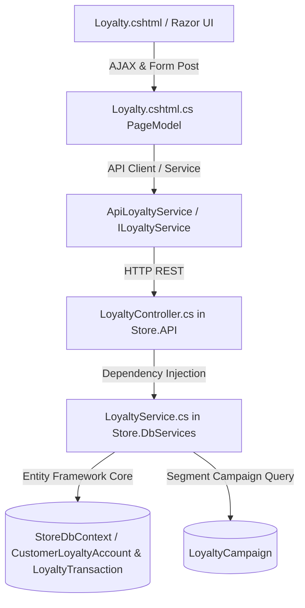

# Loyalty & Rewards Management Hub — Comprehensive Architectural & Feature Gap Analysis

**Document Version:** 1.0.0  
**Target Systems:** `Store.Models`, `Store.DbServices`, `Store.API`, `Store.UI` (`Pages/Loyalty.cshtml`), `Store.API.Tests`  
**Architecture Guidelines:** Uncle Bob Clean Architecture, Dennis Ritchie Systems Engineering, Least Privilege Security  

---

## 1. Executive Summary & Context

The Loyalty module (`/Loyalty`) in ClexAn Foods Operations Console is designed to fulfill **SRS EX-FR-4.2** (*"The system shall support loyalty point accrual and redemption rules"*), **EX-FR-4.3** (*"Campaign integration channels"*), and **EX-FR-4.4** (*"Customer segmentation for targeted pricing and offers"*).

While foundational entities (`CustomerLoyaltyAccount`, `LoyaltyTransaction`, `LoyaltyCampaign`) and basic services exist, the current implementation is barebones, contains a **critical tier-demotion bug on point redemption**, lacks an enterprise management interface, and is siloed from the broader store operations.

This document provides a comprehensive, rigorous analysis of the existing codebase, identifies critical bugs, architectural deficiencies, and UX bottlenecks, checks for features implemented elsewhere in the system, and proposes a complete enterprise modernization plan.

---

## 2. Codebase Audit: Existing Implementation vs. Deficiencies

### 2.1 Backend Architecture & Clean Architecture Audit

| Component | Current State | Deficiencies & Gaps | Clean Architecture Remediation |
| :--- | :--- | :--- | :--- |
| **Entities** | `CustomerLoyaltyAccount`<br>`LoyaltyTransaction`<br>`LoyaltyCampaign` | • Missing `LifetimePointsEarned` and `TotalPointsRedeemed` fields.<br>• Account has no enrollment timestamp (`DateCreated` in base entity, but no explicit `EnrolledAt` / `LastActivityAt`).<br>• No configurable tier thresholds (hardcoded in code). | Add computed/tracked lifetime accrual metrics to separate point liability balance from tier qualification. |
| **`LoyaltyService.cs`** | Implements basic `Earn`, `Redeem`, `Adjust`, `GetAccount`, `GetTransactions`. | **CRITICAL BUG (Tier Demotion on Redemption):**<br>`ComputeTier(account.Points)` calculates tier based on *current spendable balance*. When a VIP Gold customer redeems points for a reward, their balance decreases and they are immediately demoted to Bronze!<br>• Hardcoded tier thresholds (`Silver: 500`, `Gold: 2000`).<br>• No server-side search, filtering, or pagination for loyalty members (`GetAllAccountsAsync`).<br>• No store-wide metrics aggregation (`GetLoyaltyMetricsAsync`).<br>• No global transaction ledger query (`GetGlobalTransactionsAsync`). | • Compute tier based on **Lifetime Points Earned** (Tier Qualifying Points), preserving customer VIP status when points are spent.<br>• Implement `GetMetricsAsync`, `GetAllMembersAsync(search, tier, sortBy, page, pageSize)`, and `GetGlobalTransactionsAsync`. |
| **`LoyaltyController.cs`** | Has endpoints for `GET customers/{id}`, `GET customers/{id}/transactions`, `POST earn`, `POST redeem`, `POST adjust`. | • Uses legacy `Authorize(Roles = "Admin,Manager,Cashier")` rather than modern authorization policies (`CustomerRead`, `CustomerWrite`, `AdminRoles`).<br>• Missing `GET /api/loyalty/metrics` (store-wide metrics).<br>• Missing `GET /api/loyalty/members` (paginated, searchable member list).<br>• Missing `GET /api/loyalty/transactions` (global audit ledger). | Modernize routing, standardize authorization with policies (`CustomerRead` / `CustomerWrite`), and add missing endpoints wrapped in standardized `ApiResponse<T>`. |
| **DTOs (`LoyaltyDtos.cs`)** | Minimal `LoyaltyAccountDto` (4 fields), `LoyaltyTransactionDto`, and 3 request models. | `LoyaltyAccountDto` lacks customer metadata (`FullName`, `Phone`, `Email`, `ThumbnailUrl`, `Segment`, `LifetimeValue`, `LifetimePointsEarned`, `TotalRedeemed`, `TierProgressPercentage`, `NextTierThreshold`). | Create rich DTOs: `LoyaltyMemberDto`, `LoyaltyMetricsDto`, `LoyaltyMemberProfileDto`, and `GlobalLoyaltyTransactionDto`. |
| **Client Proxies (`Store.UI`)** | `LoyaltyModel` calls `_apiClient` with raw HTTP string endpoints inline. No `ILoyaltyService` proxy registered in UI DI. | • Inconsistent error handling.<br>• Duplicate client code.<br>• No typed service contract in `Store.UI/Services`. | Create `ApiLoyaltyService : ILoyaltyService` implementing Clean Architecture interface segregation in UI layer. |

---

### 2.2 Critical Business Logic Bug Analysis: The Tier Demotion Flaw

In `Store.DbServices/Services/LoyaltyService.cs`:
```csharp
// Current implementation (Lines 61-70 & 121-126)
public async Task<LoyaltyTransaction> RedeemPointsAsync(Guid customerId, int points, string? note, CancellationToken ct = default)
{
    var account = await GetOrCreateAccountAsync(customerId, ct);
    if (account.Points < points) throw new InvalidOperationException(...);

    account.Points -= points;
    account.Tier = ComputeTier(account.Points); // <-- CRITICAL BUG!
    _uow.Repository<CustomerLoyaltyAccount>().Update(account);
    ...
}

private static LoyaltyTier ComputeTier(int points) => points switch
{
    >= GoldThreshold => LoyaltyTier.Gold,
    >= SilverThreshold => LoyaltyTier.Silver,
    _ => LoyaltyTier.Bronze
};
```

#### Why This Breaks Business Rules:
1. Loyalty tiers represent a customer's **standing and historical relationship** with the brand.
2. In all industry-standard programs (Starbucks Stars, Delta SkyMiles, Sephora Beauty Insider), spending rewards points reduces **Reward Balance**, but does **NOT** revoke the customer's VIP status or tier benefits.
3. In the current code, if a customer earns 2,500 points (Gold Tier) and redeems 2,100 points for a store voucher, their balance becomes 400 points, instantly demoting them to Bronze!

#### Remediation:
Calculate tier standing from **Lifetime Earned Points** (derived from the sum of all positive `Earn` transactions or a tracked `LifetimePointsEarned` column/computed property).

---

## 3. UI/UX Analysis (`Loyalty.cshtml`): Current Gaps vs. Modern Standard

### 3.1 Current Visual State
The current `Loyalty.cshtml` is a minimal 172-line utility page that:
1. **Empty Landing State:** Loads with no data. Requires user to know and search a customer ID before displaying anything.
2. **No High-Level Store Overview:** Store managers and cashiers cannot see how many loyalty members exist, what tier distribution looks like, or how much outstanding points liability the business carries.
3. **No Member Directory:** No list or table of enrolled members.
4. **Three Clunky Stacked Forms:** Earn, Redeem, and Adjust are three separate static HTML forms stacked on top of each other with redundant input fields.
5. **No Visual Tier Meter:** Does not show progress towards the next tier (e.g. *"350 / 500 pts to Silver (70%)"*).
6. **No Rewards Valuation Guidance:** Points are abstract numbers with no monetary conversion rate shown (e.g., *"1 Point = 5 XAF (500 pts = 2,500 XAF Voucher)"*).
7. **No Member Pass / Barcode Generation:** Cannot generate or print a customer loyalty card or scan a loyalty barcode.
8. **No Export Functionality:** Cannot export member lists or transaction logs for financial audits.

---

## 4. Cross-Module Investigation: What Is Already Done Elsewhere?

| Feature | Done Elsewhere in Project? | Status / Location | How Loyalty Should Leverage / Integrate |
| :--- | :--- | :--- | :--- |
| **Campaign Rules & Point Multipliers** | **YES** | `Campaigns.cshtml`, `LoyaltyCampaignService.cs`, `LoyaltyCampaignsController.cs` | `Loyalty.cshtml` should display an "Active Bonus Campaigns" widget showing currently active point multipliers (e.g. 2x Points Weekend for VIPs). |
| **Customer 360 Slide-over Drawer** | **YES** | `Customers.cshtml` (Lines 800-1100) | Standardize drawer UX: Clicking a member in Loyalty opens a dedicated **Loyalty 360 Drawer** with tier progress, ledger history, active campaigns, and 1-click reward issuance. |
| **SVG Vector Barcode Generator** | **YES** | Implemented in `Customers.cshtml` and `Suppliers.cshtml` | Reuse pure vector SVG Code128 / QR rendering for instant, zero-dependency digital membership pass printing (`LOYAL-{ID}`). |
| **Smart Optical Scanner Resolution** | **YES** | `ScannerController.cs` resolves `CUST-{ID}` and phone numbers | Ensure scanner supports `LOYAL-{ID}` barcodes and routes directly to `/Loyalty?customerId={id}` with 1-click earn/redeem. |
| **Customer Segmentation (VIP, Regular, Wholesale)** | **YES** | `CustomerSegment` enum & `CustomerService.cs` | Correlate Loyalty Tiers (Bronze, Silver, Gold) with Customer Segments (VIP, Regular, Corporate, Wholesale). |
| **CSV Export Engine** | **YES** | `Customers.cshtml.cs`, `Suppliers.cshtml.cs` | Provide streaming CSV export for Loyalty Members Directory and Global Points Transaction Ledger. |
| **Cohesive Button & Design System** | **YES** | `operations.css` + Scoped CSS classes (`supplier-btn-*`, `customer-btn-*`) | Implement `.loyalty-btn-primary`, `.loyalty-btn-secondary`, `.loyalty-btn-danger`, `.loyalty-btn-amber`, `.loyalty-btn-icon`, ensuring 100% aesthetic harmony. |

---

## 5. Proposed Advanced Features & Innovations

### 5.1 Loyalty 360 Hub: KPI Metric Cards (5 Pillars)
1. **Total Enrolled Members**: Total customer accounts with loyalty activation.
2. **Total Points in Circulation (Liability)**: Sum of all active unredeemed points + monetary valuation in XAF (e.g., `42,500 pts (~212,500 XAF)`).
3. **Points Earned (Month-to-Date)**: Total velocity of points awarded from purchases and campaigns.
4. **Points Redeemed (Month-to-Date)**: Volume of points turned into discounts/rewards.
5. **VIP Tier Ratio**: Percentage of customer base in Silver and Gold tiers.

### 5.2 Dual-View Member Directory (Grid Cards + Dense Table)
- **Instant Search & Filter Bar:** Debounced search across Name, Phone, Email, Customer Code. Filter by Tier (`All`, `Bronze`, `Silver`, `Gold`), Points Range, and Sorting (Highest Points, Most Active, Recently Enrolled, Name).
- **Interactive Member Cards:** Customer avatar/initials, full name, phone/email, Tier Badge with metallic gradient styling (Bronze, Silver, Gold), Points Balance Pill, Lifetime Points, Progress to Next Tier, and 1-click Quick Action buttons.
- **Dense Tabular View:** Responsive columns with sortable headers, last transaction date, and quick action icons.

### 5.3 Unified "Manage Points & Rewards" Modal
Instead of 3 separate ugly forms:
- Single sleek modal with segmented mode switch: **[ 🎁 Earn Points ] | [ 🏷️ Redeem Reward ] | [ ⚙️ Admin Adjust ]**.
- Live conversion preview: Entering points immediately calculates monetary discount value in XAF (e.g., `500 pts = 2,500 XAF`).
- Real-time balance check and validation: Prevents over-redemption with clear visual warnings.
- Optional Invoice Reference binding with validation.

### 5.4 Slide-Over Member Loyalty 360 Drawer
- **Drawer Header:** Customer avatar, name, contact info, digital membership badge.
- **Tier Progress Section:** Animated progress bar showing exact distance to next tier with visual unlock milestones.
- **Point Conversion Strip:** Current Balance, Monetary Value (XAF), Lifetime Earned, Lifetime Redeemed.
- **Tab 1: Transaction Ledger:** Full paginated audit trail of every Earn, Redeem, and Adjust transaction with date, points (+/-), invoice ID link, and cashier notes.
- **Tab 2: Active Bonus Campaigns:** Displays campaigns currently active for this member's segment with multiplier badges.
- **Tab 3: Digital Membership Card:** High-contrast SVG barcode (`LOYAL-{ID}`) with 1-click printable pass.

### 5.5 Global Store Transaction Ledger Tab
A top-level tab or view on the page displaying the **Store-wide Points Stream**:
- View live points activity across all customers and cashiers in real-time.
- Filter by transaction type (`Earn`, `Redeem`, `Adjust`) and date range.

### 5.6 Monetary Conversion & Reward Rule Settings
- Configurable point-to-currency conversion constant (e.g. `1 Point = 5 XAF` or `100 XAF spent = 1 Point earned`).
- Clear display on all modals and member cards so staff and customers understand exact reward values.

---

## 6. Verification & Testing Strategy

1. **Automated Unit Tests (`Store.API.Tests/LoyaltyControllerTests.cs`)**:
   - `GetMetrics_ReturnsValidStoreWideAggregations`
   - `GetAllMembers_WithSearchAndFilter_ReturnsPagedResult`
   - `EarnPoints_IncreasesBalanceAndLifetimePoints`
   - `RedeemPoints_DecreasesBalance_PreservesTierStatus` (Verifying bug fix)
   - `RedeemPoints_InsufficientBalance_ThrowsException`
   - `AdjustPoints_PositiveAndNegative_UpdatesCorrectly`
   - `GetGlobalTransactions_ReturnsAuditLedger`
2. **End-to-End Build & Compilation**:
   - `dotnet build` with 0 warnings, 0 errors.
   - `dotnet test` with 100% passing tests.
3. **Browser & UI Verification**:
   - Test responsive layout on Desktop, Tablet, and Mobile.
   - Test debounced search, tier filtering, and Grid/Table toggle.
   - Test opening Loyalty 360 Drawer and switching tabs.
   - Test modal Earn/Redeem/Adjust actions and live balance updates.
   - Test SVG barcode rendering and print preview.

---

## 7. Architecture Mapping & File Plan



### Files to Modify / Create:
1. `Store.Models/DTOs/Loyalty/LoyaltyDtos.cs` [MODIFY]: Add `LoyaltyMemberDto`, `LoyaltyMetricsDto`, `LoyaltyMemberProfileDto`, `GlobalLoyaltyTransactionDto`.
2. `Store.Models/Interfaces/Services/ILoyaltyService.cs` [MODIFY]: Add `GetMetricsAsync`, `GetAllMembersAsync`, `GetMemberProfileAsync`, `GetGlobalTransactionsAsync`.
3. `Store.DbServices/Services/LoyaltyService.cs` [MODIFY]: Fix tier demotion bug, implement member search/filter, metrics aggregation, lifetime calculations, and global ledger queries.
4. `Store.API/Controllers/LoyaltyController.cs` [MODIFY]: Standardize authorization policies (`CustomerRead`, `CustomerWrite`), add `/metrics`, `/members`, `/profile`, `/transactions` endpoints.
5. `Store.UI/Services/ApiLoyaltyService.cs` [NEW] & `Program.cs` [MODIFY]: Register typed `ILoyaltyService` proxy.
6. `Store.UI/Pages/Loyalty.cshtml.cs` [MODIFY]: Add KPI metrics loading, paginated member search, drawer AJAX profile handler, unified points action handlers, CSV export.
7. `Store.UI/Pages/Loyalty.cshtml` [MODIFY]: Complete overhaul into the **Loyalty & Rewards 360 Hub** with KPI banner, debounced filter toolbar, dual grid/table view, slide-over 360 drawer, unified reward modal, and SVG barcode passes.
8. `Store.API.Tests/LoyaltyControllerTests.cs` [NEW]: Full test suite with comprehensive coverage.
