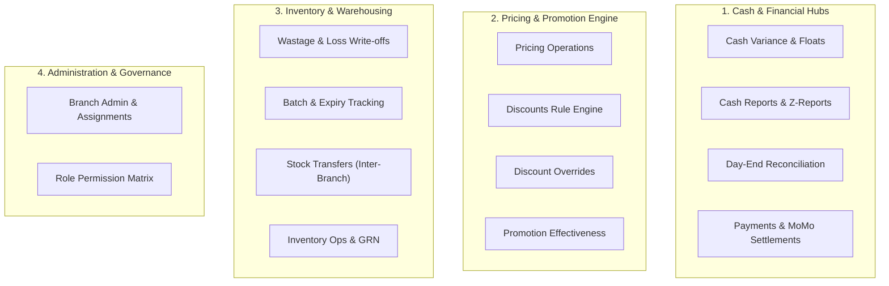

# Operations & Admin Hubs — Comprehensive Architectural & Feature Gap Analysis

**System Version:** Architech Store ERP 2.0  
**Audit Scope:** 14 Operations & Administration Hubs  
**Architectural Standards:** Dennis Ritchie Orthogonal Principles, Uncle Bob Clean Architecture, ClexAn Enterprise Design System (Emerald `#019c01`, Fluent 2.0 Component Ergonomics, 4/6-Card KPI Grids, Inline SVG Iconography, Full `XAF` Currency Formatting).

---

## Executive Summary

A comprehensive architectural, functional, and user-experience gap analysis was conducted across all **14 Operations and Administration Hubs** in the Store system. The system exhibits high architectural discipline in separation of concerns (thin presentation layer, dedicated manager services, centralized DTO contracts, robust JWT role-based security, and standardized `--z-*` stacking layers).

This report identifies:
1. **Critical Architectural Gaps** (Manager service decouplings, asynchronous interaction patterns)
2. **Key Functional Enhancements** (Supervisory sign-offs, PO-to-GRN link, waybill prints, USSD live polling, FEFO POS integration)
3. **Enterprise UI/UX Alignment Gaps** (KPI summary grids on Admin hubs, permission domain categorization, asynchronous toggles)

---

## Domain Breakdown & Gap Matrix

---

## Hub-by-Hub Deep Dive Analysis

### 1. Cash Variance & Float Audits (`CashVariance.cshtml` / `CashVariance.cshtml.cs`)

| Dimension | Current State | Identified Gap | Recommended Resolution | Priority |
| :--- | :--- | :--- | :--- | :--- |
| **Architecture** | Presentation uses `ICashVarianceManager`; search shifts calls raw API. | Search shifts bypasses manager abstraction. | Add `SearchShiftsAsync` to `ICashVarianceManager`. | `Medium` |
| **Operational Workflow** | Supports recording and reviewing shift variances with reasons. | Missing attachment/evidence upload (e.g. physical count sheet photo). | Add optional receipt/image attachment to variance investigation workflow. | `Low` |
| **Audit & Documentation** | CSV export available. | Missing printable investigation slip / audit voucher. | Add printable thermal/A4 variance audit voucher. | `Medium` |
| **UI / Ergonomics** | 4-Card Fluent 2.0 KPI grid, tab filtering, slide-over review drawer. | Fully compliant with ClexAn design system. | No UI gaps. | `Complete` |

---

### 2. Cash Reports & Daily Z-Reports (`CashReports.cshtml` / `CashReports.cshtml.cs`)

| Dimension | Current State | Identified Gap | Recommended Resolution | Priority |
| :--- | :--- | :--- | :--- | :--- |
| **Fiscal Summaries** | Daily Z-Report with tender breakdown, tax, categories, denominations. | Mid-shift snapshot (X-Report) is not available without closing shift. | Add "Generate X-Report Snapshot" without closing active register shift. | `High` |
| **Float Validation** | Denomination inputs available in shift close modal. | Denomination inputs not client-validated against closing float amount. | Add real-time sum calculator that verifies denomination count matches closing float. | `Medium` |
| **Security & Auditing** | Thermal and A4 printable fiscal vouchers. | Cashier can see expected closing balance (potential skimming risk). | Implement configurable "Blind Closing" toggle (hiding expected balance from cashier). | `Medium` |
| **UI / Ergonomics** | 6-Card KPI summary grid, date presets (`Today`, `Yesterday`, `Custom`). | Fully compliant. | No UI gaps. | `Complete` |

---

### 3. Day-End Reconciliation (`Reconciliation.cshtml` / `Reconciliation.cshtml.cs`)

| Dimension | Current State | Identified Gap | Recommended Resolution | Priority |
| :--- | :--- | :--- | :--- | :--- |
| **Governance** | Consolidated register balance audits, tender reconciliations, cash drops. | Missing formal Manager "Sign-Off & Approve" audit seal. | Add `SignOffDayEndAsync` action storing supervisor ID, timestamp, and notes. | `High` |
| **Banking Flow** | Cash drops listed per shift. | Missing Safe-to-Bank Deposit Slip generation. | Add "Prepare Bank Deposit" feature with generated deposit slip reference. | `Medium` |
| **Reporting** | CSV export and structured tables. | No printable Consolidated Day-End Summary Sheet. | Add A4 printable Day-End Reconciliation Executive Summary. | `Medium` |
| **UI / Ergonomics** | 4-Card KPI grid, tabbed views, date presets. | Fully compliant. | No UI gaps. | `Complete` |

---

### 4. Payments & Electronic Settlements (`Payments.cshtml` / `Payments.cshtml.cs`)

| Dimension | Current State | Identified Gap | Recommended Resolution | Priority |
| :--- | :--- | :--- | :--- | :--- |
| **Architecture** | Directly calls `_apiClient.GetAsync` in `PaymentsModel`. | **Violates Clean Architecture**: missing dedicated `IPaymentsManager`. | Create `IPaymentsManager` and `PaymentsManager` in `Store.UI/Services`. | `High` |
| **Operational Action** | Lists MoMo transactions and settlement totals. | Missing manual "Check Status / Poll Provider" button for pending USSD pushes. | Add row-level "Query Status" action calling provider gateway directly. | `High` |
| **Data Export** | No export button. | Missing CSV export of digital settlement transactions. | Add `OnGetExportCsvAsync` for settlement transactions. | `Medium` |
| **UI / Ergonomics** | 4-Card KPI summary grid, date range filters, provider status filters. | Fully compliant. | No UI gaps. | `Complete` |

---

### 5. Pricing Operations & Tax Profiles (`PricingOps.cshtml` / `PricingOps.cshtml.cs`)

| Dimension | Current State | Identified Gap | Recommended Resolution | Priority |
| :--- | :--- | :--- | :--- | :--- |
| **Bulk Updates** | Simulator, Tax Profiles, Product Bundles, Customer Segment Tiers. | Missing Bulk Price Markup/Markdown tool across categories/departments. | Add Bulk Price Adjustment Wizard (e.g. +5% across Beverage category). | `Medium` |
| **Scheduling** | Price changes take immediate effect upon save. | No future price activation scheduling (e.g. New Year promo pricing). | Add effective start/end datetime fields for price revisions. | `Low` |
| **Reporting** | CSV export for taxes, bundles, and segments. | Fully compliant. | No reporting gaps. | `Complete` |
| **UI / Ergonomics** | 4-Card KPI grid, interactive simulator AJAX drawer. | Fully compliant. | No UI gaps. | `Complete` |

---

### 6. Discounts Rule Engine (`Discounts.cshtml` / `Discounts.cshtml.cs`)

| Dimension | Current State | Identified Gap | Recommended Resolution | Priority |
| :--- | :--- | :--- | :--- | :--- |
| **Promo Codes** | Automatic rule-based discounts (Percentage, Fixed, BOGO, Tiered, Bundles). | Missing Alphanumeric Promo Code / Coupon generation (`PROMO2026`). | Add Coupon Code field with max usage limit and per-customer usage cap. | `Medium` |
| **Stacking Rules** | Single discount evaluation per line. | No explicit "Allow Stacking" toggle with customer loyalty tier rewards. | Add `IsStackableWithLoyalty` boolean rule flag. | `Low` |
| **Simulation** | Interactive live discount calculation preview. | Fully compliant. | No simulation gaps. | `Complete` |
| **UI / Ergonomics** | 4-Card KPI grid, search/type/segment filters, paginated table. | Fully compliant. | No UI gaps. | `Complete` |

---

### 7. Discount Overrides & Approvals (`DiscountOverrides.cshtml` / `DiscountOverrides.cshtml.cs`)

| Dimension | Current State | Identified Gap | Recommended Resolution | Priority |
| :--- | :--- | :--- | :--- | :--- |
| **Real-time Alerting** | Cashier requests override; manager reviews in drawer. | Manager must refresh/navigate to view new pending override requests. | Implement SignalR real-time badge/toast notification on supervisor screens. | `Medium` |
| **Policy Guardrails** | Reviewer can approve any discount percentage. | No maximum allowable supervisor override cap setting. | Add maximum supervisor discount limit policy (e.g. >25% requires Director). | `Low` |
| **Audit Trail** | Status messages, timestamps, reviewer tracking. | Fully compliant. | No audit gaps. | `Complete` |
| **UI / Ergonomics** | 4-Card KPI grid, status filters, review blade with validation. | Fully compliant. | No UI gaps. | `Complete` |

---

### 8. Promotion Effectiveness & Analytics (`PromotionEffectiveness.cshtml` / `PromotionEffectiveness.cshtml.cs`)

| Dimension | Current State | Identified Gap | Recommended Resolution | Priority |
| :--- | :--- | :--- | :--- | :--- |
| **Attribution** | Revenue lift, incremental margin, cannibalization analysis, channels. | Fixed marketing campaign spend cannot be entered to calculate net ROI. | Add "Campaign Spend / Ad Cost" input field to compute Net ROI. | `Medium` |
| **Visualizations** | Heatmaps, progress bars, metric cards. | Missing interactive SVG time-series revenue lift charts. | Add lightweight inline SVG sparkline / trend charts. | `Low` |
| **Exporting** | Granular CSV export by section (`all`, `lift`, `channels`, `cannibalization`). | Fully compliant. | No export gaps. | `Complete` |
| **UI / Ergonomics** | 4-Card KPI grid, 8 date presets, 6 tabbed analytical views. | Fully compliant. | No UI gaps. | `Complete` |

---

### 9. Branch Administration & Assignments (`BranchAdmin.cshtml` / `BranchAdmin.cshtml.cs`)

| Dimension | Current State | Identified Gap | Recommended Resolution | Priority |
| :--- | :--- | :--- | :--- | :--- |
| **Architecture** | Directly calls `_apiClient` and `_userService`. | Missing dedicated `IBranchManager` abstraction. | Create `IBranchManager` to encapsulate branch CRUD and assignment rules. | `Medium` |
| **UI / Ergonomics** | Has Branch cards and Assignment table. | **Missing 4-Card KPI Summary Grid** at the top of the page. | Add 4-Card KPI Grid (Total Branches, Active, Assigned Staff, Multi-Branch). | `High` |
| **Data Integrity** | Allows marking branch inactive. | Deactivation does not verify if open cashier shifts or in-transit transfers exist. | Add guardrail validation preventing deactivation if open shifts exist. | `High` |

---

### 10. Role Permission Matrix (`RoleMatrix.cshtml` / `RoleMatrix.cshtml.cs`)

| Dimension | Current State | Identified Gap | Recommended Resolution | Priority |
| :--- | :--- | :--- | :--- | :--- |
| **UI Ergonomics** | Flat table of 10+ columns with full-page POST reload on every toggle. | **No KPI Grid**, synchronous full-page postbacks, heavy horizontal scrolling. | Add 4-Card KPI Grid; convert toggles to async AJAX fetch with toast notification. | `High` |
| **Categorization** | Permission columns rendered as flat unorganized list. | Missing permission domain grouping. | Group headers by Domain (Sales/POS, Inventory, Pricing/Cash, System/Admin). | `High` |
| **Role Management** | Toggles permissions on fixed roles. | Cannot create new custom role titles from the UI. | Add "Create Custom Role" modal dialog. | `Medium` |

---

### 11. Wastage & Loss Write-Offs (`Wastage.cshtml` / `Wastage.cshtml.cs`)

| Dimension | Current State | Identified Gap | Recommended Resolution | Priority |
| :--- | :--- | :--- | :--- | :--- |
| **Batch Integration** | Records item, quantity, wastage type, cost. | Does not allow selecting specific Batch Lot when writing off batch-tracked items. | Add Batch Number selector to wastage record modal when item is batch-tracked. | `Medium` |
| **Financial Threshold** | Single-user write-off recording. | No dual-authorization requirement for high-value write-offs (> 50,000 XAF). | Add threshold check requiring supervisor approval for large loss entries. | `Low` |
| **UI / Ergonomics** | 4-Card KPI grid, catalog search autocomplete, CSV export. | Fully compliant. | No UI gaps. | `Complete` |

---

### 12. Batch Tracking & Expiry Management (`BatchTracking.cshtml` / `BatchTracking.cshtml.cs`)

| Dimension | Current State | Identified Gap | Recommended Resolution | Priority |
| :--- | :--- | :--- | :--- | :--- |
| **POS FEFO Link** | Dedicated batch inventory tracking, expiring alerts, write-off to wastage. | POS checkout does not enforce or highlight First-Expired First-Out lots. | Expose earliest expiring batch suggestion during POS item barcode scans. | `High` |
| **Label Generation** | Manual batch code entry. | Missing Barcode / QR label thermal printing for newly received batches. | Add "Print Batch Barcode" button in batch row actions. | `Medium` |
| **UI / Ergonomics** | 4-Card KPI grid, 30-day expiring alert tab, search & filters. | Fully compliant. | No UI gaps. | `Complete` |

---

### 13. Stock Transfers & Inter-Branch Logistics (`StockTransfers.cshtml` / `StockTransfers.cshtml.cs`)

| Dimension | Current State | Identified Gap | Recommended Resolution | Priority |
| :--- | :--- | :--- | :--- | :--- |
| **Documentation** | Multi-item transfer creation, dispatch, and receive with discrepancies. | Missing printable **Inter-Branch Dispatch Waybill / Transport Manifest**. | Add printable Waybill voucher with driver and receiving clerk sign-off lines. | `High` |
| **In-Transit Valuation** | Items move from Source branch to Destination branch upon receipt. | In-transit goods are not surfaced as an active floating asset metric. | Add "In-Transit Goods Valuation" KPI metric card to top summary grid. | `Medium` |
| **UI / Ergonomics** | 4-Card KPI grid, modal workflows with token z-indexes, CSV export. | Fully compliant. | No UI gaps. | `Complete` |

---

### 14. Inventory Operations & GRN (`InventoryOps.cshtml` / `InventoryOps.cshtml.cs`)

| Dimension | Current State | Identified Gap | Recommended Resolution | Priority |
| :--- | :--- | :--- | :--- | :--- |
| **PO Integration** | Goods Receipt (GRN) takes reference code and item inputs. | GRN does not link directly to approved Purchase Orders from `PurchaseOrders.cshtml`. | Add "Receive against Approved Purchase Order" selector in GRN modal. | `High` |
| **Stocktake Sessions** | Individual quick stock adjustments. | Missing structured Multi-Item Cycle Count / Periodic Stocktake Session mode. | Add "Stocktake Session" workflow (theoretical stock vs physical count delta). | `Medium` |
| **UI / Ergonomics** | 4-Card KPI grid, movement filters, reorder suggestion thresholds, CSV export. | Fully compliant. | No UI gaps. | `Complete` |

---

## Recommended Prioritized Roadmap

Based on the gap analysis, the recommended implementation sequence is structured into three progressive phases:

### Phase 1: High-Impact Operational Gaps & Ergonomics (Immediate)
1. **Role Permission Matrix (`RoleMatrix.cshtml`) Modernization**:
   - Add 4-Card KPI Summary Grid (Total Roles, Total Capabilities, Elevated Roles, Active Policies).
   - Categorize permission columns into 4 domains (Sales & POS, Inventory & Warehousing, Pricing & Cash, System & Security).
   - Convert permission toggle buttons to asynchronous AJAX requests with optimistic UI toggles and `window.showToast()`.
2. **Branch Admin (`BranchAdmin.cshtml`) KPI Summary & Guardrails**:
   - Add 4-Card KPI Summary Grid.
   - Add shift/transfer dependency validation before allowing branch deactivation.
3. **Payments Clean Architecture & Live Status Polling (`Payments.cshtml`)**:
   - Implement `IPaymentsManager` / `PaymentsManager`.
   - Add "Query Status" live polling action for pending USSD mobile money authorizations.
   - Add CSV export for electronic settlement ledger.

### Phase 2: Inter-Module Operational Linkages (Short-Term)
4. **Stock Transfer Printable Waybill (`StockTransfers.cshtml`)**:
   - Create printable dispatch manifest / transfer waybill with driver & receiver signature blocks.
   - Add In-Transit Goods valuation metric to KPI summary.
5. **Goods Receipt to Purchase Order Link (`InventoryOps.cshtml`)**:
   - Allow receiving goods directly against an approved Purchase Order, auto-populating line items, quantities, and supplier agreed costs.
6. **Cash Management Mid-Shift Snapshot & Blind Closing (`CashReports.cshtml`)**:
   - Add X-Report reading action.
   - Add denomination count validation against closing float.

### Phase 3: Advanced Governance & Analytics (Medium-Term)
7. **Day-End Supervisory Sign-off (`Reconciliation.cshtml`)**:
   - Implement digital supervisory sign-off with audit logging and A4 executive summary report.
8. **FEFO Recommendation at POS Scan (`BatchTracking.cshtml` / `Pos.cshtml`)**:
   - Suggest and pre-select earliest expiring batch lots during checkout.
9. **Wastage Batch Allocation & Threshold Approvals (`Wastage.cshtml`)**:
   - Connect wastage write-offs to specific batch numbers and require dual-authorization for losses exceeding threshold.
