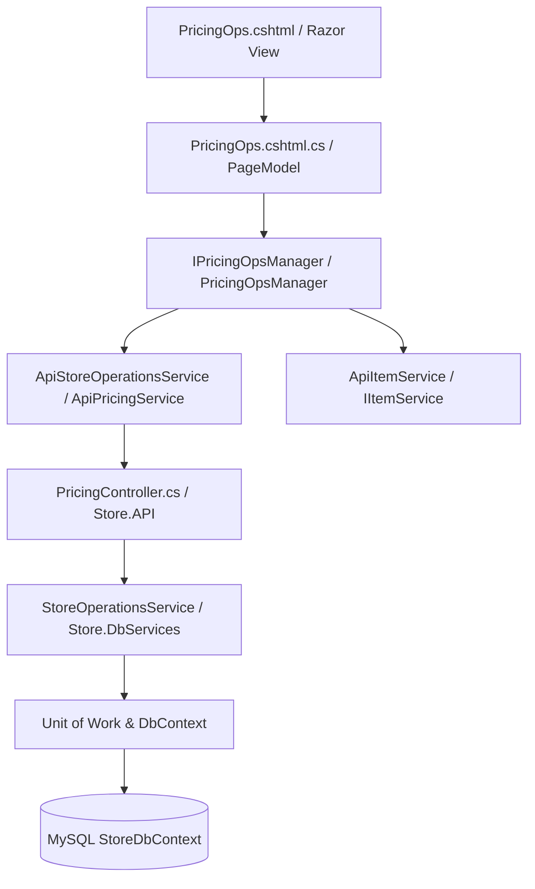
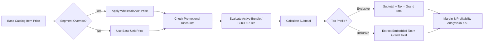

# Pricing Operations Hub — Deep Dive Analysis & Systems Design Report
### Cross-referenced against the Design System Specification, Clean Architecture, and Retail Margin Engine
---

## 1. Executive Summary & Current State

The **Pricing Operations Hub** (`/PricingOps`) is the core engine for fiscal compliance, multi-tier pricing strategies, promotional combo bundling, and transactional price simulation for ClexAn Foods (EX-PRC-1.1 / PRC-2 / COM-3 / TAX-4). It governs how standard catalog prices are transformed across customer tiers, bundle configurations, and tax schedules:

$$\text{Catalog Base Unit Price} \xrightarrow{\text{Segment Tier Override (Wholesale/VIP)}} \xrightarrow{\text{Catalog Discounts}} \xrightarrow{\text{Bundle/BOGO Rules}} \xrightarrow{\text{Tax Application (Inclusive/Exclusive)}} \text{Final Cart Price (XAF)}$$

### Current Health Score: ~35%
An audit of the current implementation reveals critical governance, UX, and architectural deficiencies:
1. **Clean Architecture & Presentation Coupling**:
   - `PricingOpsModel` directly injects `IApiClientService` and `IItemService`, issuing un-orchestrated REST calls directly inside HTTP handlers without an application service manager (`IPricingOpsManager`).
2. **Page Reloads on Simulation**:
   - The "Pricing Preview" feature uses full HTTP form posts (`OnPostPreviewAsync`), reloading the entire page, re-fetching all items and rules, and losing user context.
3. **Missing Margin & Cost Visibility**:
   - Neither the segment price override nor the live simulator displays the item's purchase cost price or resulting gross profit margin ($$\text{Margin} = \frac{\text{Price} - \text{Cost}}{\text{Price}}$$). This creates high risk of pricing products below procurement cost.
4. **Design System Non-Compliance**:
   - Current UI uses legacy `.grid-3` layouts, unstyled HTML tables, lacks the mandatory **4-card KPI banner**, has no search/filtering within rules tables, and lacks active/inactive toggle actions.
5. **No CSV Export or Auditing**:
   - No capability to export current price schedules, tax rates, or active bundle programs for auditing.

---

## 2. Feature & Architectural Gap Analysis

| Feature Area | Current State | Required State (Dennis Ritchie & Clean Arch) | Severity |
|---|---|---|---|
| **Architecture** | Raw `IApiClientService` and `IItemService` calls inside `PricingOpsModel` | Encapsulated [`IPricingOpsManager`](file:///c:/Users/Rodern/source/repos/Architech-Inc/StoreProject/Store.UI/Services/IPricingOpsManager.cs) with dedicated domain DTOs and lean controller | High |
| **KPI Metrics Grid** | None | 4-Card color-coded KPI banner: Active Tax Profiles, Active Bundle Rules, Tier Overrides, Simulator Test Bench | High |
| **Live Simulator** | Full HTTP POST page reload | Reactive AJAX simulator with instant breakdown of Base Price, Tier Markdown, Bundle Discount, Tax, and **Gross Profit Margin %** | High |
| **Margin Safety Guard** | No cost price lookup or margin warning | Live unit cost comparison and negative-margin warning banner | High |
| **Data Tables** | Unstyled HTML `<table>` without search or pagination | High-density tables with search docks, type badges, status pills, and toggle/edit actions | Medium |
| **Currency Consistency** | Mixed decimal strings | Strict **`XAF`** Central African CFA Franc format | Medium |
| **Tax Management** | Static form with no edit/toggle | Modal-based upsert with Exclusive vs Inclusive fiscal badges and status toggle | Medium |
| **Bundle & BOGO Engine** | Basic trigger/reward item selectors | Rich combo rule cards with visual trigger ➔ reward arrows, discount chips, and date validity badges | Medium |
| **Segment Tier Pricing** | Simple override table | Tiered pricing matrix (Standard, Wholesale, VIP) with instant markup calculation | Medium |
| **Export Ledger** | None | CSV export for Tax Schedules, Bundle Rules, and Tier Price Lists | Medium |

---

## 3. Systems Design & Target Clean Architecture

### 3.1 Domain & Application Orchestration Layer

### 3.2 Price Transformation Pipeline

---

## 4. UI/UX Modernization & Design System Specification

### 4.1 4-Card Interactive KPI Banner
1. **Active Tax Profiles**: Blue shield/tax icon displaying active fiscal rules and average rate.
2. **Active Bundle Rules**: Purple gift icon tracking active combo / BOGO rules.
3. **Customer Tier Overrides**: Amber user-group icon tracking special Wholesale/VIP pricing rules.
4. **Simulator Engine**: Emerald calculator icon with quick test launch.

### 4.2 Tabbed Navigation Structure
- 🧮 **Live Pricing & Margin Simulator**: Interactive test bench with real-time AJAX margin calculator and step-by-step price breakdown.
- 🎁 **Bundle & BOGO Combos**: High-density grid of active bundle rules with visual trigger/reward badges, validity dates, and toggle actions.
- 👥 **Customer Segment Pricing**: Tiered pricing table with item search, wholesale/VIP markup tags, and quick edit.
- 🏛️ **Tax Profiles**: Fiscal rule table with rate chips, application type badges (Exclusive vs Inclusive), and status toggles.

### 4.3 Interactive Modals
- **Tax Profile Modal (`#taxModal`)**: Upsert fiscal rate, inclusive/exclusive flag, and name.
- **Bundle Rule Modal (`#bundleModal`)**: Smart product lookups for trigger/reward items, minimum quantities, discount %, and date schedule.
- **Segment Price Modal (`#segmentModal`)**: Smart item lookup, customer segment tier, and override price with live margin preview.

---

## 5. Security & Permission Governance
- **Read Operations (`PricingRead`)**: Required to view tax profiles, bundle rules, segment pricing, and use the live simulator.
- **Write Operations (`PricingWrite`)**: Required to create, update, or deactivate tax profiles, bundle rules, and segment price overrides.
- **Anti-Forgery Validation**: Enforced across all state-modifying POST requests (`@Html.AntiForgeryToken()`).
