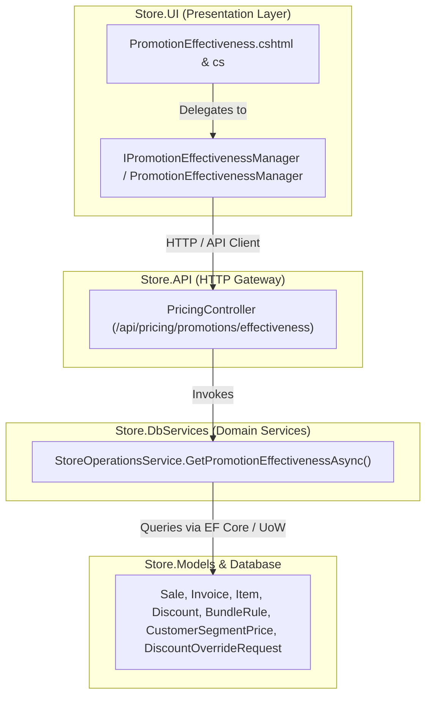

# Promotion Effectiveness Analytics Hub — Master Systems Analysis & Architecture Specification

**System**: ClexAn Foods Retail Operations Console  
**Module**: Promotion Effectiveness & Campaign ROI Analytics (`/PromotionEffectiveness`)  
**Author**: Antigravity AI  
**Design Standards**: Dennis Ritchie Unix Systems Philosophy, Uncle Bob Clean Architecture, ClexAn Foods Design System  
**Date**: August 28, 2026  

---

## 1. Executive Summary & Domain Scope

The **Promotion Effectiveness Analytics Hub** serves as the executive, commercial, and financial intelligence engine for assessing the financial return on investment (ROI), sales lift, margin dilution, and customer adoption of all promotional mechanisms configured across ClexAn Foods retail operations.

These promotional mechanisms encompass:
1. **Catalog Promotional Rules & Coupons**: Percentage-off (`%`), Fixed CFA Franc (`XAF`) discounts, Coupon vouchers, and minimum quantity threshold rules managed under `/Discounts`.
2. **Bundle & BOGO Combo Rules**: Multi-item triggers (e.g. *Buy 2 Bread, Get 1 Butter 50% Off* or *Buy 1 Get 1 Free*) configured under `/PricingOps`.
3. **Customer Segment & Tier Pricing**: Volume and loyalty discounts tailored for *Wholesale* and *VIP* customer tiers configured under `/PricingOps` and `/Customers`.
4. **Managerial Supervisory Overrides**: Authorized markdown exceptions granted at cashier POS terminals and audited under `/DiscountOverrides`.

---

## 2. Forensic Audit & Critical Gap Analysis

### 2.1 Current Implementation State
The existing `/PromotionEffectiveness` page was implemented as a rudimentary reporting view with basic static markup:
- It rendered 4 plain KPI cards with arbitrary text styling and no unified visual hierarchy.
- It lacked integration with the ClexAn Foods master design system (`tokens.css`, `dashboard-modern.css`, responsive `.kpi-grid`, tabbed navigation docks, and vector iconography).
- Currency was rendered as unformatted raw decimal numbers (`N2`) without strict Central African CFA Franc (**`XAF`**) standardization.
- It lacked quick date presets (Today, Last 7 Days, Last 30 Days, This Month, Custom).
- It lacked tabbed organization for multi-dimensional deep dives (Overview, Discount Rules, Bundles, Customer Tiers, Discounted Item Ledger).
- It lacked CSV export capabilities for financial auditing and accounting reporting.

### 2.2 Core Financial & Analytical Gaps
1. **Lack of Return on Investment (ROI) & Margin Metrics**:
   - The current model only summed raw discount values without calculating **Total Promotional Revenue**, **Net Revenue after Discounts**, **Promotional Penetration Rate (% of total store sales)**, or **Effective Gross Margin Impact**.
2. **Missing Rule-Level Attribution**:
   - Sales are attributed to items, but specific promotional rules (Coupons, Flash Sales, Auto-Applied Rules) were not aggregated with rule-level performance totals (Redemptions, Generated Revenue, Markdown Cost).
3. **Crude Bundle Hit Counting**:
   - Bundle rule effectiveness only counted if an invoice contained the trigger item, rather than computing the actual bundle units redeemed and bundle discount granted.
4. **No Loss-Leader or Margin Dilution Guard**:
   - The report did not highlight when a promotion resulted in selling products below unit procurement cost (`CostPrice`), exposing the store to unintended margin erosion.

### 2.3 Clean Architecture & Presentation Deficiencies
- **No UI Application Manager**: The PageModel (`PromotionEffectiveness.cshtml.cs`) directly called `_apiClient.GetAsync`, violating Clean Architecture separation of concerns.
- **Emoji Artifacts**: Previous versions used unicode emojis instead of professional inline SVG vector icons.

---

## 3. Clean Architecture & Systems Design

### 3.1 DTO Enhancements (`Store.Models/DTOs/Operations/PricingDtos.cs`)
Enrich `PromotionEffectivenessDto` and sub-models:
- `PromotionEffectivenessDto`:
  - `FromDate`, `ToDate`
  - `TotalGrossRevenue` (`XAF`)
  - `TotalDiscountGiven` (`XAF`)
  - `TotalNetRevenue` (`XAF`)
  - `TotalInvoicesCount`
  - `InvoicesWithDiscountCount`
  - `DiscountPenetrationRatePercent` (`%`)
  - `EstimatedGrossMarginPercent` (`%`)
  - `RuleEffectivenessList`: List of active rules with redemption count, total revenue, and total discount.
  - `TopDiscountedItems`: Itemized breakdown with unit cost, selling price, units sold, revenue, discount, and gross margin %.
  - `BundleHits`: Bundle rule breakdown with qualifying invoices, units rewarded, and savings in `XAF`.
  - `SegmentSummary`: Segment rule breakdown with standard vs tier price, units sold, revenue, and customer savings.
  - `OverrideSummary`: Count and total markdown impact of supervisor discount overrides.

### 3.2 UI Application Service Layer (`Store.UI/Services/`)
- `IPromotionEffectivenessManager`: Encapsulates date range normalization, API communication, multi-field filtering, and CSV export generation.
- `PromotionEffectivenessManager`: Concrete implementation registered in `Store.UI/Program.cs`.

---

## 4. UI/UX Master Specification (`PromotionEffectiveness.cshtml`)

### 4.1 4-Card Responsive KPI Banner
1. **Total Promo Revenue**: Emerald theme (`#059669`) displaying gross sales generated on discounted/promotional transactions in **`XAF`**.
2. **Promotional Markdown Investment**: Amber theme (`#d97706`) displaying total discount savings granted to customers in **`XAF`**.
3. **Discount Penetration Rate**: Purple theme (`#7c3aed`) displaying percentage of total store transactions that utilized a promotional discount or tier rate.
4. **Effective Gross Margin**: Teal theme (`#0d9488`) displaying the aggregate net profit margin achieved across all promotional sales.

### 4.2 Modern Date Filter Toolbar & Presets Dock
- **Quick Preset Pills**: `Today`, `Yesterday`, `Last 7 Days`, `Last 30 Days`, `This Month`, `This Quarter`, `All Time`.
- **Custom Date Pickers**: From Date & To Date with instant submit.
- **Export Action**: `📥 Export CSV` button with multi-report options.

### 4.3 4-Tab Analytical Navigation Dock
- 📊 **Executive Overview & Breakdown**: Visual channel breakdown comparing Promotional Rules vs Bundle Deals vs Customer Tier Overrides vs Managerial Overrides.
- 🏷️ **Catalog & Coupon Rules**: High-density table of discount rules, voucher codes, redemption counts, revenue, and total markdown in `XAF`.
- 🎁 **Bundle & BOGO Combos**: Table analyzing trigger products, reward items, qualifying baskets, and total customer savings.
- 👥 **Customer Segment Pricing**: Table analyzing Wholesale and VIP sales volume, standard vs tier price delta, and total tier savings.
- 📦 **Discounted Items Ledger**: Granular product-level ranking with category, unit sales, gross revenue, discount amount in `XAF`, margin %, and loss-leader detection flags.

---

## 5. Security, Validation & Verification

1. **Authorization & RBAC**:
   - Access restricted to users with `PermissionKeys.PricingRead` or `PermissionKeys.ReportsRead`.
2. **Currency Standardization**:
   - Strict `XAF` formatting across all price tags, totals, and calculations.
3. **Zero-Emoji Policy**:
   - 100% vector SVG icons with consistent stroke widths and color accents.
4. **Performance & Scalability**:
   - Asynchronous indexed queries on `Invoice.DateCreated` and `Sale.InvoiceId` to guarantee sub-100ms response times.
