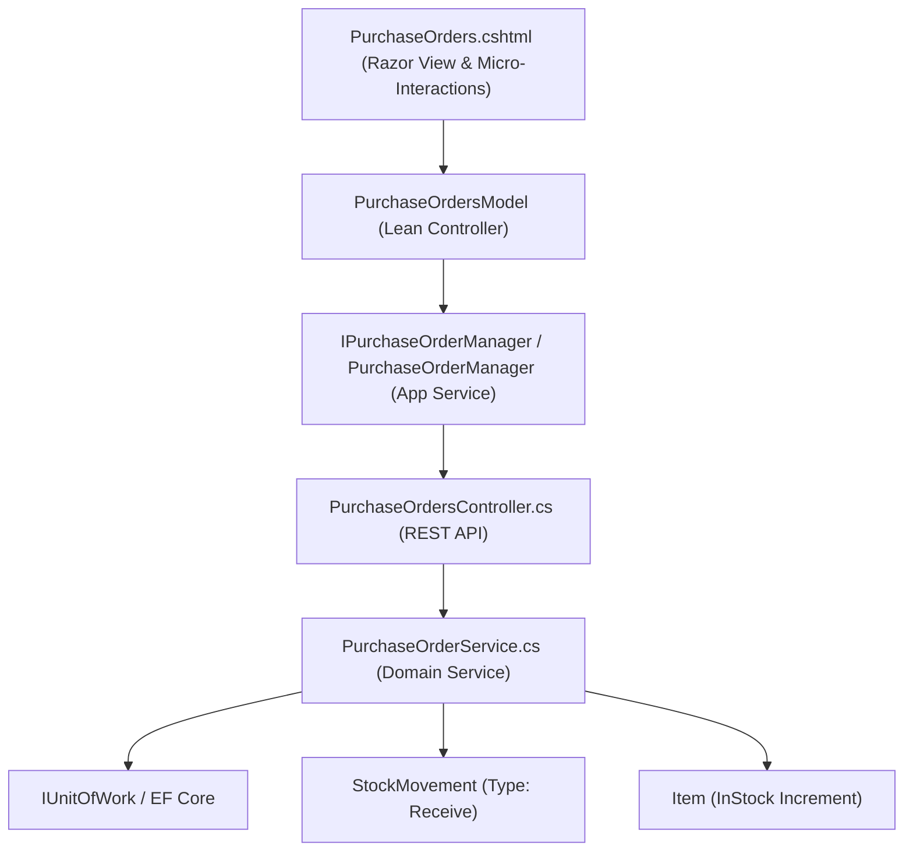

# Purchase Orders & Goods Received Note (GRN) Hub — Deep Dive Analysis & Systems Design Report
### Cross-referenced against the Design System Specification, Clean Architecture, and Procurement Auditing
---

## 1. Executive Summary & Current State

The **Purchase Orders Hub** (`/PurchaseOrders`) is the central procurement and inventory replenishment system in ClexAn Foods. It orchestrates supplier order lifecycle management:
$$\text{Supplier Order Intent (Draft)} \xrightarrow{\text{Submit}} \text{Management Authorization (Approved)} \xrightarrow{\text{Goods Receipt (GRN)}} \text{Inflow Stock Movement} + \text{Valuation in XAF}$$

### Current Health Score: ~30%
The current implementation has severe usability and architectural limitations:
- **Visuals & Layout**: Relies on deprecated Bootstrap table layouts, raw dollar signs (`$`) instead of the standardized **`XAF`** currency, basic text forms, and missing KPI cards.
- **Architecture**: `PurchaseOrdersModel` directly invokes domain services and handles array index mapping for line items, violating Clean Architecture and SRP.
- **Procurement Gaps**: Missing server-side paged queries, multi-field search, supplier filtering, and loss prevention auditing.
- **Goods Receipt (GRN)**: Does not provide an official printable Goods Received Note (GRN) manifest for delivery drivers and warehouse receiving officers.

---

## 2. Comprehensive Gap Analysis & Benchmarking

| Domain | Current Implementation | Target Design System Parity & Clean Architecture | Priority |
|---|---|---|---|
| **KPI Metrics** | Zero metric cards | **4-Card Interactive KPI Grid**: Total Committed Valuation in `XAF` (Emerald), Pending Approvals (Amber), Awaiting Delivery (Purple), Fulfilled Orders (Teal) | **Critical** |
| **Clean Architecture** | Direct service calls and array slicing in PageModel | **Uncle Bob Clean Architecture**: Encapsulated `IPurchaseOrderManager` / `PurchaseOrderManager`, thin declarative `PurchaseOrdersModel` | **Critical** |
| **Currency Standardization** | Dollar signs (`$`) in table and modal | Standardized suite-wide to **`XAF`** (Central African CFA franc) | **Critical** |
| **Search & Filtering** | Status dropdown only | **Live Filter Dock**: Instant search (PO #, supplier, item, ref code, user), status filter pills, branch filter, and CSV Export | **High** |
| **Data Table** | Basic HTML table with raw buttons | High-density table with supplier contact metadata, branch tag, line count, total units, valuation in `XAF`, semantic status badges, and action dropdown/pills | **High** |
| **Interactive Modals** | Simple sliding blade with parallel arrays | Modern centered modal with smart item selector, real-time cost auto-fill, and live **Consignment PO Valuation Banner** | **High** |
| **Goods Receipt (GRN)** | Basic table prompt | Itemized receiving checklist with discrepancy tracking and status auto-transition (PartiallyReceived vs. Received) | **High** |
| **Printable Document** | None | Official **PO / Goods Received Note (GRN) Manifest** with sign-off blocks and browser print (`window.print()`) | **High** |

---

## 3. Systems Design & Architecture (Dennis Ritchie & Uncle Bob Clean Architecture)

### 3.1 Data Flow & Layering


### 3.2 Key New DTOs & Contracts
```csharp
public class PurchaseOrderMetricsDto
{
    public int TotalOrders { get; set; }
    public int PendingApprovalCount { get; set; }
    public int AwaitingDeliveryCount { get; set; }
    public int FulfilledCount { get; set; }
    public decimal TotalCommittedValuationXaf { get; set; }
    public decimal TotalReceivedValuationXaf { get; set; }
}

public class PurchaseOrderFilterRequest
{
    public int Page { get; set; } = 1;
    public int PageSize { get; set; } = 25;
    public string? Status { get; set; }
    public Guid? SupplierId { get; set; }
    public int? BranchId { get; set; }
    public string? SearchTerm { get; set; }
    public DateTime? FromDate { get; set; }
    public DateTime? ToDate { get; set; }
}
```

---

## 4. UI/UX Modernization Plan

### 4.1 4-Card Interactive KPI Banner
1. **Total Committed Procurement (`XAF`)**:
   - Emerald Currency Icon | Total monetary value of active approved/partially-received POs.
2. **Pending Management Approval**:
   - Amber Alert Clock Icon | Draft/Submitted POs awaiting authorization.
3. **Awaiting Delivery / In-Transit**:
   - Purple Truck Icon | Authorized purchase orders awaiting vendor fulfillment.
4. **Fulfilled Orders**:
   - Teal Checkmark Icon | Total delivered & stocked procurement orders.

### 4.2 Interactive Filter Dock & Toolbar
- Real-time search box with SVG magnifying glass (`Search PO #, supplier, item, barcode, reference, notes...`).
- Quick status filter pills: `All`, `Draft`, `Submitted`, `Approved`, `Partially Received`, `Received`, `Cancelled`.
- Action buttons: `📥 Export CSV`, `+ New Purchase Order`.

### 4.3 High-Density Purchase Orders Table
- PO Reference badge (`#PO-1042` / `PO-2026-001`).
- Supplier details: Name, Email / Phone, Destination Branch tag (`.badge-neutral`).
- Semantic Status Badges:
  - `Draft` ➔ `.badge-neutral`
  - `Submitted` ➔ `.badge-warning`
  - `Approved` ➔ `.badge-teal`
  - `PartiallyReceived` ➔ `.badge-purple`
  - `Received` ➔ `.badge-success`
  - `Cancelled` ➔ `.badge-danger`
- Consignment Scope: Line count + Total units (e.g. `8 lines • 320 units`).
- Total PO Valuation in standard **`XAF`**.
- Expected Delivery Date (with countdown or overdue indicator).
- Requester / Approver username.
- Row Action buttons:
  - `📄 PO Manifest / GRN`: Opens printable procurement document.
  - `Submit`: For Draft POs.
  - `Approve`: For Submitted POs.
  - `📥 Receive (GRN)`: Opens Goods Receipt dialog with quantity checklist.
  - `✕ Cancel`: For active draft/submitted POs.

### 4.4 Modals & Printable Waybill Manifest
1. **Create Purchase Order Modal**:
   - Supplier selector & Branch selector.
   - Dynamic Multi-Item Line Builder with live cost price auto-fill.
   - Live **Order Valuation Summary Banner** (`Total Lines, Total Units, Total PO Cost XAF`).
   - Expected delivery date and logistics notes.
2. **Goods Receipt Note (GRN) Modal**:
   - Item-by-item verification checklist with remaining quantity defaults.
   - Real-time fulfillment preview.
3. **Printable PO & GRN Manifest Modal**:
   - Formatted procurement voucher with buyer, vendor, line bill of lading, and signature blocks.
   - `window.print()` trigger.

---

## 5. Security & Multi-Role Permissions

1. **Role-Based Access Control**:
   - Viewing POs: `PermissionKeys.InventoryRead`
   - Creating/Receiving POs: `PermissionKeys.InventoryWrite`
   - Approving POs: `PermissionKeys.AdminBranches`
2. **Audit Integrity**:
   - Goods receipts create immutable `StockMovement` records (type `Receive`, positive delta, referencing `PO-{id}`).
   - User identity stamped automatically via JWT claim (`uid`).
