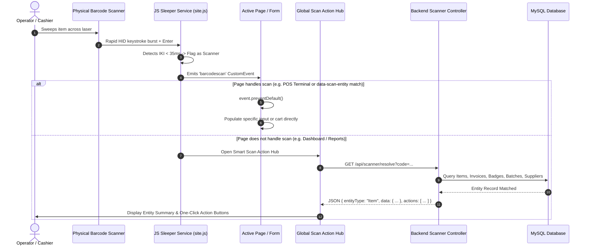

# Technical Specification: Smart Barcode/QR Scanner Sleeper Service & Global Action Hub

## 1. Executive Summary & Objective

Modern retail, wholesale, and supermarket ERP operations rely heavily on physical barcode and 2D QR scanners (handheld USB/Bluetooth, wireless presentation/countertop scanners, and mobile camera emulators). 

This document specifies the architecture, detection mechanics, resolution pipeline, and contextual dispatch workflows for the **Smart Barcode Scanner Sleeper Service & Global Action Hub**.

### Primary Objectives:
1. **Background Hardware Detection ("Sleeper Service")**: Passively classify incoming keystrokes to differentiate high-speed hardware scanner bursts from standard human keyboard typing.
2. **Context-Aware Consumption (Case 1)**: If the user is currently on an active data-entry screen (e.g., POS terminal, line-item entry in Stock Transfers or Wastage), route the scan directly to that form/cart without popup friction.
3. **Global Omnipresent Action Hub (Case 2)**: If the scan occurs anywhere else (Dashboard, Reports, Settings, browsing), intercept the scan, query the database across multiple entity domains, and present a **Contextual Action Hub Modal** with pre-populated, one-click operational destinations.
4. **Hardware Flaw Mitigation**: Eliminate input string concatenation (`123456` + `123456` = `123456123456`) and accidental rapid double-firing from hands-free presentation scanners.

---

## 2. Hardware Detection Engine (The "Sleeper" Service)

### 2.1 Physical Signature Comparison

Barcode and 2D QR scanners emulate USB Human Interface Devices (HID Keyboards). The software distinguishes them from human typing using three physical characteristics:

| Signature Metric | Human Typist | Hardware Barcode / QR Scanner |
| :--- | :--- | :--- |
| **Inter-Keystroke Interval (IKI)** | 80ms – 300ms+ per character | **5ms – 35ms** per character (fixed burst) |
| **Cadence Variance ($\sigma$)** | High variance (thinking/hunting keys) | Near zero variance ($\pm 2\text{ms}$ between bytes) |
| **Termination Character** | Manual `Enter`, `Tab`, or Click | Immediate `Enter` (`\r\n` / keycode 13) suffix |
| **Minimum Character Length** | 1 to arbitrary | Standard barcode length ($\ge 4$ to $50+$ chars) |

```
Human Typing Timeline:
  [Key '8'] ----(160ms)----> [Key '9'] ----(220ms)----> [Key '0'] ----(110ms)----> [Key '1']

Hardware Scanner Burst:
  [Key '8'] -(12ms)- [Key '9'] -(11ms)- [Key '0'] -(12ms)- [Key '1'] -(10ms)- [Enter]
```

### 2.2 Sleeper Listener State Machine

```
              ┌────────────────────────┐
              │      IDLE / SLEEP      │
              └───────────┬────────────┘
                          │ Printable KeyDown
                          ▼
              ┌────────────────────────┐
        ┌────►│  Buffer & Check Timing │◄───┐
        │     └───────────┬────────────┘    │
IKI <= 35ms   │           │                 │ IKI <= 35ms
        │     │ IKI > 35ms│ Enter Key       │
        └─────┘           ▼                 └─────┘
                   [Reset Buffer]
                          │
            Buffer.length >= 4 & isScanner?
                          │
               ┌──────────┴──────────┐
               │                     │
              YES                   NO
               ▼                     ▼
     [Deduplication Check]     [Standard Enter]
               │
          Within Cooldown?
          ┌────┴────┐
         YES        NO
          │          │
      [Suppress]     ▼
          [Dispatch 'barcodescan' Event]
```

---

## 3. Two-Tier Routing & Dispatch Architecture

### 3.2 Tier 1: Local / Contextual Consumption (In-Context)

When an operational view is loaded, it can register itself as a **Scan Consumer**:
- **POS Terminal (`/Pos`)**: Directly executes `addToCart(item)` and beeps a positive chime.
- **Active SmartLookup Input**: Binds the selected entity and focuses the next logical input (e.g., `Quantity`).
- **Catalog Management (`/Catalog`)**: If the create/edit modal is open, populates the `Barcode` field.

### 3.3 Multi-Input Page Disambiguation & Entity-Typed Routing

In complex enterprise scenarios, a single page may contain **two or more inputs** capable of taking a barcode/QR code (e.g., an Item barcode input AND a Supplier registration input, or an Employee Badge input AND a Product input, or Source Item vs Destination Item in Stock Transfers).

The Sleeper Service applies a **3-tier disambiguation engine** to ensure scans land in the correct field:

```mermaid
flowchart TD
    ScanCaptured([Scan Captured & Entity Resolved]) --> CheckFocus{Is a barcode input\ncurrently focused?}
    
    CheckFocus -- YES --> MatchFocus{Does focused input accept\nthis resolved entity type?}
    MatchFocus -- YES --> RouteFocus[Route directly to Focused Input]
    MatchFocus -- NO --> FindByType
    
    CheckFocus -- NO --> FindByType{Find inputs matching\nresolved entity type\n(data-scan-entity='...')}
    
    FindByType -- 1 Match Found --> RouteAuto[Auto-populate Target Input & Advance Focus]
    FindByType -- 0 Matches Found --> FallbackHub[Open Global Smart Scan Action Hub]
    FindByType -- 2+ Matches Found --> Disambiguate[Show Inline Disambiguation Mini-Prompt\ne.g., 'Apply to Source Item or Target Item?']
```

#### Disambiguation Rules:
1. **Rule 1: Focus Priority with Type Validation**
   - If an input is actively focused, and its `data-scan-entity` matches the resolved entity (or accepts `*`), the scan fills that input immediately.
2. **Rule 2: Semantic Entity-Type Matching (`data-scan-entity`)**
   - Form inputs declare their accepted entity types via HTML attributes:
     - `<input data-scan-entity="item" placeholder="Scan Product Barcode" />`
     - `<input data-scan-entity="supplier" placeholder="Scan Supplier QR/Reg" />`
     - `<input data-scan-entity="user" placeholder="Scan Employee Badge" />`
     - `<input data-scan-entity="invoice" placeholder="Scan Invoice/Receipt QR" />`
   - If the user scans a Supplier QR code, the service skips the Product input and routes directly to the Supplier field, even if neither input was focused!
3. **Rule 3: Same-Type Disambiguation Chooser (e.g., Source vs Destination)**
   - When a page has two inputs of the exact same entity type (e.g., Stock Transfer with `SourceItem` and `TargetItem`) and neither is focused, the UI renders an immediate inline action prompt:
     `"Scanned: Coca-Cola 500ml -> Apply to [1. Source Item] or [2. Target Item]?"`

---

### 3.4 Tier 2: Global Smart Scan Action Hub (Out-of-Context)

If `barcodescan` is **not** intercepted by any active on-page input, the global sleeper service executes Tier 2:
1. Displays the `#globalScanModal` overlay with a smooth entrance animation and loading skeleton.
2. Dispatches an asynchronous lookup request to the unified backend resolution endpoint:
   ```http
   GET /api/scanner/resolve?code={rawCode}
   ```
3. Renders the resolved **Entity Card** with metadata, stock levels, and prioritized action buttons.



---

## 4. Entity Resolution & Contextual Action Catalog

The resolution engine evaluates the scanned string against multiple ERP domains in prioritized order:

| Priority | Entity Domain | Match Criteria | Returned Context | Action Catalog |
| :---: | :--- | :--- | :--- | :--- |
| **1** | **Product / Item** | `Barcode` or `ItemCode` or `SKU` | Name, Category, Stock Level, Price, Reorder Level | • **Sell in POS** (`/Pos?barcode=...`)<br>• **Edit in Catalog** (`/Catalog?edit=...`)<br>• **Log Wastage** (`/Wastage?itemId=...`)<br>• **Stock Transfer** (`/StockTransfers?itemId=...`)<br>• **Price Adjustment** (`/PricingOps?itemId=...`)<br>• **Batch Details** (`/BatchTracking?barcode=...`) |
| **2** | **Invoice / Sale** | `InvoiceNumber`, `InvoiceId` (UUID/QR) | Date, Total, Payment Method, Cashier, Status | • **View / Print Receipt** (`/Invoices?id=...`)<br>• **Process Refund / Return**<br>• **Audit Payment Details** |
| **3** | **Employee / Badge** | `BadgeNumber`, `UserCode`, `UserId` | Full Name, Role, Assigned Branch, Shift Status | • **View Profile** (`/Users?id=...`)<br>• **Manage Shift / Permissions** (`/BranchAdmin?userId=...`)<br>• **Audit Logins / Activity** |
| **4** | **Supplier / PO** | `RegistrationNumber`, `PONumber` | Company Name, Phone, Email, Open POs | • **Open Purchase Order** (`/PurchaseOrders?po=...`)<br>• **Receive Goods (GRN)**<br>• **View Supplier Profile** (`/Suppliers`) |
| **5** | **Batch / Lot** | `BatchNumber` | Expiry Date, Remaining Qty, Manufacturing Date | • **Inspect Expiry** (`/BatchTracking`)<br>• **Quarantine / Adjust Batch** |
| **6** | **Unregistered Code** | *No record matched* | Raw scanned string | • **Register as New Product** (`/Catalog?newBarcode=...`)<br>• **Search Entire Database** |

---

## 5. UI/UX Design & Micro-Interactions

### 5.1 Modal Presentation Layout
The **Smart Scan Hub** adheres to the application's modern dark/light design system:
- **Header**: Scanned code badge with copy button and auto-detected barcode format (EAN-13, UPC-A, QR, Code-128).
- **Entity Body**:
  - High-contrast entity badge (`[Product]`, `[Invoice]`, `[Employee]`).
  - Item photo / Avatar / QR icon preview.
  - Key operational indicators (e.g., Stock status badge: *In Stock (42)* vs *Out of Stock (0)*).
- **Action Grid**: Responsive grid of action buttons with keyboard shortcuts (`1`, `2`, `3`, `Esc`).

```
┌────────────────────────────────────────────────────────────────────────┐
│  ⚡ SMART SCAN HUB                      [ 7622210123456 ] [📋 Copy]  ✕ │
├────────────────────────────────────────────────────────────────────────┤
│                                                                        │
│   ┌──────┐   Coca-Cola Original 500ml PET                              │
│   │ 🥤   │   Category: Non-Alcoholic Beverages • Unit: Bottle          │
│   └──────┘   Price: 500 XAF  •  Cost: 380 XAF  •  Stock: 48 in stock   │
│                                                                        │
├────────────────────────────────────────────────────────────────────────┤
│  SUGGESTED ACTIONS                                                     │
│                                                                        │
│  [1] 🛒 Sell in POS Terminal       [2] 📝 Edit in Catalog              │
│  [3] 🗑️ Record Wastage             [4] 🔄 Transfer to Another Branch   │
│  [5] 🏷️ Adjust Price / Discount    [6] 📦 Inspect Batch & Expiry       │
│                                                                        │
│  [Press 1-6 or click an action • Press ESC to dismiss]                 │
└────────────────────────────────────────────────────────────────────────┘
```

---

### 5.2 Quick-Access Floating Widget & User Control Dock

To give operators complete control over their hardware scanning environment, a sleek, non-intrusive **Floating Quick-Access Scanner Widget (FAB)** is embedded across the application layout:

```
┌────────────────────────────────────────────────────────────────────────┐
│                                                                        │
│                                                ┌─────────────────────┐ │
│                                                │ ⚡ SCANNER HUB      │ │
│                                                ├─────────────────────┤ │
│                                                │ Status: 🟢 ACTIVE   │ │
│                                                │ Mode: Full Hub      │ │
│                                                ├─────────────────────┤ │
│                                                │ ⏱️ Pause 15 mins    │ │
│                                                │ ⏱️ Pause 1 hour     │ │
│                                                │ 🔒 Pause Session    │ │
│                                                │ ⚪ Disable Scanner  │ │
│                                                ├─────────────────────┤ │
│                                                │ 🧪 Test Scan Input  │ │
│                                                └──────────┬──────────┘ │
│                                                           │            │
│                                                   ┌───────┴───────┐    │
│                                                   │  ⚡ Scanner   │    │
│                                                   │   [🟢 Active] │    │
│                                                   └───────────────┘    │
└────────────────────────────────────────────────────────────────────────┘
```

#### Status Indicators & Visual Feedback:
- 🟢 **Active / Listening**: Scanner icon with a pulsing emerald status indicator.
- 🟡 **Temporarily Paused**: Amber badge displaying countdown timer (e.g. `Paused (12m)`).
- ⚪ **Disabled / Silent**: Muted monochrome badge indicating dormant state.

#### User Pause & Session Control Modes:
| Option | Storage Scope | Behavior |
| :--- | :--- | :--- |
| **Active (Default)** | Persistent (`localStorage`) | Full background detection and global action hub enabled. |
| **Pause for 15 Mins** | Memory Timer (`Date.now() + 15m`) | Suppresses global popups for 15 minutes; automatically wakes up after timeout. |
| **Pause for 1 Hour** | Memory Timer (`Date.now() + 60m`) | Suppresses global popups for 1 hour; automatically wakes up after timeout. |
| **Disable for Session** | `sessionStorage` | Stays disabled until the user closes the browser tab or logs in again. |
| **Disable Permanently** | `localStorage` | Permanently disabled for this browser/user until manually toggled back on. |
| **In-Page Inputs Only** | `localStorage` | Disables Tier 2 global modal popups, but continues to route scans into actively focused form inputs. |

---

## 6. Strict Authentication & Security Gatekeeper

To guarantee zero unauthorized access, data leaks, or background firing while unauthenticated:

### 6.1 Unauthenticated & Public Route Quarantine
- **Quarantined Public Pages**: The Sleeper Service is **strictly dormant and disabled** on public authentication routes:
  - `/Login`, `/Register`, `/ForgotPassword`, `/ResetPassword`, `/AccessDenied`, `/Error`.
- **Client Session Check**:
  - On page load, `site.js` verifies the presence of an active authenticated session token/cookie (`document.body.dataset.authenticated === "true"`). If false, all global listeners are completely unattached.

### 6.2 Token Expiry & Active Window Enforcement
- **Active Browser Focus**: Scans are rejected if `document.hasFocus()` is false or if the tab is in the background.
- **Heartbeat & 401 Interception**:
  - The resolution endpoint `GET /api/scanner/resolve` is protected by `[Authorize]` and validates `UserSecurityContext`.
  - If a session/token has expired (returning `401 Unauthorized`), the client suppresses the entity data, cancels the modal, and safely presents a login renewal dialog without exposing database records.

### 6.3 Role-Based Action Masking & Data Redaction
- Returned action options are strictly filtered on the server before sending to the client based on `PermissionConstants`:
  - **Cashier**: Can only see `[Sell in POS]` and `[Check Price]`.
  - **Inventory Clerk**: Can see `[Wastage]`, `[Stock Transfer]`, and `[Batch Inspect]`.
  - **Store Manager / Admin**: Can see `[Edit Catalog]`, `[Adjust Pricing]`, and `[Manage Staff Badges]`.
- Confidential properties (e.g., cost prices, profit margins, employee salaries) are redacted from the response if the current user lacks the corresponding view permissions.

---

## 7. Edge Cases & Resilience Strategy

| Edge Case | Failure Mode | Mitigation Strategy |
| :--- | :--- | :--- |
| **Presentation Stand Scanner Bounce** | Scanner beeps 2–3 times for 1 item. | **800ms Cooldown Lock**: Consecutive identical scans within 800ms are suppressed. |
| **Operator Typing Fast on Numeric Keypad** | Fast human typing mistaken for scanner. | **Threshold Tuning**: Require $\ge 4$ characters at $\le 35\text{ms}$ interval + immediate `Enter` suffix. |
| **User Pauses Scanner for Desk Cleaning** | Unwanted popups while handling physical items. | User clicks floating widget and selects **"Pause for 15 mins"**. |
| **Unfocused Screen / Background Tab** | Scan occurs while browser window is unfocused. | Window focus listener ensures sleeper re-attaches immediately upon window focus. |
| **Non-Latin / Binary QR Codes** | QR codes containing URLs, JSON, or vCards. | Sleeper parses payload; if JSON/URL detected, routes to dedicated parser or raw view. |
| **Network Latency / Offline Mode** | Server unreachable during resolution. | Sleeper falls back to local browser cache (IndexedDB / LocalStorage catalog snapshot). |

---

## 8. Implementation Steps

1. **Frontend (`Store.UI/wwwroot/js/site.js` & `components.css`)**:
   - Implement `BarcodeScannerService` with pause timers and storage state.
   - Add floating Quick-Access Scanner Widget (`#scannerFabWidget`) and menu.
   - Add `#globalScanModal` HTML template and contextual action buttons into `_Layout.cshtml`.
   - Wire keyboard navigation (`1`-`9`, `Escape`) and test scan simulator.
2. **Backend API (`Store.API/Controllers/ScannerController.cs`)**:
   - Create `[HttpGet("resolve")]` endpoint with role-based action filtering.
   - Aggregate lookups across `IItemService`, `IInvoiceService`, `IEmployeeService`, and `ISupplierService`.
   - Return structured `ScanResolutionResultDto`.
3. **Target Pages Integration**:
   - Add `data-scan-entity` attributes to disambiguate multi-input forms.
   - Enable deep-linking query parameters (e.g. `/Pos?addItemBarcode=...`, `/Catalog?highlightBarcode=...`, `/Wastage?itemCode=...`).
