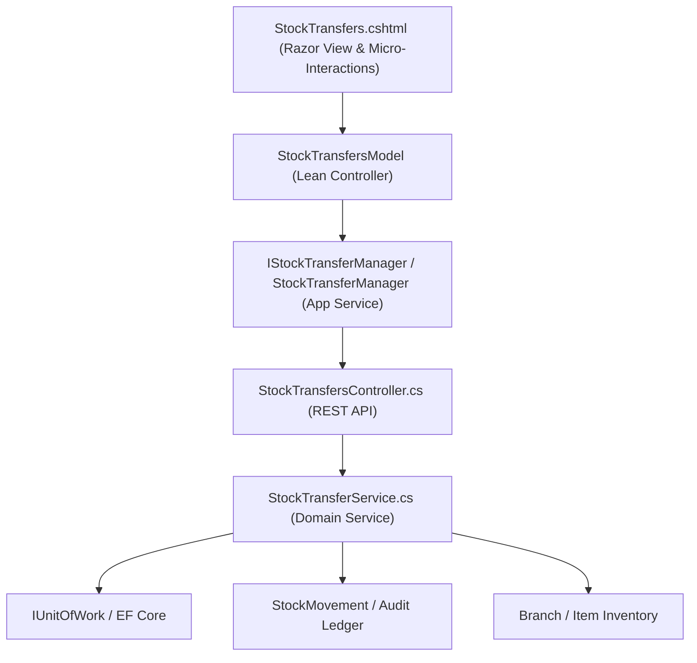

# Stock Transfers Hub — Deep Dive Analysis & Systems Design Report
### Cross-referenced against the Design System Specification, Clean Architecture, and Suite-Wide Benchmarks
---

## 1. Executive Summary & Current State

The **Stock Transfers Hub** (`/StockTransfers`) is the inter-branch supply chain, logistics, and multi-location inventory orchestration console in ClexAn Foods. It manages the full lifecycle of moving inventory between warehouses, cold-storage units, retail storefronts, and satellite fulfillment nodes:
$$\text{Requested} \longrightarrow \text{Approved} \longrightarrow \text{Dispatched (In Transit)} \longrightarrow \text{Received (Completed)}$$

### Current Health Score: ~35%
The existing implementation is an early prototype with substantial structural and visual gaps:
- **Visuals & Layout**: Relies on deprecated `.panel`, `.card-resource`, inline CSS, raw `<select>` tags, and basic tables without responsive metrics.
- **Architecture**: `StockTransfersModel` directly consumes `IStockTransferService`, handles raw serialization, and lacks an application manager layer (`IStockTransferManager`).
- **Inventory Disconnect**: Dispatches and receives do not record immutable `StockMovement` records or track transit discrepancies/damages.
- **Logistics Gaps**: Lacks driver/vehicle metadata, printable Delivery Waybills/Manifests, CSV audit exports, and valuation metrics in **`XAF`**.

---

## 2. Comprehensive Gap Analysis & Benchmarking

| Domain | Current Implementation | Target Design System Parity & Clean Architecture | Priority |
|---|---|---|---|
| **KPI Metrics** | Zero metric cards | **4-Card Interactive KPI Grid**: Pending Approval (Amber), In-Transit / Dispatched (Purple), Completed Transfers (Emerald), Total In-Transit Valuation in `XAF` (Teal) | **Critical** |
| **Architecture** | Direct API calls in PageModel, inline JSON string parsing | **Uncle Bob Clean Architecture**: Encapsulated `IStockTransferManager` / `StockTransferManager`, thin declarative `StockTransfersModel` | **Critical** |
| **Search & Filtering** | Basic status dropdown with form submit button | **Live Filter Dock**: Instant search input (transfer #, branch, item, creator), Origin/Destination branch select, Quick status pills (`All`, `Requested`, `Approved`, `In Transit`, `Received`, `Cancelled`), CSV Export | **High** |
| **Data Table** | Basic HTML table with raw serialized JSON attributes | High-density table with route arrows (`Origin` ➔ `Destination`), item badges, unit counts, transfer valuation in `XAF`, formatted timestamps, and semantic status badges | **High** |
| **Logistics & Waybill** | Simple dl list in generic modal | **Printable Delivery Note & Waybill Manifest**: Official logistics sheet with driver/carrier info, dispatch/receive signatures, and item verification table | **High** |
| **Transit Discrepancies** | Raw inputs without verification or shrinkage tracking | **Discrepancy Resolution**: Automated detection when `ReceivedQty < DispatchedQty`, allowing logging of damaged/lost in-transit stock | **High** |
| **Stock Movement Sync** | Status change only | Automatic generation of immutable `StockMovement` entries (type `Transfer`) on dispatch and receipt | **Medium** |
| **Currency Standards** | Inconsistent or missing | Standardized suite-wide to **`XAF`** (Central African CFA franc) | **Critical** |

---

## 3. Systems Design & Architecture (Dennis Ritchie & Uncle Bob Clean Architecture)

### 3.1 Data Flow & Layering


### 3.2 Key New DTOs & Contracts
```csharp
public class TransferMetricsDto
{
    public int TotalRequested { get; set; }
    public int TotalApproved { get; set; }
    public int TotalInTransit { get; set; }
    public int TotalReceived { get; set; }
    public int TotalTransferredUnits { get; set; }
    public decimal TotalInTransitValuationXaf { get; set; }
}

public class TransferFilterRequest
{
    public int Page { get; set; } = 1;
    public int PageSize { get; set; } = 25;
    public int? BranchId { get; set; }
    public string? Status { get; set; }
    public string? SearchTerm { get; set; }
    public DateTime? FromDate { get; set; }
    public DateTime? ToDate { get; set; }
}
```

---

## 4. UI/UX Modernization Plan

### 4.1 4-Card Interactive KPI Banner
1. **Pending Approval (`Requested`)**:
   - Amber Clock Icon | Count of transfers awaiting supervisor approval.
2. **In-Transit (`Dispatched`)**:
   - Purple Cargo Truck Icon | Active consignments moving between facilities.
3. **Completed Transfers (`Received`)**:
   - Emerald Check Icon | Total successfully received transfers.
4. **In-Transit Capital Valuation**:
   - Teal Currency Icon | Capital value of goods in transit formatted in **`XAF`**.

### 4.2 Interactive Filter Dock & Toolbar
- Search input with SVG magnifying glass (`Search transfer #, branch, item, requester...`).
- Quick status filter pills: `All`, `Pending Approval`, `Approved`, `In Transit`, `Completed`, `Cancelled`.
- Action buttons: `📥 Export CSV`, `+ New Transfer Request`.

### 4.3 High-Density Transfers Stream Table
- **Transfer ID**: Pill badge (`#TRF-1042`).
- **Logistics Route**: `From Branch` ➔ `To Branch` with route icon.
- **Consignment Details**: Total lines, total units, line valuation in **`XAF`**.
- **Requester & Date**: User name, creation date, and status timeline indicator.
- **Status Badges**:
  - `Requested` ➔ `.badge-warning`
  - `Approved` ➔ `.badge-teal`
  - `Dispatched` ➔ `.badge-purple`
  - `Received` ➔ `.badge-success`
  - `Cancelled` ➔ `.badge-danger`
- **Action Buttons**:
  - `📄 View / Waybill`: Opens full manifest with print capability.
  - `✓ Approve` / `✕ Reject`: For pending requests.
  - `🚚 Dispatch`: For approved requests.
  - `📥 Receive`: For dispatched transfers with discrepancy verification.
  - `✕ Cancel`: For active transfers.

### 4.4 Modals & Sliding Blades
1. **New Transfer Request**:
   - Origin & Destination Branch selection (validation against same origin/destination).
   - Dynamic multi-item line builder with catalog search and quantity inputs.
   - Live **Consignment Valuation Banner** (`XAF`).
   - Transport & Logistics notes (Driver, Vehicle #, Carrier).
2. **Dispatch Transfer Modal**:
   - Line items verification checklist with dispatched quantity inputs.
   - Dispatch timestamp and carrier notes.
3. **Receive Transfer Modal**:
   - Received quantity verification vs dispatched quantity.
   - Discrepancy detection (alerting if items were lost/damaged in transit).
4. **Transfer Details & Printable Waybill Manifest Modal**:
   - Formatted delivery note layout ready for browser printing (`Ctrl+P` / Print button).
   - Complete itemized bill of lading with sign-off blocks.
5. **Approve, Reject & Cancel Confirmation Modals**.

---

## 5. Security & Multi-Branch Access Control

1. **Role-Based Policies**:
   - Reading transfers: `PermissionKeys.InventoryRead`
   - Creating/Dispatching/Receiving transfers: `PermissionKeys.InventoryWrite`
   - Approving/Rejecting transfers: `PermissionKeys.AdminBranches` or authorized branch managers.
2. **Branch Access Enforcement**:
   - Users can only dispatch transfers if assigned to the origin branch.
   - Users can only receive transfers if assigned to the destination branch.
3. **Anti-CSRF & Data Sanitization**:
   - All forms protected with `@Html.AntiForgeryToken()`.
   - Complete HTML encoding of user inputs to prevent XSS.

---

## 6. Implementation Phasing

1. **Phase 1: DTOs & Backend Services**:
   - Add `TransferMetricsDto`, `TransferFilterRequest`, and enriched `StockTransferDto` properties in `Store.Models/DTOs/Transfers/StockTransferDtos.cs`.
   - Update `IStockTransferService` and `StockTransferService.cs` with `GetTransferMetricsAsync`, `GetTransfersPagedAsync`, and `StockMovement` synchronization.
   - Add `metrics` and `paged` endpoints in `StockTransfersController.cs`.
   - Implement `ApiStockTransferService.cs` additions.
2. **Phase 2: Application Layer (`IStockTransferManager`)**:
   - Create `IStockTransferManager` and `StockTransferManager` in `Store.UI/Services/`.
   - Register in `Store.UI/Program.cs`.
3. **Phase 3: Presentation Overhaul (`StockTransfers.cshtml` & `StockTransfers.cshtml.cs`)**:
   - Refactor `StockTransfers.cshtml.cs` to lean controller.
   - Rewrite `StockTransfers.cshtml` with KPI grid, filter dock, high-density table, live calculators, printable waybill modal, and modern blades.
4. **Phase 4: Verification & Walkthrough**:
   - Compile, test all workflows, and document in `walkthrough.md`.
