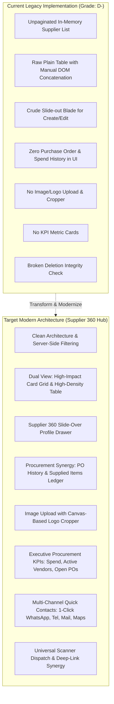
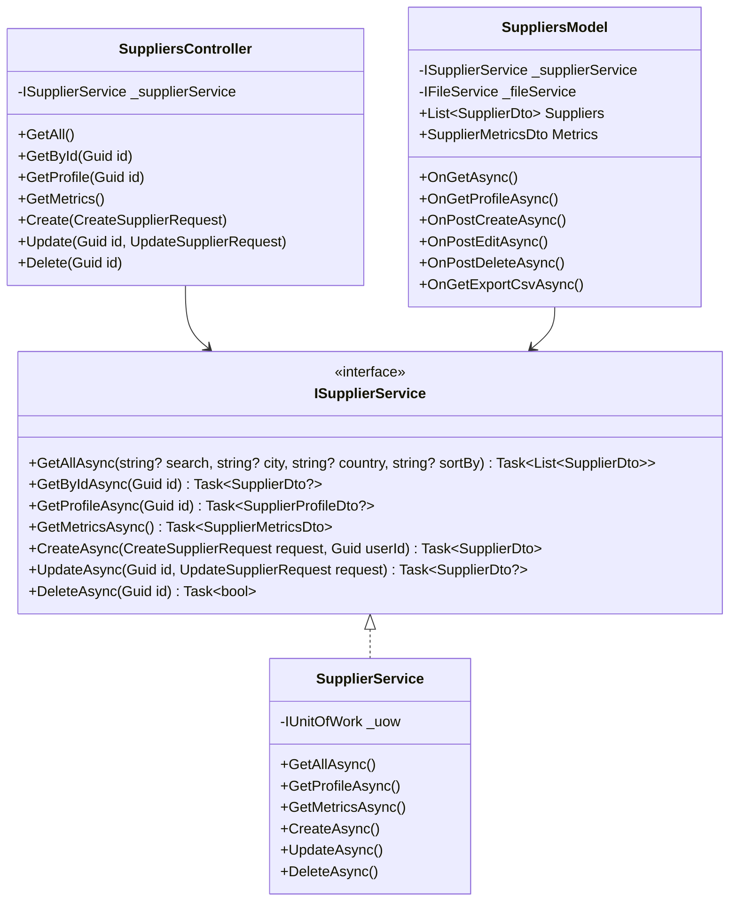

# Supplier Management & Procurement 360 Hub — Comprehensive Analysis & Design Specification

**Document Version:** 1.0.0  
**Author:** Antigravity AI Engineering  
**Target Module:** Supplier Directory, Supplier 360 Slide-Over Hub, Procurement & Purchase Order Integration, Smart Scanner & Vendor Ledger  
**Status:** Analysis Complete & Ready for Implementation  

---

## 1. Executive Summary

This document presents a complete audit, architectural analysis, and technical blueprint for upgrading the **Suppliers** module (`/Suppliers`) into an enterprise-grade **Supplier 360 Management & Procurement Hub**.

### Current vs. Target Subsystem Comparison



The upgraded module delivers:
1. **Dennis Ritchie & Uncle Bob Clean Architecture**: Strict separation of concerns across Domain Entities, DTO contracts, Database Services with Unit of Work, RESTful API Controllers with standard permission policies, and Razor PageModels.
2. **Supplier 360° Slide-Over Drawer**: Interactive side panel providing real-time vendor insights: Total Procurement Spend, Order History, In-Flight Deliveries, Supplied Products Catalog, and Payment Terms.
3. **Dual View UI Layout**: Instant toggle between modern visual Vendor Cards and a high-density tabular operational view with debounced multi-field search and active filter pills.
4. **Integrated Contact Operations**: Multi-email, multi-phone, and multi-address management with instant WhatsApp Web direct chat, `tel:` calling, `mailto:` composition, and Google Maps address lookup.
5. **Procurement & Purchase Order Synergy**: Direct 1-click "Create PO" dispatching pre-selected vendor context to `/PurchaseOrders?supplierId={id}`, and real-time PO tracking from the supplier profile.
6. **Smart Scanner & Deep-Linking Support**: Full support for `/Suppliers?id={id}`, `?supplierId={id}`, `?action=create`, `?action=edit`, and `?action=po`.
7. **Vendor Identity & Printable Dossier**: Vector SVG QR/Barcode generator for vendor registration and contact card printing.

---

## 2. Comprehensive Codebase Audit & Existing Implementations

We conducted a deep audit across all layers of the `StoreProject` solution to identify existing implementations, reused services, cross-cutting dependencies, and gaps:

### 2.1 Cross-Cutting Component Analysis

| Subsystem / Layer | Existing Assets | Current Limitation / Gap | Modernization Plan |
| :--- | :--- | :--- | :--- |
| **Domain Entities** | `Supplier`, `SupplierEmail`, `SupplierPhone`, `SupplierLocation`, `PurchaseOrder`, `ItemsOrder` in `Store.Models.Entities` | `Supplier` has `ThumbnailUrl` and `FullImageUrl` but no payment terms, tax ID, or status fields. | Utilize existing entities and relationships; enrich DTOs with procurement aggregates. |
| **DTO Definitions** | Conflicting definitions: `Store.Models.DTOs.Suppliers` (legacy, minimal) and `Store.Models.DTOs.Procurement` (richer) | Duplicated classes causing confusion; missing aggregate fields (`TotalSpend`, `OpenOrdersCount`, `SuppliedItemsCount`, `LastOrderDate`). | Unify around `Store.Models.DTOs.Procurement`, add `SupplierProfileDto` and `SupplierMetricsDto`. |
| **Database Services** | `SupplierService.cs` (`ISupplierService`), `PurchaseOrderService.cs` | `SupplierService.GetAllAsync()` fetches all rows in memory without pagination or search filters; `DeleteAsync` forgets to check `PurchaseOrder` foreign keys. | Add server-side search, filtering, sorting, profile aggregation, and fix deletion safety checks against `PurchaseOrder`. |
| **REST API Controller** | `SuppliersController.cs` | Uses `[Authorize(Policy = PermissionKeys.AdminBranches)]` for Write operations (should be `InventoryWrite` consistent with `PurchaseOrdersController`). Missing profile/metrics endpoints. | Standardize permission policies (`InventoryRead`, `InventoryWrite`); expose `/api/suppliers/metrics` and `/api/suppliers/{id}/profile`. |
| **API Client Service** | `ApiSupplierService.cs` | Minimal 5-method client without search query parameter or metrics support. | Update client to handle search queries, profile loading, and metrics aggregation. |
| **Razor UI Frontend** | `Suppliers.cshtml`, `Suppliers.cshtml.cs` | Raw HTML table with inline styling; DOM `innerHTML` string concatenation in JS; no image upload/crop; no 360 drawer; deep-link URL params ignored. | Full UI rebuild with Glassmorphism design tokens, KPI cards, Dual View, 360 Drawer, and interactive modals. |
| **Purchase Order Integration** | `PurchaseOrders.cshtml`, `PurchaseOrderService.cs` | `PurchaseOrders.cshtml.cs` searches suppliers via `OnGetSearchSuppliersAsync`, but Suppliers page has no link to POs. | Bidirectional linking: Supplier drawer displays PO history and has a direct "Create PO" button. |
| **Smart Optical Scanner** | `ScannerController.cs` (lines 288-332) | Resolves suppliers by Registration Number or Name, but formats contact lists as object strings, and deep-link `/Suppliers?id=...` is ignored by UI. | Fix string formatting in `ScannerController.cs` and wire up auto-opening of Supplier 360 Drawer on page load. |

---

## 3. Detailed Gap Analysis & Bug Catalog

### 3.1 Critical Bugs Identified

1. **Bug #1: Database Foreign Key Crash on Delete (`SupplierService.cs:170`)**:
   - `SupplierService.DeleteAsync` checks for associated orders using:
     ```csharp
     var hasOrders = await _uow.Repository<ItemsOrder>().ExistsAsync(o => o.SupplierId == id);
     if (hasOrders) return false;
     ```
   - It **does NOT** check for `PurchaseOrder` records (`_uow.Repository<PurchaseOrder>().ExistsAsync(p => p.SupplierId == id)`).
   - When an administrator attempts to delete a supplier that has existing purchase orders, Entity Framework throws a fatal database foreign key constraint violation exception (`DbUpdateException`) resulting in an unhandled 500 error!

2. **Bug #2: Memory-Leaking Unpaginated Fetch (`SupplierService.cs:17-28`)**:
   - `GetAllAsync()` executes `.Include(s => s.Emails).Include(s => s.Phones).Include(s => s.Locations).ToListAsync()` across the entire database table without limits.
   - For retail enterprises with hundreds or thousands of vendors, this loads massive object graphs into RAM on every page request.

3. **Bug #3: Inconsistent Authorization Policies (`SuppliersController.cs:41, 54, 65`)**:
   - `SuppliersController` decorates `Create`, `Update`, and `Delete` with `[Authorize(Policy = PermissionKeys.AdminBranches)]`.
   - In contrast, `PurchaseOrdersController` uses `PermissionKeys.InventoryWrite`, and `_AppLayout.cshtml` links Suppliers under the Inventory/Procurement menu. Floor managers and inventory specialists with `inventory.write` permissions are denied access to manage suppliers!

4. **Bug #4: Scanner Deep-Link Ignored by UI (`Suppliers.cshtml.cs` & `Suppliers.cshtml`)**:
   - `ScannerController.cs` generates deep-links: `TargetUrl = $"/Suppliers?id={matchedSupplier.SupplierId}"`.
   - `Suppliers.cshtml.cs` only inspects `string? search` and completely ignores `id` or `supplierId`. The user lands on the supplier list with no drawer opened and no row highlighted.

5. **Bug #5: Malformed Contact Strings in Scanner Resolution (`ScannerController.cs:306-307`)**:
   - `ScannerController.cs` formats supplier details using:
     ```csharp
     ["Phones"] = string.Join(", ", matchedSupplier.Phones)
     ```
   - Since `matchedSupplier.Phones` is a `List<SupplierPhoneDto>`, `string.Join` calls `.ToString()` on each object, outputting `"Store.Models.DTOs.Procurement.SupplierPhoneDto"` instead of the actual telephone numbers.

6. **Bug #6: Fragile Vanilla DOM String Concat (`Suppliers.cshtml:311-385`)**:
   - Dynamic contact addition relies on `div.innerHTML = ...` with string templates and hardcoded Razor loops inside JavaScript functions. Any quotes or special characters in city or email fields can break the script parser.

---

## 4. Architectural & Technical Specification

### 4.1 System Architecture Overview



### 4.2 Data Contracts & DTOs (`Store.Models/DTOs/Procurement/SupplierDtos.cs`)

```csharp
public class SupplierMetricsDto
{
    public int TotalSuppliers { get; set; }
    public int ActiveSuppliers { get; set; }
    public decimal TotalProcurementSpend { get; set; }
    public int OpenPurchaseOrdersCount { get; set; }
    public int PendingDeliveriesCount { get; set; }
}

public class SupplierProfileDto : SupplierDto
{
    public decimal TotalSpend { get; set; }
    public int TotalPurchaseOrdersCount { get; set; }
    public int OpenOrdersCount { get; set; }
    public DateTime? LastOrderDate { get; set; }
    public List<SupplierPurchaseOrderSummaryDto> RecentOrders { get; set; } = new();
    public List<SupplierItemSummaryDto> SuppliedItems { get; set; } = new();
}

public class SupplierPurchaseOrderSummaryDto
{
    public int PurchaseOrderId { get; set; }
    public string? ReferenceNumber { get; set; }
    public string Status { get; set; } = string.Empty;
    public decimal TotalAmount { get; set; }
    public int ItemsCount { get; set; }
    public DateTime DateCreated { get; set; }
    public DateTime? ExpectedDeliveryDate { get; set; }
}

public class SupplierItemSummaryDto
{
    public Guid ItemId { get; set; }
    public string ItemName { get; set; } = string.Empty;
    public string? Barcode { get; set; }
    public decimal LastUnitCost { get; set; }
    public int TotalQuantityReceived { get; set; }
    public DateTime? LastReceivedDate { get; set; }
}
```

---

## 5. UI/UX Design Specification: Supplier 360 Hub

### 5.1 Visual Hierarchy & Component Wireframe

```
+---------------------------------------------------------------------------------------------------------+
| [Procurement & Supply Hub]   Suppliers Directory                                                         |
| Real-time vendor relationships, purchase order histories, contacts & procurement metrics.                 |
+---------------------------------------------------------------------------------------------------------+
| [ KPI 1: Active Vendors ]   [ KPI 2: Total Spend ]    [ KPI 3: Open POs ]    [ KPI 4: Pending Deliveries]|
|         24 Vendors              XAF 142,850,000            6 Orders                3 Expected Today     |
+---------------------------------------------------------------------------------------------------------+
| [ Search suppliers, reg #... ] [ Country: All v ] [ City: All v ] [ Sort: Name (A-Z) v ] [Grid|Table] [+ New Vendor]|
+---------------------------------------------------------------------------------------------------------+
|  +---------------------------+  +---------------------------+  +---------------------------+            |
|  | [LOGO] ABC Distributors   |  | [LOGO] Global Pharm Ltd   |  | [LOGO] Central Foods Co   |            |
|  | Reg: RC-2024-99812        |  | Reg: TAX-9912048          |  | Reg: RC-88712             |            |
|  | [TEL] +237 670 11 22 33   |  | [TEL] +237 699 00 11 22   |  | [TEL] +237 655 44 33 22   |            |
|  | [MAIL] sales@abc.com      |  | [MAIL] contact@global.cm  |  | [MAIL] supply@central.com |            |
|  | [LOC] Douala, Cameroon   |  | [LOC] Yaounde, Cameroon   |  | [LOC] Bafoussam, Cameroon |            |
|  | ------------------------- |  | ------------------------- |  | ------------------------- |            |
|  | Total Spend: XAF 14.5M    |  | Total Spend: XAF 48.2M    |  | Total Spend: XAF 8.9M     |            |
|  | Orders: 12 (1 Open)       |  | Orders: 34 (2 Open)       |  | Orders: 8 (0 Open)        |            |
|  | [ 360 Profile ] [+ PO]    |  | [ 360 Profile ] [+ PO]    |  | [ 360 Profile ] [+ PO]    |            |
|  +---------------------------+  +---------------------------+  +---------------------------+            |
+---------------------------------------------------------------------------------------------------------+
```

### 5.2 Slide-Over Supplier 360 Profile Drawer

When any vendor card, row, or deep-link `/Suppliers?id={id}` is triggered, a high-performance slide-over drawer animates from the right side:

1. **Vendor Header**:
   - Company Logo (or stylized 2-letter monogram with unique color hash).
   - Legal Business Name & Registration/Tax Number.
   - Primary Phone with 1-Click WhatsApp web trigger (`https://wa.me/{number}`) and direct dialer.
   - Primary Email with 1-Click `mailto:`.
   - Primary Location with Google Maps link.
2. **Key Metric Stat Pills**:
   - Total Procurement Spend (XAF formatted).
   - Total Purchase Orders Count.
   - In-Flight / Open PO Count.
   - Last Order Placement Date.
3. **Tabbed Information Architecture**:
   - **Tab 1: Overview & Contacts**:
     - All registered telephone numbers categorized by type (`Work`, `Mobile`, `Fax`) with Primary badge.
     - All registered email addresses categorized by type (`Work`, `Billing`, `Support`) with Primary badge.
     - All registered physical warehouse/office addresses with City, State, Country, Postal Code.
     - Internal procurement notes & vendor terms.
   - **Tab 2: Purchase Order History**:
     - Live data table of recent purchase orders: PO Number, Status Badge (`Draft`, `Submitted`, `Approved`, `PartiallyReceived`, `Received`, `Cancelled`), Item Count, Total Value, Order Date.
     - Direct "Inspect in PO Hub" action link to `/PurchaseOrders?id={poId}`.
   - **Tab 3: Supplied Products Catalog**:
     - List of inventory items sourced from this supplier.
     - Last unit purchase price vs current retail selling price.
     - Total lifetime units received.
4. **Drawer Action Bar**:
   - **"Create Purchase Order" Button**: Navigates to `/PurchaseOrders?supplierId={id}` with vendor pre-selected.
   - **"Edit Supplier" Button**: Opens the modern multi-step edit modal.
   - **"Print Contact Dossier" Button**: Generates a printable A4/card dossier with Code128 / QR vendor barcode.

---

## 6. Implementation Action Plan

### Phase 1: Data Contracts & Backend Service Modernization
- [ ] **DTO Updates**: Extend `Store.Models/DTOs/Procurement/SupplierDtos.cs` with `SupplierMetricsDto`, `SupplierProfileDto`, `SupplierPurchaseOrderSummaryDto`, and `SupplierItemSummaryDto`.
- [ ] **Service Interface (`ISupplierService.cs`)**: Add `GetProfileAsync(Guid id)` and `GetMetricsAsync()`, and support search/filtering parameters in `GetAllAsync(...)`.
- [ ] **Service Implementation (`SupplierService.cs`)**:
  - Implement `GetProfileAsync` aggregating PO history and supplied products.
  - Implement `GetMetricsAsync` calculating active vendors, total spend, and open orders.
  - Fix `DeleteAsync` to check both `ItemsOrder` and `PurchaseOrder` foreign keys safely.
- [ ] **API Controller (`SuppliersController.cs`)**:
  - Fix permission policies to `PermissionKeys.InventoryRead` and `PermissionKeys.InventoryWrite`.
  - Add `GET /api/suppliers/metrics` and `GET /api/suppliers/{id}/profile`.
- [ ] **API Client (`ApiSupplierService.cs`)**: Implement client methods with JWT token forwarding.

### Phase 2: UI Modernization & Supplier 360 Hub (`Store.UI`)
- [ ] **PageModel (`Suppliers.cshtml.cs`)**:
  - Support query parameters: `search`, `city`, `country`, `sortBy`, `viewMode`, `id`, `supplierId`.
  - Add image upload and cropping handler with `IFileService`.
  - Add AJAX handler `OnGetProfileAsync(Guid id)` for instant 360 drawer population.
  - Add CSV export handler `OnGetExportCsvAsync()`.
- [ ] **View (`Suppliers.cshtml`)**:
  - Implement Executive KPI Header cards.
  - Implement Modern Filter Bar with debounced search and sort options.
  - Implement Dual View: Grid Cards & Tabular View.
  - Implement Slide-Over Supplier 360 Drawer with contact shortcuts, PO history, and supplied products tabs.
  - Implement Modern Create / Edit Vendor Modal with Logo upload & cropper.
  - Add pure SVG QR/Barcode generator and print layout.

### Phase 3: Cross-Module Integration & Verification
- [ ] **Smart Scanner Integration**: Update `ScannerController.cs` to correctly format supplier contact strings and test deep-link resolution.
- [ ] **Purchase Orders Linkage**: Connect `/PurchaseOrders?supplierId={id}` pre-selection seamlessly with `/Suppliers`.
- [ ] **Verification**: Run comprehensive solution build and automated unit tests.
