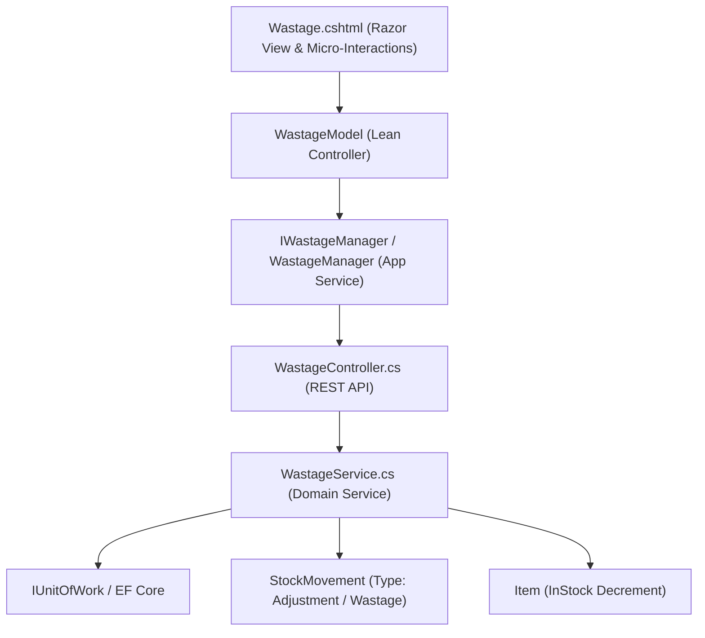

# Wastage & Shrinkage Log — Deep Dive Analysis & Systems Design Report
### Cross-referenced against the Design System Specification, Clean Architecture, and Financial Loss Auditing
---

## 1. Executive Summary & Current State

The **Wastage & Shrinkage Log** (`/Wastage`) is the loss prevention, quality control, and inventory write-off audit hub in ClexAn Foods. It records stock adjustments caused by product expiration, handling damages, perishable spoilage, theft/shrinkage, and administrative variances:
$$\text{Catalog Inventory} \xrightarrow{\text{Wastage Entry}} \text{Deducted On-Hand Stock} + \text{Immutable Stock Movement (Adjustment)} + \text{Financial Loss in XAF}$$

### Current Health Score: ~35%
The current page is a legacy prototype:
- **Visuals & Layout**: Relies on deprecated `.ops-page`, zero KPI cards, no financial loss computations in standard **`XAF`**, plain `<select>` tags, and basic tables.
- **Architecture**: `WastageModel` directly calls domain services, mixes UI logic, and lacks an application manager layer (`IWastageManager`).
- **Financial Audit Gaps**: Does not display cost valuations or aggregate financial loss metrics by wastage reason (e.g. Total Expired Loss vs. Total Damage Loss).
- **Search & Filtering**: Lacks text search, date range filtering, and CSV export for financial and loss prevention audits.

---

## 2. Comprehensive Gap Analysis & Benchmarking

| Domain | Current Implementation | Target Design System Parity & Clean Architecture | Priority |
|---|---|---|---|
| **KPI Metrics** | Zero metric cards | **4-Card Interactive KPI Grid**: Total Written-Off Valuation in `XAF` (Red/Teal), Expired Losses (Amber), Damaged/Spoiled Losses (Purple), Total Units Lost (Emerald) | **Critical** |
| **Architecture** | Direct API calls in PageModel | **Uncle Bob Clean Architecture**: Encapsulated `IWastageManager` / `WastageManager`, thin declarative `WastageModel` | **Critical** |
| **Financial Valuation** | No monetary tracking (only raw quantities) | **XAF Valuation**: Computes unit cost and total financial loss per entry and across the entire catalog | **Critical** |
| **Search & Filtering** | Basic type dropdown with page submit | **Live Filter Dock**: Instant text search (item name, barcode, ref code, notes, user), Reason filter pills (`All`, `Expiry`, `Damage`, `Spoilage`, `Theft`, `AdminError`), and CSV Export | **High** |
| **Data Table** | Basic HTML table | High-density table with product category badge, barcode, semantic reason badges, unit count, financial valuation in `XAF`, user timestamp, and delete action | **High** |
| **Interactive Modals** | Basic sliding blade with raw fields | Modern centered modal with smart item selector, available stock indicators, live **Financial Loss Valuation Calculator**, and reference code auto-generator | **High** |
| **Audit CSV Export** | None | Full CSV export for loss prevention managers, accountants, and inventory auditors | **High** |
| **Currency Standards** | Inconsistent or missing | Standardized suite-wide to **`XAF`** (Central African CFA franc) | **Critical** |

---

## 3. Systems Design & Architecture (Dennis Ritchie & Uncle Bob Clean Architecture)

### 3.1 Data Flow & Layering


### 3.2 Key New DTOs & Contracts
```csharp
public class WastageMetricsDto
{
    public int TotalEntries { get; set; }
    public int TotalQuantity { get; set; }
    public decimal TotalValuationXaf { get; set; }
    public decimal TotalExpiredLossXaf { get; set; }
    public decimal TotalDamagedLossXaf { get; set; }
    public decimal TotalSpoiledLossXaf { get; set; }
    public decimal TotalTheftLossXaf { get; set; }
}

public class WastageFilterRequest
{
    public int Page { get; set; } = 1;
    public int PageSize { get; set; } = 25;
    public string? WastageType { get; set; }
    public Guid? ItemId { get; set; }
    public string? SearchTerm { get; set; }
    public DateTime? FromDate { get; set; }
    public DateTime? ToDate { get; set; }
}
```

---

## 4. UI/UX Modernization Plan

### 4.1 4-Card Interactive KPI Banner
1. **Total Written-Off Valuation (`XAF`)**:
   - Red/Teal Currency Icon | Total monetary cost of written-off inventory.
2. **Expired Stock Losses**:
   - Amber Clock Icon | Capital lost to expired shelf-life.
3. **Damaged / Handling Losses**:
   - Purple Box Damage Icon | Losses from store handling, transit, or physical breakages.
4. **Total Written-Off Units**:
   - Emerald Package Icon | Total physical units written off across all categories.

### 4.2 Interactive Filter Dock & Toolbar
- Live search input with SVG magnifying glass (`Search item name, barcode, ref code, notes, user...`).
- Quick Reason filter pills: `All`, `Expired`, `Damaged`, `Spoiled`, `Theft / Shrinkage`, `Admin Error`.
- Action buttons: `📥 Export CSV`, `+ Record Wastage Entry`.

### 4.3 High-Density Wastage Log Table
- Reference code badge (`WASTE-2026-001`).
- Product details: Item Name, Category badge (`.badge-neutral`), Barcode (`.code-badge`), current stock.
- Semantic Reason Badge:
  - `Expiry` ➔ `.badge-danger`
  - `Damage` ➔ `.badge-purple`
  - `Spoilage` ➔ `.badge-warning`
  - `Theft` ➔ `.badge-critical`
  - `AdminError` / `Other` ➔ `.badge-neutral`
- Written-Off Quantity (bold units).
- Valuation: Unit cost + Line total in **`XAF`**.
- User & Timestamp: Recorded by username + formatted local time.
- Action: `🗑️ Delete` (opens secure confirmation dialog).

### 4.4 Modals & Micro-Interactions
1. **Record Wastage Modal**:
   - Product Item Selector (with live stock level and cost price preview).
   - Wastage Reason Dropdown (`Expiry`, `Damage`, `Spoilage`, `Theft`, `AdminError`, `Other`).
   - Quantity Input (validated against current stock with safety warning).
   - Reference Code input (prefilled with `WASTE-YYYY-XXX`).
   - Live **Financial Loss Valuation Banner** (`Quantity × Unit Cost = Total Lost XAF`).
   - Notes textarea for inspection details.
2. **Delete Wastage Modal**:
   - Confirmation dialog warning about inventory reconciliation.

---

## 5. Security & Multi-Role Permissions

1. **Role-Based Access Control**:
   - Reading wastage log: `PermissionKeys.InventoryRead`
   - Recording/Deleting wastage entries: `PermissionKeys.InventoryWrite`
2. **Audit Integrity**:
   - All write-offs write immutable `StockMovement` records (type `Adjustment` or `Wastage`).
   - User identity stamped automatically via JWT claim (`sub` / `uid`).
3. **Anti-CSRF & Data Sanitization**:
   - All forms protected with `@Html.AntiForgeryToken()`.
